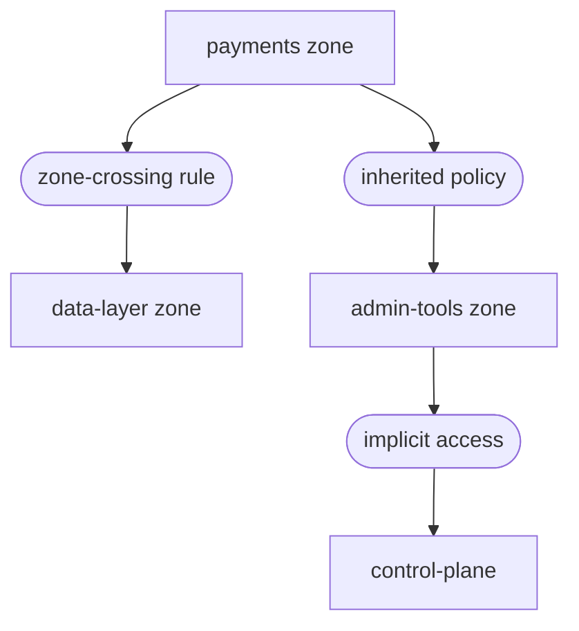

في الشهر الماضي، التقطنا مسار تنقّل جانبي في بيئة المرحلة لدينا. لم يحدث اختراق. ولم يُطلق أيّ تنبيه. وجده Parapet أثناء محاكاة سياسة روتينيّة، حساب خدمة بوصول ضمني إلى منطقة Rampart لم يكن ينبغي أن يصل إليها قطّ.

{/* truncate */}

## الإعداد

نشرنا خدمة دقيقة جديدة في منطقة `payments`. احتاجت الخدمة إلى وصول إلى ذاكرة تخزين مؤقّت مشتركة في منطقة `data-layer`، فأضاف مهندس قاعدة عبور بين المنطقتَين. كانت القاعدة صحيحة. ما لم يُدركه المهندس أنّ حساب الخدمة ورث سياسة ثقة ثانية من مجموعة `internal-services`، سياسة منحت أيضاً وصولاً إلى منطقة `admin-tools`.

بدا المسار هكذا:



كانت خدمة `payments` مُخترَقَة ستستطيع الوصول إلى مستوى التحكّم في قفزتَين. في الشبكة التقليديّة، كان هذا سيظلّ غير مرئي حتى يستغلّه مهاجم. مع Parapet، وجدناه قبل أن يهمّ.

## تشغيل المحاكاة

يُعيد Parapet تشغيل حركة بيانات أنفاق Filament الفعليّة مقابل السياسات المسودّة أو القائمة. شغّلنا محاكاة مقابل مجموعة سياسات الإنتاج مع قاعدة العبور الجديدة بين المنطقتَين مُضمَّنة:

```bash title="Parapet simulation command"
sentinel parapet simulate \
  --policy-set production \
  --include draft:payments-cache-access \
  --traffic-source staging-replay \
  --duration 24h
```

عالجت المحاكاة 847,000 سجلّ اتصال من الـ 24 ساعة السابقة من حركة بيانات المرحلة. استغرقت 11 دقيقة.

```text title="Simulation output"
Parapet Simulation Report
  Policy set:    production + draft:payments-cache-access
  Traffic source: staging-replay (847,291 connections)
  Duration:       24h replay in 11m 14s

  Results:
    Connections evaluated:  847,291
    Access granted:         812,447 (95.9%)
    Access denied:          34,844 (4.1%)

  Anomalies detected: 1
    LATERAL-MOVEMENT-PATH
    Source: svc-payments (payments zone)
    Path:   payments → data-layer → admin-tools → control-plane
    Via:    inherited policy "internal-services-baseline"
    Risk:   CRITICAL — control-plane reachable from application zone
```

شذوذ واحد. مسار واحد. ظهر بعد بعد لإصلاحه.

## الإصلاح

ضيّقنا نطاق سياسة `internal-services-baseline` لاستبعاد منطقة `admin-tools` لأيّ حساب خدمة ينطلق من منطقة تطبيق:

```text title="trust-policy.grain — scoped exclusion"
policy "internal-services-baseline" {
  resource = "internal-services"
  effect   = "allow"

  conditions {
    user.type = "service-account"
  }

  // highlight-start
  exclusions {
    zone.origin = ["payments", "catalog", "search"]
    zone.target = ["admin-tools", "control-plane"]
  }
  // highlight-end
}
```

أعدنا تشغيل المحاكاة. اختفى مسار التنقّل الجانبي. حافظت خدمة `payments` على وصول ذاكرة التخزين المؤقّت. لم تُلمس أيّ سياسة إنتاج حتى أكّدت المحاكاة الإصلاح.

:::warning اختبر قبل الفرض
تُعالج محاكاة Parapet حركة بيانات تاريخية، لا بيانات اصطناعيّة. تكشف أنماط وصول فعليّة، لكنّها لا تستطيع التنبّؤ بأنماط حركة بيانات لم تحدث من قبل. اجمع دائماً بين المحاكاة والنمذجة اليدويّة للتهديدات لبنى المناطق الجديدة.
:::

## ما لا يفعله Parapet

Parapet ليس أداة اختبار اختراق. لا يُولّد حركة بيانات هجوميّة ولا يُحاول الاستغلال. يُجيب عن سؤال أضيق، نظراً لهذه السياسات وهذه الحركة، ما مسارات الوصول الموجودة؟

ذلك السؤال يكفي. معظم استغلالات التنقّل الجانبي تتّبع مسارات موجودة بالفعل في رسم خرائط السياسة. لا تتطلّب ثغرات يوم صفر. بل تتطلّب ثقة ضمنيّة، النوع الذي يتراكم بصمت حين تُضاف السياسات ولا تُقلَّم.

## الخلاصة

لم يكن لدينا اختراق. كانت لدينا محاكاة. كلّفتنا المحاكاة 11 دقيقة ووجدت تعرّضاً لمستوى التحكّم كان سيظلّ غير مرئي للمراقبة التقليديّة.

كلّ قاعدة عبور بين منطقتَين جديدة تمرّ الآن عبر Parapet قبل أن تصل إلى الإنتاج. كلفة المحاكاة تُقاس بالدقائق. كلفة البديل تُقاس بتقارير الحوادث.

اقرأ دليل [محاكاة السياسة](/docs/operations/policy-simulation/) لإعداد Parapet في بيئتك.
