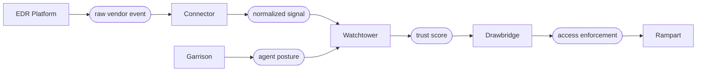

import Tabs from '@theme/Tabs';
import TabItem from '@theme/TabItem';

# موصلات EDR

يجمع Garrison الوضع الأمني من وكيل Filament على كلّ جهاز مسجّل. وتُوسّع موصلات EDR هذه الصورة باستيعاب إشارات من منصّات الكشف والاستجابة المخصّصة لنقاط النهاية المنتشرة بالفعل عبر الأسطول. يرى الوكيل ما يعرفه الجهاز عن نفسه، أمّا EDR فترى ما لا يستطيع الجهاز رؤيته، قياسات على مستوى النواة، وشذوذ سلوكي، وأحكام بشأن البرمجيات الخبيثة.

تُطبّع طبقة الموصلات إشارات EDR في مفردات الوضع الأمني ذاتها التي يُقيّمها Watchtower. اكتشاف بمستوى خطورة حرج من CrowdStrike وحدث عدم امتثال من JAMF يُغذّيان حساب درجة الثقة ذاته. ويستجيب Drawbridge لأيّ منهما بأوّلية الإلغاء ذاتها.

## تدفّق الإشارة

تصل أحداث EDR بشكل غير متزامن. يشترك الموصل في تدفّق أحداث المُورّد، ويُطبّع الحمولة، ويدفع الإشارة المُطبَّعة إلى خطّ تقييم Watchtower:



ومن الجوهري أنّ إشارات EDR لا تحلّ محلّ الوضع الأمني للوكيل من Garrison، بل تُكمّله. الجهاز ذو الوضع الأمني السليم في Garrison مع اكتشاف EDR حرج يفقد الوصول مع ذلك. والجهاز الذي تُعلِّمه قاعدة EDR منخفضة الخطورة لكنّه ممتثل خلاف ذلك قد يرى درجة ثقته تنخفض قليلاً.

## الموصلات المدعومة

| الموصل                  | مصدر الحدث             | الإشارات المُطبَّعة                         | زمن الوصول |
|-------------------------|------------------------|---------------------------------------------|------------|
| CrowdStrike Falcon      | Falcon streaming API   | خطورة الاكتشاف، حالة الوقاية، صحّة المستشعر | < 5s       |
| Microsoft Defender XDR  | Microsoft Graph events | خطورة التهديد، مخاطر الجهاز، حالة العزل     | < 15s      |
| JAMF Protect            | JAMF Webhooks API      | أحداث التهديد، حالة الامتثال، انتهاكات MDM  | < 10s      |
| SentinelOne Singularity | S1 SyslogNG stream     | خطورة التهديد، حكم الوكيل، الرؤية العميقة   | < 5s       |
| مُورّد عامّ (webhook)   | HTTPS webhook          | قابل للتهيئة عبر مخطّط ربط                  | متغيّر     |

يقبل موصل الـ webhook العامّ أيّ حمولة JSON تُصدرها المُورّدات، ويربط الحقول بمخطّط الإشارة المُطبَّعة. استخدمه لمنصّات EDR التي لا تتوفّر لها موصلات مخصّصة، أو لأنظمة الكشف الداخلية.

## مخطّط الإشارة المُطبَّعة

كلّ إشارة EDR، بصرف النظر عن المصدر، تُطبَّع إلى مخطّط واحد قبل أن يستهلكها Watchtower:

```json title="Normalized EDR signal"
{
  "signal_id":  "edr_evt_8a3f7c2b9d1e",
  "device_id":  "dev_a3b7c9d1e5f2",
  "source":     "crowdstrike",
  "received_at": "2025-06-15T14:22:47Z",
  "severity":   "critical",
  "category":   "malware",
  "verdict":    "blocked",
  "details": {
    "vendor_event_id": "ldt:abc123:9876543",
    "detection_name":  "WIN/TROJAN.GENERIC.A",
    "process_path":    "C:\\Users\\m.torres\\Downloads\\setup.exe",
    "process_hash":    "sha256:e3b0c44298fc1c14..."
  },
  "posture_impact": {
    "score_delta":     -45,
    "categories":      ["software", "behavior"],
    "expires_at":      "2025-06-15T14:52:47Z"
  }
}
```

يُقيّم Watchtower كتلة `posture_impact`. يُطبَّق `score_delta` على الوضع الأمني المركّب للجهاز للمدّة المُحدّدة بـ `expires_at`. اكتشاف عالي الخطورة يُنتج فرقاً كبيراً بما يكفي لدفع الجهاز دون كلّ عتبة سياسة؛ أمّا إشارة معلوماتية منخفضة الخطورة فقد تُطبّق فرقاً صغيراً أو لا تُطبّق فرقاً على الإطلاق.

## تهيئة موصل

<Tabs>
<TabItem value="crowdstrike" label="CrowdStrike" default>

```text title="connectors/crowdstrike.grain"
edr_connector "crowdstrike-prod" {
  vendor       = "crowdstrike"
  client_id    = ref("secrets/cs_client_id")
  client_secret = ref("secrets/cs_client_secret")
  cloud_region = "us-2"

  event_stream {
    feed = "DetectionSummaryEvent"
    feed = "IncidentSummaryEvent"
    feed = "SensorHeartbeatEvent"
  }

  severity_mapping {
    critical = { score_delta = -50, expires = "30m" }
    high     = { score_delta = -25, expires = "20m" }
    medium   = { score_delta = -10, expires = "10m" }
    low      = { score_delta = -2,  expires = "5m"  }
  }

  device_correlation {
    match = "hostname"
    fallback = "agent_id"
  }
}
```

تُخبر كتلة `device_correlation` الموصل كيف يربط حدث CrowdStrike بجهاز مسجّل في Sentinel. اسم المضيف هو الافتراضي، وإن تعارضت أسماء المضيفين في الأسطول، فالرجوع إلى مُعرّف وكيل مستشعر CrowdStrike، الذي يُسجّله Garrison عند التسجيل إن كان مستشعر CrowdStrike موجوداً.

</TabItem>
<TabItem value="defender" label="Microsoft Defender">

```text title="connectors/defender.grain"
edr_connector "defender-xdr" {
  vendor       = "defender"
  tenant_id    = ref("secrets/aad_tenant_id")
  client_id    = ref("secrets/defender_client_id")
  client_secret = ref("secrets/defender_client_secret")

  graph_subscriptions {
    resource = "/security/alerts_v2"
    resource = "/deviceManagement/managedDevices"
  }

  severity_mapping {
    high     = { score_delta = -45, expires = "30m" }
    medium   = { score_delta = -20, expires = "15m" }
    low      = { score_delta = -5,  expires = "5m"  }
  }

  device_correlation {
    match = "azure_ad_device_id"
    fallback = "hostname"
  }
}
```

يشترك موصل Defender في إشعارات تغيير Microsoft Graph. `azure_ad_device_id` هو مفتاح الربط الأكثر موثوقيّة حين تكون الأجهزة مسجّلة أيضاً في Intune، يصمد أمام تغييرات أسماء المضيفين، وإعادة تهيئة الصورة، وعمليّات الانضمام.

</TabItem>
<TabItem value="jamf" label="JAMF Protect">

```text title="connectors/jamf.grain"
edr_connector "jamf-protect" {
  vendor      = "jamf"
  webhook_url = "https://sentinel.yourcompany.internal/connectors/jamf"
  shared_secret = ref("secrets/jamf_webhook_secret")

  event_types {
    type = "ThreatEvent"
    type = "ComplianceEvent"
    type = "MDMNonCompliantEvent"
  }

  severity_mapping {
    Critical = { score_delta = -50, expires = "30m" }
    High     = { score_delta = -30, expires = "20m" }
    Medium   = { score_delta = -12, expires = "10m" }
    Info     = { score_delta = -2,  expires = "5m"  }
  }

  device_correlation {
    match = "jamf_device_uuid"
    fallback = "hostname"
  }
}
```

JAMF Protect قائم على webhook لا على السحب. يُتحقّق من السرّ المشترك في حمولة webhook مقابل `ref("secrets/jamf_webhook_secret")` قبل قبول الحدث.

</TabItem>
<TabItem value="generic" label="مُورّد عامّ">

```text title="connectors/generic-vendor.grain"
edr_connector "in-house-detection" {
  vendor      = "generic"
  webhook_url = "https://sentinel.yourcompany.internal/connectors/in-house"
  shared_secret = ref("secrets/in_house_secret")

  // highlight-start
  payload_mapping {
    device_id = "$.host.hostname"
    severity  = "$.detection.severity"
    category  = "$.detection.category"
    verdict   = "$.detection.action"
    received_at = "$.timestamp"
  }
  // highlight-end

  severity_mapping {
    "Severity-1" = { score_delta = -50, expires = "30m" }
    "Severity-2" = { score_delta = -25, expires = "15m" }
    "Severity-3" = { score_delta = -10, expires = "10m" }
  }
}
```

يقبل الموصل العامّ JSON اعتباطياً عبر webhook، ويستخدم تعابير JSONPath لاستخراج الحقول التي يتطلّبها مخطّط الإشارة المُطبَّعة. أيّ مُورّد قادر على إطلاق HTTPS webhook يمكن دمجه بهذه الطريقة.

</TabItem>
</Tabs>

## أثر الوضع الأمني وDrawbridge

حين يستلم Watchtower إشارة EDR، يُطبّق `score_delta` على درجة الوضع الأمني للجهاز طوال عمر الإشارة. تعكس دورة تقييم السياسة التالية الدرجة المُعدَّلة:

```text title="Drawbridge response to EDR signal"
[14:22:46] WATCHTOWER evaluation: policy api-access → PASS (score 92)
[14:22:47] EDR-CONNECTOR crowdstrike-prod: critical detection
             device: dev_a3b7c9d1   delta: -50   expires: 14:52:47
[14:22:47] WATCHTOWER evaluation: policy api-access → FAIL (score 42, below 80)
[14:22:47] DRAWBRIDGE revoke: api-cluster-east (tunnel tun_8a3f)
[14:22:47] RAMPART    zone crossing revoked: internal → api-services
[14:22:48] NOTIFICATION sent to security-ops
```

يحدث الإلغاء في دورة التقييم ذاتها التي تصل فيها الإشارة، أقلّ من ثانية واحدة من إصدار اكتشاف CrowdStrike إلى إغلاق نفق Drawbridge. ويجب على الجهاز معالجة السبب الجوهري (يجب أن يُزيل EDR الاكتشاف) قبل أن تتعافى درجة وضعه الأمني.

:::warning ربط الخطورة سياسة
قيم `score_delta` في تهيئة الموصل قرارات سياسة، لا إعدادات افتراضيّة تقنيّة. يفترض الفرق `-50` لاكتشاف حرج عتبة وضع أمني أساسية تبلغ 80؛ وفي البيئات ذات الأسس الأقلّ صرامة، قد يحتاج الفرق إلى أن يكون أكبر لإجبار الإلغاء. اضبط الربط بإعادة تشغيل Parapet قبل النشر.
:::

## السياسات التي تُشير إلى إشارات EDR

تستطيع سياسات الثقة قراءة أثر الوضع الأمني لـ EDR مباشرة عبر مساحة الأسماء `edr`:

```text title="policies/edr-aware.grain"
policy "edr-clean-required" {
  resource = "production-data"
  effect   = "allow"

  conditions {
    device.posture       >= 90
    user.mfa             = true
    // highlight-start
    edr.critical_events  = 0
    edr.high_events      <= 1
    // highlight-end
  }

  on_failure {
    action = "revoke"
    notify = "security-ops"
    log    = "spyglass"
  }
}
```

يحسب شرط `edr.critical_events` الإشارات النشطة ذات الخطورة الحرجة عبر جميع منصّات EDR المتّصلة. اكتشاف حرج واحد، من أيّ موصل، يُخفق السياسة. ويسمح شرط `edr.high_events <= 1` بإشارة نشطة واحدة عالية الخطورة، لا أكثر.

## ربط Spyglass

تُسجَّل كلّ إشارة EDR في Spyglass جنباً إلى جنب مع قرارات Drawbridge التي حرّكتها. تُظهر إعادة البناء الجنائي السلسلة الكاملة، حدث المُورّد، والإشارة المُطبَّعة، وأثر الوضع الأمني، وفرض الوصول:

```bash title="استعلام عن الإلغاءات المُحرّكة بـ EDR"
sentinel spyglass query \
  --event-type edr-correlated-revoke \
  --period "2025-06-01..2025-06-30" \
  --severity critical
```

```text title="مخرجات الاستعلام"
EDR-Correlated Revocations: Critical Severity, June 2025

DATE        DEVICE             CONNECTOR        DETECTION                   REVOCATIONS
2025-06-04  dev_b1a9c3e7       crowdstrike      WIN/TROJAN.GENERIC.A        7 sessions
2025-06-09  dev_f8e2d4c6       defender         Suspicious-PSExec-Activity  3 sessions
2025-06-15  dev_a3b7c9d1       crowdstrike      WIN/TROJAN.GENERIC.A        4 sessions
2025-06-22  dev_c5d7e9f1       jamf-protect     Malicious-LaunchAgent       2 sessions

Mean time from detection to revocation: 612ms
Mean time to posture recovery:          18m 47s
```

السلسلة كاملة، يُحفظ مُعرّف حدث المُورّد الأصلي في كلّ سجلّ Spyglass، بحيث يستطيع المحقّقون ربط إلغاءات Sentinel بوحدة تحكّم EDR دون عمليّات ربط يدويّة.

## الخطوات التالية

- [موفّرو الهوية](/docs/integrations/identity-providers/)، إشارات الهوية التي تتّحد مع إشارات الوضع الأمني لـ EDR لإنتاج درجة الثقة الكاملة.
- [التدقيق والتحقيق الجنائي](/docs/operations/audit-forensics/)، كيف يُسجّل Spyglass قرارات الوصول المُحرّكة بـ EDR ويربطها.
- [سياسات الثقة](/docs/trust/trust-policies/)، شروط السياسة التي تُشير إلى إشارات EDR عبر مساحة الأسماء `edr`.
