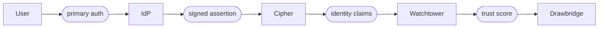

import Tabs from '@theme/Tabs';
import TabItem from '@theme/TabItem';

# موفّرو الهوية

Cipher هو طبقة المصادقة في Sentinel. لا يُخزّن كلمات المرور ولا يُصدر اعتمادات أساسية. بل يتّحد Cipher مع موفّر هوية خارجي، Okta أو Azure AD أو Google Workspace أو أيّ نقطة نهاية OIDC أو SAML متوافقة، ويُترجم تأكيدات موفّر الهوية إلى إشارات هويّة المستخدم التي يستهلكها Watchtower.

التكامل ضيّق عن قصد. يُجيب موفّر الهوية بشكل موثوق عن مَن المستخدم. ويُجيب Cipher بشكل موثوق عمّا إذا كان ذلك المستخدم، على هذا الجهاز، في هذه اللحظة، ينبغي أن يعبر Drawbridge.

## نموذج الاتحاد

يتّبع كلّ تكامل مع موفّر هوية المصافحة الرباعيّة ذاتها. يُصادق المستخدم لدى موفّر الهوية، ثمّ يُرسل موفّر الهوية تأكيداً موقّعاً، ثمّ يتحقّق Cipher من التأكيد ويستخرج مطالبات الهوية، ثمّ يستهلك Watchtower هذه المطالبات بوصفها إشارة هوية المستخدم في درجة الثقة.



لا يُمدّد Cipher جلسة موفّر الهوية أبداً. وحين تنتهي صلاحيّة الرمز الصادر عن موفّر الهوية، يجب على المستخدم إعادة المصادقة لدى موفّر الهوية، لا لدى Cipher. يُبقي هذا مصدر الحقيقة للهوية في مكان واحد.

## الموفّرون المدعومون

| الموفّر          | البروتوكول  | مصدر المجموعات         | التجهيز في الوقت المناسب | رفع MFA   |
|------------------|-------------|------------------------|--------------------------|-----------|
| Okta             | OIDC + SAML | مجموعات Okta           | نعم                      | نعم       |
| Azure AD         | OIDC + SAML | مجموعة أمان AAD        | نعم                      | نعم       |
| Google Workspace | OIDC        | وحدة تنظيمية Workspace | نعم                      | نعم       |
| OIDC عامّ        | OIDC        | مطالبة `groups`        | نعم                      | اختياري   |
| SAML 2.0 عامّ    | SAML        | سمة `memberOf`         | نعم                      | اختياري   |
| مصدر SCIM 2.0    | SCIM (دفع)  | مجموعة SCIM            | قائم على الدفع           | غير منطبق |

تتعامل موصلات OIDC وSAML العامّة مع أيّ موفّر متوافق. استخدمها حين لا يتوفّر موصل مخصّص لموفّر هويتك، أو حين تحتاج إلى الإشارة إلى نقطة نهاية مُستضافة ذاتياً.

## تهيئة موفّر هوية

<Tabs>
<TabItem value="okta" label="Okta" default>

```text title="cipher/okta.grain"
identity_provider "okta-primary" {
  protocol      = "oidc"
  issuer        = "https://yourcompany.okta.com"
  client_id     = ref("secrets/okta_client_id")
  client_secret = ref("secrets/okta_client_secret")

  claims {
    user_id     = "sub"
    email       = "email"
    groups      = "groups"
    mfa_method  = "amr"
  }

  jit_provisioning = true
  step_up_mfa      = true
}
```

تربط كتلة `claims` أسماء مطالبات OIDC بحقول الهوية الداخلية في Cipher. يُصدر Okta مطالبة `amr` (مراجع أساليب المصادقة)، التي يستخدمها Watchtower للتحقّق من قوّة MFA.

</TabItem>
<TabItem value="azure" label="Azure AD">

```text title="cipher/azure-ad.grain"
identity_provider "azure-ad" {
  protocol      = "oidc"
  issuer        = "https://login.microsoftonline.com/{tenant-id}/v2.0"
  client_id     = ref("secrets/aad_client_id")
  client_secret = ref("secrets/aad_client_secret")

  claims {
    user_id     = "oid"
    email       = "preferred_username"
    groups      = "groups"
    mfa_method  = "amr"
  }

  group_resolution {
    // highlight-start
    expand_transitive = true
    overage_strategy  = "graph_api"
    // highlight-end
  }

  jit_provisioning = true
}
```

يقطع Azure AD مطالبة `groups` حين يكون المستخدم عضواً في أكثر من 200 مجموعة. تُوجّه كتلة `overage_strategy = "graph_api"` Cipher إلى الرجوع إلى Microsoft Graph API لحلّ عضوية المجموعات الكاملة.

</TabItem>
<TabItem value="google" label="Google Workspace">

```text title="cipher/google-workspace.grain"
identity_provider "google-workspace" {
  protocol      = "oidc"
  issuer        = "https://accounts.google.com"
  client_id     = ref("secrets/google_client_id")
  client_secret = ref("secrets/google_client_secret")

  claims {
    user_id     = "sub"
    email       = "email"
    hd          = "hd"          # hosted domain
  }

  group_resolution {
    source         = "admin_sdk"
    delegated_user = "sentinel-sync@yourcompany.com"
  }

  jit_provisioning = true
}
```

لا يُصدر Google Workspace مجموعات في رمز OIDC. يحلّ Cipher عضوية المجموعات عبر Admin SDK بحساب خدمة مُفوَّض. وتُفرض مطالبة `hd` لرفض تسجيلات الدخول من حسابات Google الخارجية.

</TabItem>
<TabItem value="generic" label="OIDC عامّ">

```text title="cipher/generic-oidc.grain"
identity_provider "internal-keycloak" {
  protocol      = "oidc"
  issuer        = "https://auth.yourcompany.internal"
  client_id     = ref("secrets/keycloak_client_id")
  client_secret = ref("secrets/keycloak_client_secret")

  discovery_url = "https://auth.yourcompany.internal/.well-known/openid-configuration"

  claims {
    user_id     = "sub"
    email       = "email"
    groups      = "realm_access.roles"
    mfa_method  = "amr"
  }

  trust_root = "/etc/sentinel/certs/keycloak-ca.pem"
}
```

يتّبع موصل OIDC العامّ وثيقة الاكتشاف في نقطة النهاية المعروفة. يقبل حقل `trust_root` حزمة CA مخصّصة للشهادات الموقّعة ذاتياً على موفّري الهوية الداخليّين.

</TabItem>
</Tabs>

:::info موفّر أساسي واحد، عدة ثانويّين
يدعم Sentinel موفّر هوية أساسياً واحداً فقط لكلّ مستأجر. يمكن تهيئة موفّري هوية ثانويّين لفئات محدّدة من المستخدمين، المتعاقدين أو الشركاء أو المسؤولين في حالات الطوارئ، لكنّ موفّر الهوية الأساسي هو المصدر الموثوق لرسم خرائط هويّات الموظّفين.

:::

## ربط السياسات بمجموعات موفّر الهوية

تُشير سياسات الثقة إلى مجموعات موفّر الهوية مباشرة عبر شرط `user.groups`. اسم المجموعة هو القيمة كما يُصدرها موفّر الهوية بعد ربط Cipher للمطالبات:

```text title="policies/group-scoped-access.grain"
policy "platform-team-access" {
  resource = "platform-services"
  effect   = "allow"

  conditions {
    user.groups      = ["platform-engineering", "sre"]
    device.posture   >= 85
    user.mfa         = true
  }

  on_failure {
    action = "revoke"
    log    = "spyglass"
  }
}
```

يُطابق الشرط أيّ مستخدم تتضمّن مطالبة مجموعات موفّر هويته إمّا `platform-engineering` أو `sre`. تُعاد عضوية المجموعات في كلّ دورة Watchtower، المستخدم الذي يُزال من المجموعة في موفّر الهوية يفقد الوصول خلال 90 ثانية دون أيّ إجراء من جهة Sentinel.

:::warning تأخّر حلّ المجموعات
تُقيس دورة الـ 90 ثانية وتيرة تقييم Watchtower، لا تأخّر انتشار موفّر الهوية. وإن استغرق موفّر الهوية نفسه دقائق لانتشار تغييرات المجموعات، فإنّ ذلك التأخّر يُضاف فوقها. للمجموعات عالية المخاطر، اضبط موفّر الهوية لانتشار فوري للمجموعات، أو استخدم موصل SCIM للتحديثات القائمة على الدفع.
:::

## تجهيز المستخدمين في الوقت المناسب

حين يُصادق مستخدم لأوّل مرّة عبر موفّر هوية مُتّحد، يُنشئ Cipher سجلّ هوية في جانب Sentinel تلقائياً. لا يلزم إنشاء حساب مُسبقاً.

```text title="JIT provisioning event"
[14:22:03] CIPHER user authentication
  IdP:           okta-primary
  Subject:       00uX2Y4Z1A3B
  Email:         m.torres@yourcompany.com
  Groups:        [engineering, oncall-secondary]
  MFA method:    [pwd, otp]

[14:22:03] CIPHER JIT provisioning
  Created Sentinel identity: usr_8a3f7c2b
  Mapped groups: engineering → policy.engineering-access
                 oncall-secondary → policy.oncall-tier-2

[14:22:04] WATCHTOWER initial evaluation
  Trust score: 88
  Result:      GRANT api-cluster-east (tunnel tun_9f4a)
```

لا يمنح التجهيز في الوقت المناسب وصولاً بمفرده. تخضع الهوية الجديدة لكلّ سياسة ثقة معمول بها، الوضع الأمني للجهاز، وقوّة MFA، وعضوية المجموعات، وأيّ شرط آخر. التجهيز في الوقت المناسب يُزيل فقط الاحتكاك التشغيلي لإنشاء الحسابات مُسبقاً.

## بوّابات الوصول المشروط

يُقيّم Cipher الإشارات الصادرة عن موفّر الهوية بوصفها بوّابات وصول مشروط قبل أن يصل المستخدم إلى Drawbridge. تُنتج بوّابة مُخفقة فشلَ مصادقة، لا نفقاً مُلغى:

| البوّابة          | مطالبة المصدر             | نمط الإخفاق           |
|-------------------|---------------------------|-----------------------|
| قوّة MFA          | `amr` / `acr`             | مطالبة برفع MFA       |
| درجة مخاطر الحساب | إشارة مخاطر موفّر الهوية  | المصادقة مرفوضة       |
| تقييد جغرافي      | مطالبة موقع موفّر الهوية  | المصادقة مرفوضة       |
| ربط الجهاز        | شهادة جهاز موفّر الهوية   | الرفع إلى جهاز مربوط  |
| عمر الجلسة        | `auth_time` لموفّر الهوية | إعادة مصادقة إجباريّة |

تُهيَّأ البوّابات المشروطة لكلّ موفّر هوية، وتُطبَّق بشكل موحّد على جميع السياسات التي تُشير إلى مجموعات ذلك الموفّر. وتبقى الشروط الخاصّة بالموارد من مسؤوليّة سياسات الثقة.

```text title="cipher/conditional-gates.grain"
gates "okta-primary" {
  mfa_strength {
    require = ["hwk", "fido"]
    fallback {
      action  = "step_up"
      methods = ["push", "otp"]
    }
  }

  risk_threshold {
    max_score = 70
    on_exceed = "reject"
  }

  geo_restriction {
    allow = ["US", "CA", "GB", "DE"]
    on_deny = "reject"
  }
}
```

## تجهيز SCIM

للبيئات عالية التغيّر، يُلغي تجهيز الدفع بـ SCIM 2.0 تأخّر الانتشار الكامن في حلّ المجموعات القائم على السحب. يدفع موفّر الهوية تغييرات المستخدمين والمجموعات إلى نقطة نهاية SCIM في Cipher فور حدوثها:

```bash title="تسجيل نقطة نهاية SCIM"
sentinel cipher scim register \
  --provider okta-primary \
  --token-ttl 365d
```

```text title="مخرجات نقطة نهاية SCIM"
SCIM 2.0 endpoint registered

  URL:           https://sentinel.yourcompany.internal/scim/v2
  Token:         scim_8f3a2b9c4e1d... (single display, store securely)
  Token TTL:     365d

  Supported operations:
    Users:   CREATE, READ, UPDATE, DELETE
    Groups:  CREATE, READ, UPDATE, DELETE
    Schema:  urn:ietf:params:scim:schemas:core:2.0:User
             urn:ietf:params:scim:schemas:core:2.0:Group
```

تُطبَّق أحداث SCIM على رسم خرائط هويّات Sentinel خلال ثوانٍ من دفع موفّر الهوية. المستخدم الذي يُزال من مجموعة عبر SCIM يفقد الوصول في دورة Watchtower التالية، عادةً أسرع من وتيرة السحب البالغة 90 ثانية.

## تدقيق أحداث موفّر الهوية

يمرّ كلّ حدث مصادقة عبر Spyglass مع موفّر الهوية الأصلي ومُعرّف الموضوع ومجموعة المجموعات المحلولة:

```bash title="تدقيق أحداث مصادقة موفّر الهوية"
sentinel spyglass query \
  --event-type cipher-auth \
  --idp okta-primary \
  --period "2025-06-01..2025-06-30"
```

يُعيد الاستعلام السلسلة الكاملة، تأكيد موفّر الهوية المتلقّى، والمطالبات المُستخرجة، والتجهيز في الوقت المناسب (إن كان منطبقاً)، وتقييم البوّابة المشروطة، ودرجة ثقة Watchtower الناتجة. تكامل موفّر الهوية ليس صندوقاً أسود، كلّ تأكيد قابل للتدقيق.

## الخطوات التالية

- [موصلات EDR](/docs/integrations/edr-connectors/)، كيف يربط Watchtower إشارات الوضع الأمني للجهاز من منصّات EDR بإشارات الهوية الموصوفة هنا.
- [التحكّم في الوصول](/docs/trust/access-control/)، كيف يُترجم Drawbridge عضوية مجموعات موفّر الهوية إلى قرارات وصول ملموسة.
- [مرجع API](/docs/reference/api-reference/)، الإدارة البرمجيّة لتهيئة موفّر هوية Cipher ونقاط نهاية SCIM.
