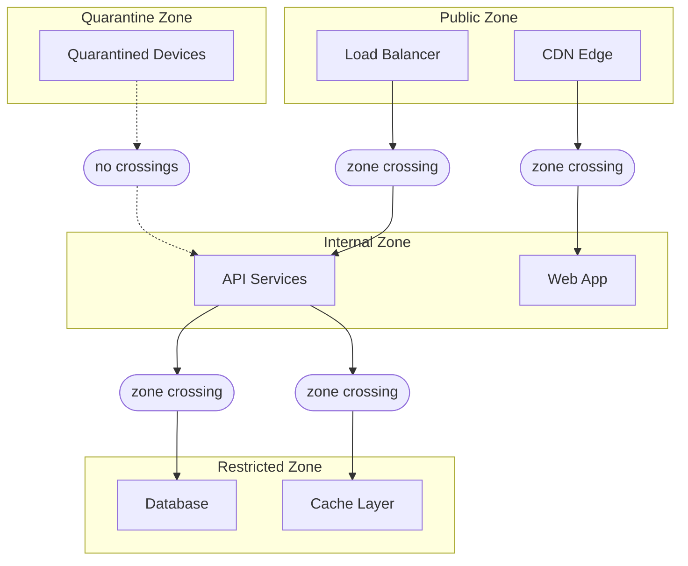

# التجزئة الدقيقة

Rampart هو طبقة التجزئة الدقيقة في Sentinel. يعزل أعباء العمل في مناطق منفصلة، بحيث يكون التنقّل الجانبي بينها مستحيلاً افتراضياً. وحتى إن اخترق المهاجم منطقة واحدة، يظلّ الاختراق محتوى. ولا تثق أيّ منطقة بأيّ منطقة أخرى دون قاعدة عبور صريحة خاضعة لتقييم السياسة.

## بنية المناطق

يُقسّم Rampart بنيتك التحتيّة إلى أربعة أنواع من المناطق، لكلّ نوع خصائص ثقة افتراضيّة مختلفة:



| نوع المنطقة      | الثقة الافتراضية | الوارد                        | الصادر                            |
|------------------|------------------|-------------------------------|-----------------------------------|
| **العامّة**      | لا توجد          | حركة بيانات خارجية مسموح بها  | مناطق داخلية عبر قواعد العبور     |
| **الداخلية**     | منخفضة           | مناطق عامّة عبر قواعد العبور  | مناطق مقيّدة عبر قواعد العبور     |
| **المقيّدة**     | لا توجد          | مناطق داخلية عبر قواعد العبور | لا حركة صادرة مسموح بها افتراضياً |
| **الحجر الصحّي** | لا توجد          | لا حركة واردة مسموح بها       | لا حركة صادرة مسموح بها           |

## تعريف المناطق

تُصرَّح المناطق بصيغة `.grain` وتُطبَّق على أعباء العمل عبر وسم المورد:

```text title="zones/production.grain"
zone "api-services" {
  type     = "internal"
  workloads = ["api-east-*", "api-west-*"]

  ingress {
    allow_from = ["public-edge"]
    require_policy = "api-access"
  }

  egress {
    allow_to = ["data-layer"]
    require_policy = "data-access"
  }
}

zone "data-layer" {
  type     = "restricted"
  workloads = ["db-primary", "db-replica-*", "cache-*"]

  ingress {
    allow_from = ["api-services"]
    require_policy = "data-access"
  }

  egress {
    allow_to = []
  }
}
```

يتطلّب كلّ عبور بين المناطق قاعدة بنيوية (تصاريح `ingress`/`egress`) وتقييم سياسة ثقة معاً. وحتى إن سمحت القاعدة البنيوية بالعبور، يُقيّم Drawbridge السياسة المُحدّدة قبل فتح نفق Filament.

## منع التنقّل الجانبي

يحدث التنقّل الجانبي حين ينتقل المهاجم من نظام مُخترق إلى آخر داخل الشبكة. في الشبكة المسطّحة، يستطيع كلّ نظام الوصول إلى كلّ نظام آخر. أمّا في شبكة مُجزّأة بـ Rampart، فكلّ قفزة تتطلّب عبور منطقة، وكلّ عبور منطقة يتطلّب تقييم سياسة.

تأمّل مهاجماً يخترق خدمة في منطقة `api-services`:

| مسار الهجوم           | الشبكة المسطّحة | Rampart المُجزّأ         |
|-----------------------|-----------------|--------------------------|
| API → قاعدة البيانات  | وصول مباشر      | عبور منطقة، سياسة مطلوبة |
| API → أدوات المسؤولين | وصول مباشر      | لا قاعدة عبور، محجوب     |
| API → خدمة API أخرى   | وصول مباشر      | المنطقة ذاتها، مسموح     |
| API → مستوى التحكّم   | وصول مباشر      | لا قاعدة عبور، محجوب     |

يستطيع المهاجم الوصول إلى خدمات أخرى داخل المنطقة ذاتها لكنّه لا يستطيع الخروج منها. لا توجد قاعدة عبور من `api-services` إلى `admin-tools` أو `control-plane`، فيُرفض طلب نفق Filament قبل وصوله إلى Drawbridge.

:::warning دقّة المناطق
يُنتج التجزئة المُفرطة احتكاكاً تشغيلياً. أمّا التجزئة الناقصة فترفع نصف قطر الانفجار. النهج الموصى به هو التجزئة بحسب مستوى الثقة وحساسيّة البيانات، لا بحسب الفريق أو اسم الخدمة. ينبغي أن تحتوي المنطقة على أعباء عمل تثق ببعضها بعضاً، ولا شيء سواها.
:::

## قواعد عبور المناطق

تُحدّد قواعد العبور المسار البنيوي بين المناطق. ولا تمنح وصولاً، بل تُمكّن Drawbridge من تقييم سياسة لذلك المسار:

```text title="crossings/api-to-data.grain"
crossing "api-to-data" {
  source = "api-services"
  target = "data-layer"
  policy = "data-access"

  constraints {
    max_concurrent = 100
    timeout        = 30
    protocol       = ["filament"]
  }
}
```

يحدّ قيد `max_concurrent` عدد أنفاق Filament المتزامنة بين المنطقتين. ويُغلق `timeout` الأنفاق الخاملة بعد 30 ثانية. تعمل هذه القيود باستقلال عن سياسة الثقة، فهي حدود بنيوية على حدود المنطقة.

## منطقة الحجر الصحّي

تُنقل الأجهزة التي تُخفق فحص امتثال Garrison أو تقلّ عن الحدّ الأدنى لعتبة الوضع الأمني تلقائياً إلى منطقة الحجر الصحّي. ولا تستطيع الأجهزة المحجورة الوصول إلى أيّ منطقة أخرى:

```text title="Quarantine output"
Garrison posture check: dev_a9c1e3f5b7d4
  Posture score: 62 (threshold: 80)
  Failing checks:
    - OS patch level: 47 days stale (max: 30)
    - Antivirus definitions: 12 days stale (max: 3)

  Action: device moved to quarantine zone
  Access: all Filament tunnels terminated
  Remediation: update OS patches and antivirus definitions
```

يبقى الجهاز في الحجر الصحّي حتى يُؤكّد Garrison أنّ جميع متطلّبات مُلفّ الامتثال مستوفاة. وعند ذلك، يُعاد الجهاز إلى منطقته الأصلية ويسير تقييم Watchtower التالي بشكل طبيعي.

## الخطوات التالية

- [التدقيق والتحقيق الجنائي](/docs/operations/audit-forensics/)، كيف يُسجّل Spyglass أحداث عبور المناطق ونشاط الأنفاق.
- [محاكاة السياسة](/docs/operations/policy-simulation/)، اختبر تغييرات طوبولوجيا المناطق بـ Parapet قبل النشر.
- [التحكّم في الوصول](/docs/trust/access-control/)، كيف يُقيّم Drawbridge سياسات العبور.
