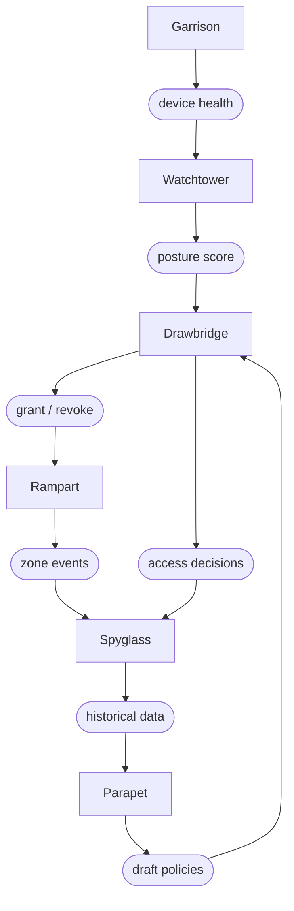

# نظرة عامة على المنصة

Sentinel محرّك ثقة للفرق الموزّعة. يُقيّم باستمرار ما إذا كان ينبغي للشخص والجهاز والسياق أن يحتفظوا بحق الوصول، ويُلغي هذا الحق في اللحظة التي تتغيّر فيها الإجابة. الوصول ليس باباً تفتحه مرّة واحدة، بل حوار لا ينقطع.

> "ذاب المحيط الدفاعي منذ سنوات. ونحن توقّفنا عن التظاهر بأنّه لم يَذُب."

## البنية المعمارية

تتألّف منصّة Sentinel من ستة مكوّنات تعمل بوصفها حلقة ثقة مستمرّة. يُراقب Watchtower، ويُطبّق Drawbridge القرارات، ويُدير Garrison نقاط النهاية، ويُجزّئ Rampart أعباء العمل، ويُدقّق Spyglass، ويُحاكي Parapet.

## المكوّنات

| المكوّن        | الغرض                                                                                                     |
|----------------|-----------------------------------------------------------------------------------------------------------|
| **Watchtower** | تقييم مستمرّ للوضع الأمني، يُقيّم صحّة الجهاز والموقع والسلوك كلّ 90 ثانية.                               |
| **Drawbridge** | بوّابة وصول تكيّفية، تمنح الوصول أو تُضيّقه أو تُلغيه آنياً بناءً على السياق.                             |
| **Garrison**   | محرّك امتثال لنقاط النهاية، يُطبّق السياسة على كلّ جهاز متّصل قبل منح الوصول.                             |
| **Rampart**    | طبقة تجزئة دقيقة، تعزل أعباء العمل بحيث يصبح التنقّل الجانبي بين المناطق مستحيلاً.                        |
| **Spyglass**   | التدقيق والتحقيقات الجنائية، إعادة بناء كاملة للجلسات مع احتفاظ غير قابل للتعديل بالسجلّات لمدّة 7 سنوات. |
| **Parapet**    | بيئة محاكاة معزولة للسياسات، اختبر قواعد الوصول مقابل حركة بيانات حقيقية قبل تطبيقها.                     |

## كيف يعمل

يتّبع كلّ قرار وصول في Sentinel الدورة ذاتها:

1. يُبلّغ **Garrison** عن الوضع الأمني للجهاز، إصدار نظام التشغيل، وتشفير القرص، وحالة جدار الحماية، ومستوى الترقيعات.
2. يحسب **Watchtower** درجة ثقة من الوضع الأمني للجهاز، وهويّة المستخدم، والسياق الشبكي، والإشارات السلوكية.
3. يُقيّم **Drawbridge** درجة الثقة مقابل السياسة المعمول بها، ثمّ يمنح الوصول أو يُضيّقه أو يُلغيه.
4. يُطبّق **Rampart** حدود المناطق، بحيث يبقى الوصول الممنوح محصوراً ضمن قطاع عبء العمل الصحيح.
5. يُسجّل **Spyglass** سلسلة القرار بأكملها، تسجيلاً غير قابل للتعديل، لمدّة سبع سنوات.
6. تتكرّر هذه الدورة كلّ 90 ثانية لكلّ جلسة نشطة.

:::info مستمرّ لا دوري
لا يفحص Sentinel الثقة مرّة واحدة عند تسجيل الدخول. بل يُعيد تقييم كلّ جلسة نشطة كلّ 90 ثانية. وإن خرج جهاز عن الامتثال أثناء الجلسة، يُلغى الوصول قبل أن يكتمل الطلب التالي.
:::

## درجة الثقة

تُحسب درجة الثقة من أربع فئات إشارات موزونة:

| الفئة                   | الوزن | الإشارات                                                       |
|-------------------------|-------|----------------------------------------------------------------|
| **الوضع الأمني للجهاز** | 40%   | إصدار نظام التشغيل، تشفير القرص، جدار الحماية، مستوى الترقيعات |
| **هوية المستخدم**       | 30%   | قوّة المصادقة، تسجيل MFA، مخاطر الحساب                         |
| **السياق الشبكي**       | 20%   | سمعة عنوان IP المصدر، الموقع الجغرافي، نوع الاتصال             |
| **الإشارات السلوكية**   | 10%   | شذوذ نمط الوصول، حجم البيانات، الوقت من اليوم                  |

تُحدّد السياسات عتبة دنيا للدرجة. وإذا انخفضت الدرجة المركّبة دون العتبة، يُلغي Drawbridge الوصول فوراً ويُطالب بإعادة المصادقة.

## الخطوات التالية

- [التثبيت](/docs/getting-started/installation/)، نشر وكيل Sentinel عبر Spark أو Vial أو Arcline.
- [سياستك الأولى](/docs/getting-started/your-first-policy/)، اكتب سياسة ثقة وراقب Watchtower يُقيّمها.
- [سياسات الثقة](/docs/trust/trust-policies/)، تعمّق في قواعد السياسة وشروطها وقابلية تركيبها.
- [مرجع API](/docs/reference/api-reference/)، وثائق Spoke API الكاملة لإدارة السياسات وتصدير التدقيق.
