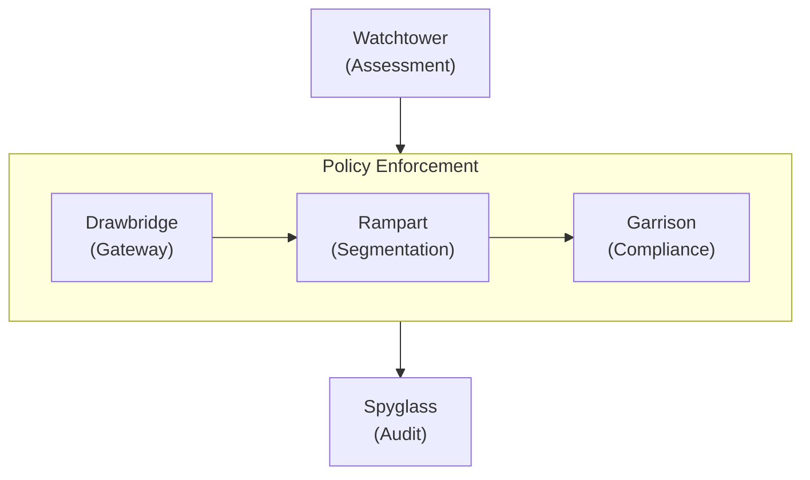
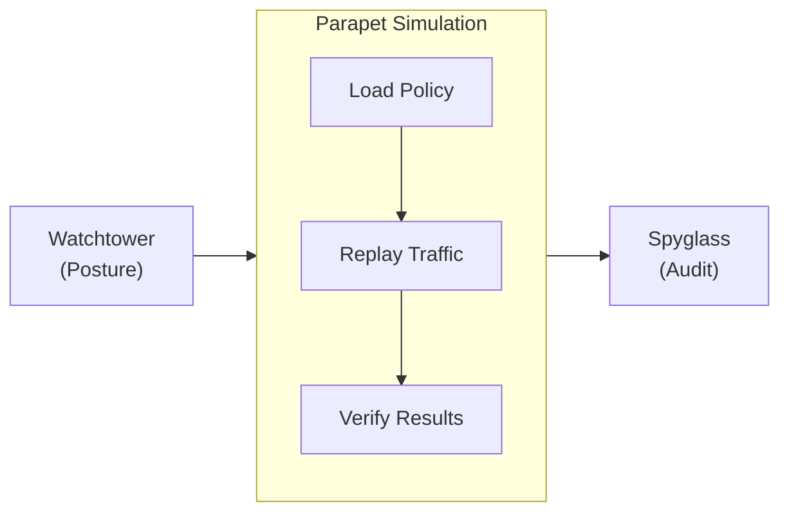
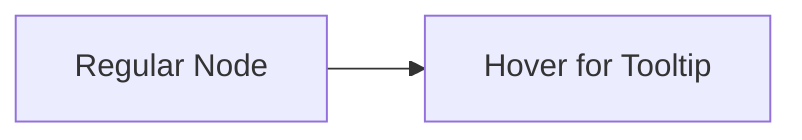

import Details from '@theme/Details';
import Tabs from '@theme/Tabs';
import TabItem from '@theme/TabItem';

# عرض السمة

تستعرض هذه الصفحة كلّ مكوّن سمة متاح في الإعداد المسبق لـ Docusaurus. استخدمها بوصفها دليل أسلوب حيّاً عند بناء صفحات التوثيق.

## العناوين

تُظهر تسلسل العناوين أدناه كيف يُعرض كلّ مستوى. استخدم `h2` حتى `h4` لبنية الصفحة. واحتفظ بـ `h5` و`h6` لحالات نادرة يستلزم فيها التداخل العميق ذلك فعلاً.

### عنوان من المستوى الثالث

#### عنوان من المستوى الرابع

##### عنوان من المستوى الخامس

###### عنوان من المستوى السادس

---

## تنسيق النصّ المضمَّن

يُعرض نصّ الفقرة العادي بخطّ المتن الأساسي. اجعل الفقرات قصيرة، من جملتين إلى أربع جمل مثالي للتوثيق التقني.

**النصّ الغامق** يلفت الانتباه إلى المصطلحات الرئيسية عند أوّل استخدام. *النصّ المائل* مفيد لتقديم المصطلحات أو الإشارة إلى العناوين. ~~النصّ المشطوب~~ يُعلِّم محتوى لم يعد دقيقاً أو حلّ محلّه غيره. ويمكن أيضاً الجمع بين **_الغامق والمائل_** حين يكون التأكيد ضرورياً.

`الكود` المضمَّن للإشارة إلى أسماء الدوال مثل `evaluatePolicy`، أو مسارات الملفّات مثل `trust-policy.grain`، أو علامات سطر الأوامر مثل `--dry-run`.

---

## الروابط

تشير الروابط الداخلية إلى صفحات أخرى ضمن موقع التوثيق هذا:

- [نظرة عامة](/docs/overview/)، الصفحة الأولى التي ينبغي للمستخدمين الجدد قراءتها.
- [دليل التثبيت](/docs/getting-started/installation/)، المتطلّبات وخطوات الإعداد.

تشير الروابط الخارجية إلى موارد خارج الموقع:

- [مرجع بروتوكول Filament](https://nova.cbnventures.io)، وثائق Filament الرسمية.
- [سوق Arcline Cloud](https://nova.cbnventures.io)، انشر Sentinel من السوق.

---

## القوائم

### قائمة غير مرتّبة

- يُقيّم Watchtower الوضع الأمني للجهاز كلّ 90 ثانية دون استثناء.
- يفرض Drawbridge قرارات الوصول آنياً استناداً إلى درجات الثقة المستمرّة.
- تمنع مناطق Rampart التنقّل الجانبي بين قطاعات أعباء العمل المعزولة.
- يحتفظ Spyglass بسجلّات تدقيق غير قابلة للتعديل لمدّة 7 سنوات.

### قائمة مرتّبة

1. ثبّت وكيل Sentinel عبر Spark.
2. سجّل في مستوى التحكّم لديك باستخدام رمز تسجيل.
3. اكتب سياسة ثقة بصيغة `.grain` تُحدّد شروط الوصول.
4. شغّل `sentinel policy validate` للتحقّق من صيغة السياسة.
5. شغّل `sentinel policy apply` لبدء الفرض.

### القوائم المتداخلة

- **أوامر CLI**
  - السياسة
    - `sentinel policy validate`، تحقّق من صيغة السياسة قبل التطبيق.
    - `sentinel policy apply`، طبّق سياسة مُتحقَّق منها على الإنتاج.
    - `sentinel policy list`، اعرض جميع السياسات النشطة وحالتها.
  - المراقبة
    - `sentinel watchtower watch`، راقب تقييمات الوضع الأمني المباشرة.
    - `sentinel drawbridge watch`، راقب قرارات الوصول آنياً.
- **فئات المكوّنات**
  - Trust، السياسات، وتسجيل الأجهزة، والتحكّم في الوصول.
  - العمليّات، التجزئة الدقيقة، والتدقيق، والمحاكاة.
  - المرجع، نقاط نهاية API، وأوامر CLI.

---

## الاقتباسات

> الثقة ثغرة. الافتراض الآمن الوحيد هو أنّ كلّ افتراض غير آمن.

تعمل الاقتباسات المتداخلة للإسناد أو التعليق اللاحق:

> ذاب المحيط الدفاعي منذ سنوات. ونحن توقّفنا عن التظاهر بأنّه لم يَذُب.
>
> > لذلك يُقيّم Sentinel باستمرار، يُزيل افتراض الثقة قبل أن يصير عبئاً.

---

## كتل الكود

### إبراز الصياغة

سياسة Grain مع شريط عنوان:

```text title="policies/api-access.grain"
policy "api-cluster-access" {
  resource = "api-cluster-east"
  effect   = "allow"
  priority = 100

  conditions {
    device.posture   >= 85
    user.mfa         = true
    user.role        = ["engineer", "sre"]
    network.location = ["office", "vpn"]
  }

  on_failure {
    action = "revoke"
    notify = "security-ops"
    log    = "spyglass"
  }
}
```

CSS مع أرقام الأسطر:

```css showLineNumbers title="src/styles/base.css"
:root {
  --color-primary: oklch(0.55 0.18 260);
  --color-surface: oklch(0.98 0 0);
  --color-text: oklch(0.15 0 0);
  --spacing-base: 0.5rem;
  --radius-md: 0.375rem;
}

.container {
  max-width: 72rem;
  margin-inline: auto;
  padding-inline: var(--spacing-base);
}
```

استجابة JSON من API:

```json title="Spoke API — policy evaluation"
{
  "policy_id": "pol_8a3f7b2c9d1e",
  "resource": "api-cluster-east",
  "result": "pass",
  "score": 92,
  "conditions_met": 4,
  "conditions_total": 4,
  "next_evaluation": "90s"
}
```

أوامر Spark:

```bash
# Install the Sentinel agent and register
spark install sentinel-agent
sentinel-agent register --control-plane sentinel.internal

# Validate and apply a trust policy
sentinel policy validate policies/api-access.grain
sentinel policy apply policies/api-access.grain
```

### إبراز الأسطر

استخدم تعليقات `highlight-next-line` و`highlight-start` و`highlight-end` لجذب الانتباه إلى أسطر محدّدة:

```text title="policies/production-access.grain"
policy "production-access" {
  extends  = "base-access"
  resource = "production-*"

  // highlight-start
  conditions {
    device.posture   >= 90
    network.location = ["office"]
    session.age      <= 3600
  }
  // highlight-end

  on_failure {
    action = "revoke"
    // highlight-next-line
    step_up = "mfa"
  }
}
```

### إبراز الفرق

أظهر الإضافات والإزالات داخل كتلة كود:

```text title="policies/api-access.grain"
policy "api-cluster-access" {
// remove-start
  conditions {
    device.posture >= 70
  }
// remove-end
// add-start
  conditions {
    device.posture   >= 85
    user.mfa         = true
    session.age      <= 3600
  }
// add-end
}
```

---

## التنبيهات

:::note
تُقدّم الملاحظات سياقاً تكميلياً مفيداً لكنّه غير جوهري. يستطيع القارئ تجاوزها دون أن يفوته شيء حرج.
:::

:::tip
تشارك النصائح أفضل الممارسات أو الاختصارات التي تُوفّر الوقت. مثلاً، شغّل `sentinel parapet dry-run` لاختبار تغيير سياسة مقابل جميع الجلسات النشطة قبل تطبيقه.
:::

:::info
تُبرز كتل المعلومات تفاصيل خلفية تُساعد على الفهم. يُقيّم نموذج الثقة في Sentinel أربع فئات إشارات، الوضع الأمني للجهاز، وهوية المستخدم، والسياق الشبكي، والإشارات السلوكية، كلّ 90 ثانية.
:::

:::warning
تُعلِّم التحذيرات المزالق المحتملة. يُؤدّي تغيير مُلفّ امتثال إلى إعادة تقييم بأثر رجعي لجميع الأجهزة المرتبطة بذلك المُلفّ. شغّل محاكاة Parapet أوّلاً لمعرفة الأثر.
:::

:::danger
تُعلِّم كتل الخطر الإجراءات التي قد تُسبّب انقطاع الوصول. يُؤدّي تطبيق سياسة بعتبة وضع أمني تفوق متوسّط الأسطول إلى إلغاء فوري للوصول عن الأجهزة غير الممتثلة دون فترة سماح.
:::

:::tip[عنوان مخصّص]
تقبل التنبيهات عنواناً مخصّصاً بين أقواس مربّعة بعد الكلمة المفتاحية. استخدم هذا لجعل العنوان أكثر تحديداً للمحتوى.
:::

---

## التفاصيل / الأقسام القابلة للطيّ

<Details>
<summary>ما إصدارات بروتوكول Filament المدعومة؟</summary>

يتطلّب Sentinel 3.x إصدار بروتوكول Filament 2.0 أو أحدث. لا تدعم إصدارات Filament الأقدم قناة قياسات الوضع الأمني المُشفّرة التي يستخدمها Garrison للإبلاغ عن صحّة الجهاز. تحقّق من إصدارك بـ `filament --version`.

</Details>

<Details>
<summary>كيف تتركّب سياسات الثقة؟</summary>

تستطيع السياسات أن ترث من سياسة أمّ باستخدام الكلمة المفتاحية `extends`. ترث السياسة الفرعية جميع الشروط من الأم، وتستطيع إضافة شروط محدّدة أو تجاوزها:

```text title="policies/production-access.grain"
policy "production-access" {
  extends  = "base-access"
  resource = "production-*"

  conditions {
    device.posture >= 90
    session.age    <= 3600
  }
}
```

ترث السياسة الفرعية `user.mfa = true` من الأم، وتُضيف متطلّباتها الخاصّة بالوضع الأمني وعمر الجلسة.

</Details>

---

## التبويبات

<Tabs>
<TabItem value="spark" label="Spark" default>

```bash
spark install sentinel-agent
```

</TabItem>
<TabItem value="vial" label="Vial Container">

```bash
vial pull sentinel/agent:latest
```

</TabItem>
<TabItem value="arcline" label="Arcline Marketplace">

```bash
arcline deploy sentinel-agent --region us-east-1
```

</TabItem>
</Tabs>

<Tabs>
<TabItem value="policy" label="سياسة الثقة" default>

```text title="policies/access.grain"
policy "service-access" {
  resource = "api-services"
  effect   = "allow"

  conditions {
    device.posture >= 80
    user.mfa       = true
  }
}
```

</TabItem>
<TabItem value="zone" label="منطقة Rampart">

```text title="zones/internal.grain"
zone "api-services" {
  type     = "internal"
  workloads = ["api-east-*", "api-west-*"]

  ingress {
    allow_from = ["public-edge"]
  }
}
```

</TabItem>
</Tabs>

---

## الجداول

| المكوّن    | فاصل التقييم | مصدر البيانات           | الوصف                                                |
|------------|--------------|-------------------------|------------------------------------------------------|
| Watchtower | 90s          | Garrison، الشبكة        | تقييم مستمرّ للوضع الأمني والسياق.                   |
| Drawbridge | آنيّ         | Watchtower              | قرارات منح الوصول أو تضييقه أو إلغائه.               |
| Garrison   | مستمرّ       | قياسات الوكيل           | مراقبة صحّة الجهاز والامتثال.                        |
| Rampart    | عند العبور   | Drawbridge              | فرض حدود المنطقة وعزلها.                             |
| Spyglass   | إضافة فقط    | جميع المكوّنات          | سجلّ تدقيق غير قابل للتعديل مع احتفاظ لمدّة 7 سنوات. |
| Parapet    | عند الطلب    | Spyglass، حركة البيانات | محاكاة السياسة وتحليل الأثر.                         |

جدول بسيط من عمودين:

| الاختصار                                          | الإجراء      |
|---------------------------------------------------|--------------|
| <kbd>Ctrl</kbd> + <kbd>C</kbd>                    | نسخ          |
| <kbd>Ctrl</kbd> + <kbd>V</kbd>                    | لصق          |
| <kbd>Ctrl</kbd> + <kbd>Shift</kbd> + <kbd>P</kbd> | لوحة الأوامر |

---

## الصور

تستخدم الصور صيغة Markdown القياسية. ضع الملفّات في دليل `static/img/` وأشر إليها بمسار مطلق:

```markdown

```

---

## مخطّطات Mermaid

تُعرض مخطّطات Mermaid مباشرة من كتل كود محصورة. يُطبّق الإعداد المسبق ألواناً مدركة للسمة، وحواف عناقيد مدوّرة، ومنحنيات حواف سلسة تلقائياً.

### مخطّط رأسي مع عنقود أفقي



### مخطّط أفقي مع عنقود رأسي



### تلميح المسبار



---

## الفواصل الأفقيّة

تفصل الفواصل الأفقيّة الأقسام الرئيسيّة. تُعرض بخطّ رفيع يمتدّ على عرض المحتوى. الشرطات الثلاث (`---`) أعلى وأسفل كلّ قسم في هذه الصفحة فواصل أفقيّة.

---

## اختصارات لوحة المفاتيح

استخدم وسوم `<kbd>` لعرض مفاتيح لوحة المفاتيح مضمَّنة:

- <kbd>Ctrl</kbd> + <kbd>S</kbd>، احفظ الملفّ الحالي.
- <kbd>Ctrl</kbd> + <kbd>Shift</kbd> + <kbd>F</kbd>، ابحث في مساحة العمل بأكملها.
- <kbd>Ctrl</kbd> + <kbd>`</kbd>، بدّل الطرفية المدمجة.
- <kbd>Alt</kbd> + <kbd>Up</kbd> / <kbd>Down</kbd>، حرّك سطراً إلى الأعلى أو الأسفل.
- <kbd>Ctrl</kbd> + <kbd>D</kbd>، حدّد التواجد التالي للكلمة الحالية.

على macOS، استبدل <kbd>Ctrl</kbd> بـ <kbd>Cmd</kbd> لمعظم الاختصارات.
