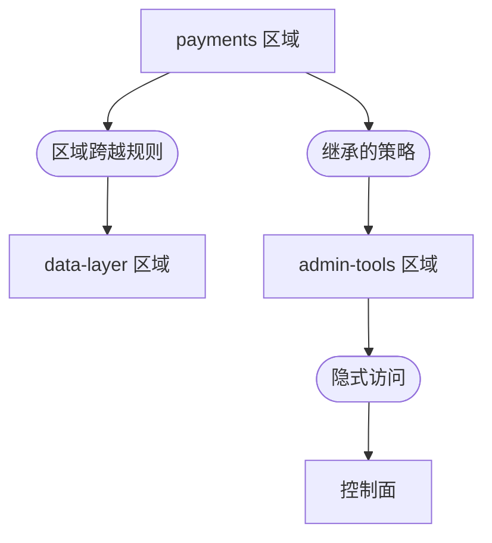

上个月我们在预发环境抓到了一条横向移动路径。没有真实入侵，没有告警响起。Parapet 在一次常规策略仿真中发现了它——一个服务账号隐式获得了访问权，触达了它本不该触达的 Rampart 区域。

{/* truncate */}

## 背景

我们在 `payments` 区域里部署了一个新的微服务。它需要访问 `data-layer` 区域里的共享缓存，于是一位工程师加了一条区域跨越规则。规则本身是对的。工程师没意识到的是，这个服务账号还从 `internal-services` 组继承了第二条信任策略——而那条策略也授予了对 `admin-tools` 区域的访问。

路径长这样：



一个被攻陷的 `payments` 服务，最多两跳就能到达控制面。在传统网络里，这会一直隐形——直到攻击者去利用它。借助 Parapet，我们在它产生影响之前就发现了它。

## 运行仿真

Parapet 会用真实的 Filament 隧道流量回放、对照草案策略或现有策略进行评估。我们把新的区域跨越规则纳入仿真，针对生产策略集执行：

```bash title="Parapet 仿真命令"
sentinel parapet simulate \
  --policy-set production \
  --include draft:payments-cache-access \
  --traffic-source staging-replay \
  --duration 24h
```

仿真处理了过去 24 小时预发流量中的 84.7 万条连接记录，耗时 11 分钟。

```text title="仿真输出"
Parapet 仿真报告
  策略集：       production + draft:payments-cache-access
  流量来源：     staging-replay（847,291 次连接）
  时长：         24 小时回放在 11 分 14 秒内完成

  结果：
    评估连接数：    847,291
    授予访问：      812,447 (95.9%)
    拒绝访问：      34,844 (4.1%)

  检测到异常：1
    LATERAL-MOVEMENT-PATH
    源：     svc-payments（payments 区域）
    路径：   payments → data-layer → admin-tools → 控制面
    途径：   继承策略 "internal-services-baseline"
    风险：   CRITICAL —— 从应用区域可达控制面
```

一个异常，一条路径，一下午就能修。

## 修复

我们收窄了 `internal-services-baseline` 策略，使其在源自应用区域的服务账号场景下，排除对 `admin-tools` 区域的访问：

```text title="trust-policy.grain — 限定排除"
policy "internal-services-baseline" {
  resource = "internal-services"
  effect   = "allow"

  conditions {
    user.type = "service-account"
  }

  // highlight-start
  exclusions {
    zone.origin = ["payments", "catalog", "search"]
    zone.target = ["admin-tools", "control-plane"]
  }
  // highlight-end
}
```

我们再跑一次仿真。横向移动路径消失了。`payments` 服务保留了它的缓存访问。在仿真确认修复之前，没有任何生产策略被改动。

:::warning 先测试，再执行
Parapet 仿真处理的是历史流量，不是合成数据。它揭示真实的访问模式，但无法预测从未出现过的流量模式。对于新的区域架构，请始终把仿真与人工威胁建模结合使用。
:::

## Parapet 不做什么

Parapet 不是渗透测试工具。它不生成攻击流量，也不尝试任何利用。它回答一个更窄的问题：在这些策略和这些流量之下，存在哪些访问路径？

这个问题已经够用。绝大多数横向移动利用走的是策略图里已经存在的路径——它们不需要零日漏洞，需要的是"隐式信任"，那种随着策略被新增而从未被裁剪、悄然累积的东西。

## 收获

我们没有遭遇入侵，我们做了一次仿真。这次仿真花了 11 分钟，却找到了一处对传统监控不可见的、通往控制面的暴露。

如今，每一条新的区域跨越规则在进入生产前都要先过 Parapet。仿真的成本以分钟计；不仿真的成本，以事件报告计。

阅读[策略仿真](/docs/operations/policy-simulation/)指南，在你的环境中启用 Parapet。
