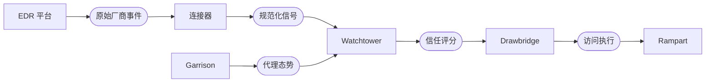

import Tabs from '@theme/Tabs';
import TabItem from '@theme/TabItem';

# EDR 连接器

Garrison 从每一台已注册设备上的 Filament 代理采集态势。EDR 连接器在此基础上更进一步——把已经部署在整个设备群上的端点检测与响应平台所产生的信号也纳入进来。代理看到的是设备对自身的认知；EDR 看到的是设备所看不到的——内核级遥测、行为异常、恶意软件判定。

连接器层把 EDR 信号规范化为 Watchtower 已经在评估的同一套态势词汇。一次 CrowdStrike 的严重检测、一次 JAMF 的不合规事件，都会进入同一个信任评分计算。Drawbridge 对二者的响应也是同一个撤销原语。

## 信号流

EDR 事件是异步到达的。连接器订阅厂商的事件流，把载荷规范化，再把规范化后的信号推入 Watchtower 的评估管线：



关键的一点是：EDR 信号永远不会取代 Garrison 的代理态势——它们是补充。一台 Garrison 态势良好、但 EDR 报出严重检测的设备同样会失去访问。一台仅被低严重度 EDR 规则标记、其他方面合规的设备，可能只是被相应下调信任评分。

## 受支持的连接器

| 连接器                     | 事件来源               | 规范化信号             | 延迟    |
|-------------------------|--------------------|-------------------|-------|
| CrowdStrike Falcon      | Falcon 流式 API      | 检测严重度、阻止状态、传感器健康度 | < 5s  |
| Microsoft Defender XDR  | Microsoft Graph 事件 | 威胁严重度、机器风险、隔离状态   | < 15s |
| JAMF Protect            | JAMF Webhooks API  | 威胁事件、合规状态、MDM 违规  | < 10s |
| SentinelOne Singularity | S1 SyslogNG 流      | 威胁严重度、代理判定、深度可见性  | < 5s  |
| 通用厂商（webhook）           | HTTPS webhook      | 通过映射 Schema 配置    | 可变    |

通用 webhook 连接器接受任何厂商发出的 JSON 载荷，并把字段映射到规范化信号 Schema。没有专用连接器的 EDR 平台，或内部自建的检测系统，皆可经此接入。

## 规范化信号 Schema

不论来源如何，每一条 EDR 信号在被 Watchtower 消费之前都会规范化为同一份 Schema：

```json title="规范化 EDR 信号"
{
  "signal_id":  "edr_evt_8a3f7c2b9d1e",
  "device_id":  "dev_a3b7c9d1e5f2",
  "source":     "crowdstrike",
  "received_at": "2025-06-15T14:22:47Z",
  "severity":   "critical",
  "category":   "malware",
  "verdict":    "blocked",
  "details": {
    "vendor_event_id": "ldt:abc123:9876543",
    "detection_name":  "WIN/TROJAN.GENERIC.A",
    "process_path":    "C:\\Users\\m.torres\\Downloads\\setup.exe",
    "process_hash":    "sha256:e3b0c44298fc1c14..."
  },
  "posture_impact": {
    "score_delta":     -45,
    "categories":      ["software", "behavior"],
    "expires_at":      "2025-06-15T14:52:47Z"
  }
}
```

Watchtower 会评估 `posture_impact` 块。`score_delta` 在 `expires_at` 指定的持续时间内被加到设备的综合态势上。高严重度检测产生的 delta 足以把设备压到每一条策略阈值之下；低严重度的提示信号则可能只产生很小的 delta，甚至不产生任何 delta。

## 配置一个连接器

<Tabs>
<TabItem value="crowdstrike" label="CrowdStrike" default>

```text title="connectors/crowdstrike.grain"
edr_connector "crowdstrike-prod" {
  vendor       = "crowdstrike"
  client_id    = ref("secrets/cs_client_id")
  client_secret = ref("secrets/cs_client_secret")
  cloud_region = "us-2"

  event_stream {
    feed = "DetectionSummaryEvent"
    feed = "IncidentSummaryEvent"
    feed = "SensorHeartbeatEvent"
  }

  severity_mapping {
    critical = { score_delta = -50, expires = "30m" }
    high     = { score_delta = -25, expires = "20m" }
    medium   = { score_delta = -10, expires = "10m" }
    low      = { score_delta = -2,  expires = "5m"  }
  }

  device_correlation {
    match = "hostname"
    fallback = "agent_id"
  }
}
```

`device_correlation` 块告诉连接器如何把一次 CrowdStrike 事件映射回某一台 Sentinel 已注册设备。默认按 hostname 匹配；若设备群中 hostname 存在冲突，则回退到 CrowdStrike 传感器的 agent ID——只要注册时设备上已存在 CrowdStrike 传感器，Garrison 会把该 ID 记录下来。

</TabItem>
<TabItem value="defender" label="Microsoft Defender">

```text title="connectors/defender.grain"
edr_connector "defender-xdr" {
  vendor       = "defender"
  tenant_id    = ref("secrets/aad_tenant_id")
  client_id    = ref("secrets/defender_client_id")
  client_secret = ref("secrets/defender_client_secret")

  graph_subscriptions {
    resource = "/security/alerts_v2"
    resource = "/deviceManagement/managedDevices"
  }

  severity_mapping {
    high     = { score_delta = -45, expires = "30m" }
    medium   = { score_delta = -20, expires = "15m" }
    low      = { score_delta = -5,  expires = "5m"  }
  }

  device_correlation {
    match = "azure_ad_device_id"
    fallback = "hostname"
  }
}
```

Defender 连接器订阅 Microsoft Graph 的变更通知。当设备同时已加入 Intune 时，`azure_ad_device_id` 是最可靠的关联键——它能扛住 hostname 变更、设备重装与重新加入操作。

</TabItem>
<TabItem value="jamf" label="JAMF Protect">

```text title="connectors/jamf.grain"
edr_connector "jamf-protect" {
  vendor      = "jamf"
  webhook_url = "https://sentinel.yourcompany.internal/connectors/jamf"
  shared_secret = ref("secrets/jamf_webhook_secret")

  event_types {
    type = "ThreatEvent"
    type = "ComplianceEvent"
    type = "MDMNonCompliantEvent"
  }

  severity_mapping {
    Critical = { score_delta = -50, expires = "30m" }
    High     = { score_delta = -30, expires = "20m" }
    Medium   = { score_delta = -12, expires = "10m" }
    Info     = { score_delta = -2,  expires = "5m"  }
  }

  device_correlation {
    match = "jamf_device_uuid"
    fallback = "hostname"
  }
}
```

JAMF Protect 由 webhook 驱动，而非轮询驱动。webhook 载荷中的共享密钥会在事件被接受前与 `ref("secrets/jamf_webhook_secret")` 进行校验。

</TabItem>
<TabItem value="generic" label="通用厂商">

```text title="connectors/generic-vendor.grain"
edr_connector "in-house-detection" {
  vendor      = "generic"
  webhook_url = "https://sentinel.yourcompany.internal/connectors/in-house"
  shared_secret = ref("secrets/in_house_secret")

  // highlight-start
  payload_mapping {
    device_id = "$.host.hostname"
    severity  = "$.detection.severity"
    category  = "$.detection.category"
    verdict   = "$.detection.action"
    received_at = "$.timestamp"
  }
  // highlight-end

  severity_mapping {
    "Severity-1" = { score_delta = -50, expires = "30m" }
    "Severity-2" = { score_delta = -25, expires = "15m" }
    "Severity-3" = { score_delta = -10, expires = "10m" }
  }
}
```

通用连接器经 webhook 接受任意 JSON，并使用 JSONPath 表达式抽取规范化信号 Schema 所需的字段。任何能够发起 HTTPS webhook 的厂商，都可以按这种方式接入。

</TabItem>
</Tabs>

## 态势影响与 Drawbridge

Watchtower 收到 EDR 信号时，会在该信号的生效周期内把 `score_delta` 加到设备的态势评分上。下一轮策略评估即反映该调整后的评分：

```text title="Drawbridge 对 EDR 信号的响应"
[14:22:46] WATCHTOWER 评估：策略 api-access → PASS（评分 92）
[14:22:47] EDR-CONNECTOR crowdstrike-prod：严重检测
             设备：dev_a3b7c9d1   delta：-50   expires：14:52:47
[14:22:47] WATCHTOWER 评估：策略 api-access → FAIL（评分 42，低于 80）
[14:22:47] DRAWBRIDGE revoke：api-cluster-east（隧道 tun_8a3f）
[14:22:47] RAMPART    区域跨越被撤销：internal → api-services
[14:22:48] 通知发送至 security-ops
```

撤销发生在与信号到达同一个评估周期内——从 CrowdStrike 发出检测到 Drawbridge 关闭隧道不到一秒。设备必须先把底层问题修复（EDR 必须先清除该检测），态势评分才能恢复。

:::warning 严重度映射本身就是策略
连接器配置里的 `score_delta` 数值是策略决策，并非技术默认值。在态势基线阈值为 80 的环境里，严重检测的 `-50` delta 是合适的；在基线更宽松的环境里，delta 可能需要更大才能促成一次撤销。请先用 Parapet 重放进行调校，再投入部署。
:::

## 引用 EDR 信号的策略

信任策略可通过 `edr` 命名空间直接读取 EDR 态势影响：

```text title="policies/edr-aware.grain"
policy "edr-clean-required" {
  resource = "production-data"
  effect   = "allow"

  conditions {
    device.posture       >= 90
    user.mfa             = true
    // highlight-start
    edr.critical_events  = 0
    edr.high_events      <= 1
    // highlight-end
  }

  on_failure {
    action = "revoke"
    notify = "security-ops"
    log    = "spyglass"
  }
}
```

`edr.critical_events` 条件计算所有已接入 EDR 平台上当前活跃的严重级别信号数量。来自任意一个连接器的、哪怕仅一次严重检测，都会使策略失败。`edr.high_events <= 1` 允许存在一个活跃的高严重度信号，但不允许更多。

## Spyglass 关联

每一条 EDR 信号都会与它触发的 Drawbridge 决策一起被 Spyglass 记录。取证还原展示的是完整链路——厂商事件、规范化信号、态势影响、访问执行：

```bash title="查询由 EDR 触发的撤销"
sentinel spyglass query \
  --event-type edr-correlated-revoke \
  --period "2025-06-01..2025-06-30" \
  --severity critical
```

```text title="查询输出"
EDR 关联的撤销：严重级别，2025 年 6 月

日期         设备                连接器           检测                          撤销
2025-06-04  dev_b1a9c3e7       crowdstrike      WIN/TROJAN.GENERIC.A        7 个会话
2025-06-09  dev_f8e2d4c6       defender         Suspicious-PSExec-Activity  3 个会话
2025-06-15  dev_a3b7c9d1       crowdstrike      WIN/TROJAN.GENERIC.A        4 个会话
2025-06-22  dev_c5d7e9f1       jamf-protect     Malicious-LaunchAgent       2 个会话

从检测到撤销的平均时间：612ms
态势恢复的平均时间：    18m 47s
```

链路是端到端的——原始厂商事件 ID 保留在每一条 Spyglass 记录中，调查人员无需手工拼接即可把 Sentinel 的撤销追溯回 EDR 控制台。

## 下一步

- [身份提供方](/docs/integrations/identity-providers/) — 与 EDR 态势信号结合，共同产出完整信任评分的身份信号。
- [审计与取证](/docs/operations/audit-forensics/) — Spyglass 如何记录与关联由 EDR 触发的访问决策。
- [信任策略](/docs/trust/trust-policies/) — 通过 `edr` 命名空间引用 EDR 信号的策略条件。
