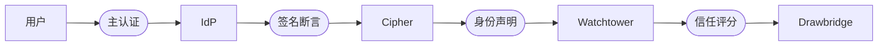

import Tabs from '@theme/Tabs';
import TabItem from '@theme/TabItem';

# 身份提供方

Cipher 是 Sentinel 的认证层。它本身不存储密码，也不签发主凭据。Cipher 与外部身份提供方进行联邦——Okta、Azure AD、Google Workspace，或任何符合规范的 OIDC 或 SAML 端点——并将 IdP 发出的断言转化为 Watchtower 所消费的用户身份信号。

这种集成有意保持职责窄化。IdP 权威地回答"用户是谁"。Cipher 权威地回答"该用户、在这台设备上、在此刻，是否应当通过 Drawbridge"。

## 联邦模型

每一次 IdP 集成都遵循同一个四阶段握手。用户在 IdP 处完成主认证，IdP 返回签名断言，Cipher 验证断言并抽取身份声明，Watchtower 在信任评分中将这些声明作为用户身份信号消费。



Cipher 从不延长 IdP 的会话。当 IdP 签发的令牌过期时，用户必须重新对 IdP 进行认证——而非对 Cipher 认证。这保证了身份的真实来源始终只有一处。

## 受支持的提供方

| 提供方              | 协议          | 组来源           | JIT 配置 | 升级 MFA |
|------------------|-------------|---------------|--------|--------|
| Okta             | OIDC + SAML | Okta 组        | 支持     | 支持     |
| Azure AD         | OIDC + SAML | AAD 安全组       | 支持     | 支持     |
| Google Workspace | OIDC        | Workspace OU  | 支持     | 支持     |
| 通用 OIDC          | OIDC        | `groups` 声明   | 支持     | 可选     |
| 通用 SAML 2.0      | SAML        | `memberOf` 属性 | 支持     | 可选     |
| SCIM 2.0 源       | SCIM（推送）    | SCIM 组        | 基于推送   | 不适用    |

通用 OIDC 与 SAML 连接器适配任何符合规范的提供方。当你的 IdP 没有专用连接器，或你需要指向自托管端点时，请使用它们。

## 配置一个 IdP

<Tabs>
<TabItem value="okta" label="Okta" default>

```text title="cipher/okta.grain"
identity_provider "okta-primary" {
  protocol      = "oidc"
  issuer        = "https://yourcompany.okta.com"
  client_id     = ref("secrets/okta_client_id")
  client_secret = ref("secrets/okta_client_secret")

  claims {
    user_id     = "sub"
    email       = "email"
    groups      = "groups"
    mfa_method  = "amr"
  }

  jit_provisioning = true
  step_up_mfa      = true
}
```

`claims` 块把 OIDC 声明名称映射到 Cipher 内部的身份字段。Okta 会发出 `amr`（认证方法引用）声明，Watchtower 用它来核验 MFA 强度。

</TabItem>
<TabItem value="azure" label="Azure AD">

```text title="cipher/azure-ad.grain"
identity_provider "azure-ad" {
  protocol      = "oidc"
  issuer        = "https://login.microsoftonline.com/{tenant-id}/v2.0"
  client_id     = ref("secrets/aad_client_id")
  client_secret = ref("secrets/aad_client_secret")

  claims {
    user_id     = "oid"
    email       = "preferred_username"
    groups      = "groups"
    mfa_method  = "amr"
  }

  group_resolution {
    // highlight-start
    expand_transitive = true
    overage_strategy  = "graph_api"
    // highlight-end
  }

  jit_provisioning = true
}
```

Azure AD 在用户隶属超过 200 个组时会截断 `groups` 声明。`overage_strategy = "graph_api"` 指示 Cipher 在该情况下回退到 Microsoft Graph API，解析出完整的组成员关系。

</TabItem>
<TabItem value="google" label="Google Workspace">

```text title="cipher/google-workspace.grain"
identity_provider "google-workspace" {
  protocol      = "oidc"
  issuer        = "https://accounts.google.com"
  client_id     = ref("secrets/google_client_id")
  client_secret = ref("secrets/google_client_secret")

  claims {
    user_id     = "sub"
    email       = "email"
    hd          = "hd"          # hosted domain
  }

  group_resolution {
    source         = "admin_sdk"
    delegated_user = "sentinel-sync@yourcompany.com"
  }

  jit_provisioning = true
}
```

Google Workspace 不会在 OIDC 令牌中发出组信息。Cipher 通过带有委派服务账号的 Admin SDK 解析组成员关系。`hd` 声明被强制启用，以拒绝来自外部 Google 账号的登录。

</TabItem>
<TabItem value="generic" label="通用 OIDC">

```text title="cipher/generic-oidc.grain"
identity_provider "internal-keycloak" {
  protocol      = "oidc"
  issuer        = "https://auth.yourcompany.internal"
  client_id     = ref("secrets/keycloak_client_id")
  client_secret = ref("secrets/keycloak_client_secret")

  discovery_url = "https://auth.yourcompany.internal/.well-known/openid-configuration"

  claims {
    user_id     = "sub"
    email       = "email"
    groups      = "realm_access.roles"
    mfa_method  = "amr"
  }

  trust_root = "/etc/sentinel/certs/keycloak-ca.pem"
}
```

通用 OIDC 连接器遵循 well-known 端点上的发现文档。`trust_root` 字段接受自定义 CA 证书包，用于支持内部 IdP 的自签名证书。

</TabItem>
</Tabs>

:::info 一个主，多个次
Sentinel 每个租户仅支持一个主 IdP。可为特定的用户群体——外包人员、合作伙伴、应急管理员——配置次级 IdP，但员工身份图谱的权威来源始终是主 IdP。
:::

## 将策略映射到 IdP 组

信任策略通过 `user.groups` 条件直接引用 IdP 组。组名即 IdP 发出、Cipher 完成声明映射后的取值：

```text title="policies/group-scoped-access.grain"
policy "platform-team-access" {
  resource = "platform-services"
  effect   = "allow"

  conditions {
    user.groups      = ["platform-engineering", "sre"]
    device.posture   >= 85
    user.mfa         = true
  }

  on_failure {
    action = "revoke"
    log    = "spyglass"
  }
}
```

该条件匹配任何 IdP 组声明中包含 `platform-engineering` 或 `sre` 的用户。组成员关系在每一次 Watchtower 周期都会重新评估——用户在 IdP 处被移出组后，无需 Sentinel 一侧任何动作，会在 90 秒内失去访问。

:::warning 组解析的延迟
90 秒的周期衡量的是 Watchtower 的评估节奏，并非 IdP 的传播延迟。如果 IdP 本身需要数分钟才能传播组变更，那部分延迟会叠加在上面。对于高风险组，请将 IdP 配置为即时传播组变更，或使用 SCIM 连接器以获得基于推送的更新。
:::

## JIT 用户配置

当用户首次通过联邦 IdP 完成认证时，Cipher 会自动创建一条 Sentinel 一侧的身份记录。无需事先创建账号。

```text title="JIT 配置事件"
[14:22:03] CIPHER 用户认证
  IdP：          okta-primary
  Subject：      00uX2Y4Z1A3B
  Email：        m.torres@yourcompany.com
  组：           [engineering, oncall-secondary]
  MFA 方法：     [pwd, otp]

[14:22:03] CIPHER JIT 配置
  创建 Sentinel 身份：usr_8a3f7c2b
  映射的组：engineering → policy.engineering-access
            oncall-secondary → policy.oncall-tier-2

[14:22:04] WATCHTOWER 初次评估
  信任评分：88
  结果：    GRANT api-cluster-east（隧道 tun_9f4a）
```

JIT 配置本身永远不会授予访问。新创建的身份仍受所有适用的信任策略约束——设备态势、MFA 强度、组成员关系，以及其他任何条件。JIT 仅消除了"预先创建账号"这一运营摩擦。

## 条件访问门控

Cipher 会在用户到达 Drawbridge 之前，把 IdP 发出的信号作为条件访问门控进行评估。门控失败会产生认证失败，而非隧道撤销：

| 门控     | 来源声明            | 失败模式      |
|--------|-----------------|-----------|
| MFA 强度 | `amr` / `acr`   | 升级 MFA 提示 |
| 账户风险评分 | IdP 风险信号        | 拒绝认证      |
| 地理限制   | IdP 地理位置声明      | 拒绝认证      |
| 设备绑定   | IdP 设备证书        | 升级至绑定设备   |
| 会话时长   | IdP `auth_time` | 强制重新认证    |

条件门控按 IdP 进行配置，并对引用该 IdP 组的所有策略统一生效。资源粒度的条件仍由信任策略负责。

```text title="cipher/conditional-gates.grain"
gates "okta-primary" {
  mfa_strength {
    require = ["hwk", "fido"]
    fallback {
      action  = "step_up"
      methods = ["push", "otp"]
    }
  }

  risk_threshold {
    max_score = 70
    on_exceed = "reject"
  }

  geo_restriction {
    allow = ["US", "CA", "GB", "DE"]
    on_deny = "reject"
  }
}
```

## SCIM 配置

对于人员流动较大的环境，SCIM 2.0 推送配置可消除拉取式组解析所固有的传播延迟。IdP 会将用户与组的变更，在发生的同时推送到 Cipher 的 SCIM 端点：

```bash title="注册 SCIM 端点"
sentinel cipher scim register \
  --provider okta-primary \
  --token-ttl 365d
```

```text title="SCIM 端点输出"
SCIM 2.0 端点已注册

  URL：          https://sentinel.yourcompany.internal/scim/v2
  令牌：         scim_8f3a2b9c4e1d...（仅展示一次，请妥善保存）
  令牌 TTL：     365d

  支持的操作：
    Users：  CREATE, READ, UPDATE, DELETE
    Groups： CREATE, READ, UPDATE, DELETE
    Schema： urn:ietf:params:scim:schemas:core:2.0:User
             urn:ietf:params:scim:schemas:core:2.0:Group
```

IdP 一旦推送，SCIM 事件会在数秒内应用到 Sentinel 的身份图谱中。通过 SCIM 被移出组的用户，会在下一个 Watchtower 周期失去访问——通常快于 90 秒的拉取节奏。

## 审计 IdP 事件

每一次认证事件都会进入 Spyglass，并记录发起方 IdP、Subject 标识与解析后的组集合：

```bash title="审计 IdP 认证事件"
sentinel spyglass query \
  --event-type cipher-auth \
  --idp okta-primary \
  --period "2025-06-01..2025-06-30"
```

查询返回的是完整链路——收到的 IdP 断言、抽取的声明、JIT 配置（如适用）、条件门控评估，以及最终的 Watchtower 信任评分。身份提供方的集成并非黑盒；每一条断言都可被审计。

## 下一步

- [EDR 连接器](/docs/integrations/edr-connectors/) — Watchtower 如何把 EDR 平台的设备态势信号与此处所述的身份信号关联起来。
- [访问控制](/docs/trust/access-control/) — Drawbridge 如何将 IdP 组成员关系转化为具体的访问决策。
- [API 参考](/docs/reference/api-reference/) — 对 Cipher IdP 配置与 SCIM 端点的程序化管理。
