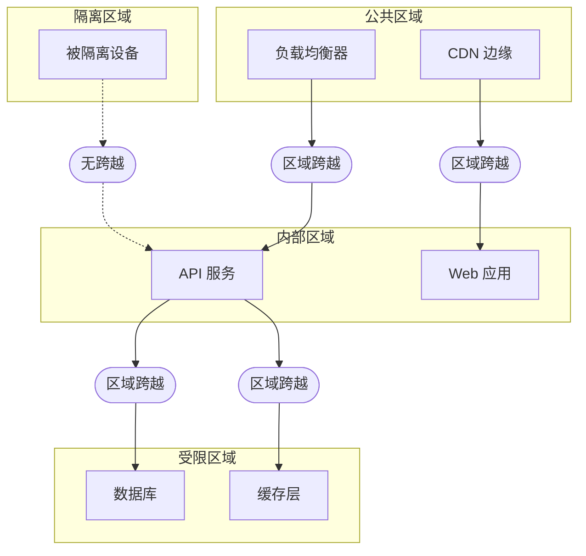

# 微隔离

Rampart 是 Sentinel 的微隔离层。它将工作负载隔离到一个个离散的区域中，使区域之间默认无法横向移动。即便攻击者攻陷了某一个区域，也会被局限在该区域内。任何区域都不会无条件信任其他区域——必须有一条经过策略评估的显式跨越规则。

## 区域架构

Rampart 将你的基础设施划分为四种区域类型，每种类型具有不同的默认信任属性：



| 区域类型           | 默认信任 | 入向                | 出向                  |
|----------------|------|-------------------|---------------------|
| **Public**     | 无    | 允许外部流量            | 通过跨越规则到达内部区域        |
| **Internal**   | 低    | 通过跨越规则来自 Public   | 通过跨越规则到达 Restricted |
| **Restricted** | 无    | 通过跨越规则来自 Internal | 默认不允许任何出向           |
| **Quarantine** | 无    | 不允许任何入向           | 不允许任何出向             |

## 定义区域

区域以 `.grain` 格式声明，并通过资源标签应用到工作负载上：

```text title="zones/production.grain"
zone "api-services" {
  type     = "internal"
  workloads = ["api-east-*", "api-west-*"]

  ingress {
    allow_from = ["public-edge"]
    require_policy = "api-access"
  }

  egress {
    allow_to = ["data-layer"]
    require_policy = "data-access"
  }
}

zone "data-layer" {
  type     = "restricted"
  workloads = ["db-primary", "db-replica-*", "cache-*"]

  ingress {
    allow_from = ["api-services"]
    require_policy = "data-access"
  }

  egress {
    allow_to = []
  }
}
```

每一次区域跨越都需要同时满足两点：结构性规则（`ingress`/`egress` 声明）与一次信任策略评估。即便结构性规则允许跨越，Drawbridge 仍会在打开 Filament 隧道前评估所指定的策略。

## 横向移动防护

横向移动是指攻击者从一个被攻陷的系统转向网络内另一个系统。在扁平网络中，任意系统都能连到任意其他系统。在 Rampart 划分的网络中，每一跳都要求一次区域跨越——每一次区域跨越都要求一次策略评估。

设想一名攻击者攻陷了 `api-services` 区域中的某个服务：

| 攻击路径            | 扁平网络 | Rampart 分段后 |
|-----------------|------|-------------|
| API → 数据库       | 直接可达 | 区域跨越——需要策略  |
| API → 管理工具      | 直接可达 | 无跨越规则——被阻断  |
| API → 其他 API 服务 | 直接可达 | 同区域——允许     |
| API → 控制面       | 直接可达 | 无跨越规则——被阻断  |

攻击者能触达同一区域内的其他服务，但无法逃离该区域。`api-services` 到 `admin-tools` 或 `control-plane` 都不存在跨越规则，Filament 隧道请求在到达 Drawbridge 之前就会被拒绝。

:::warning 区域粒度
过度细分会带来运营摩擦；分段不足又会扩大波及范围。推荐的做法是按信任级别与数据敏感度分段，而非按团队或服务名。一个区域应仅包含彼此相互信任的工作负载，仅此而已。
:::

## 区域跨越规则

跨越规则定义了区域之间的结构性路径。它们本身并不授予访问——它们只是让 Drawbridge 能为该路径评估一条策略：

```text title="crossings/api-to-data.grain"
crossing "api-to-data" {
  source = "api-services"
  target = "data-layer"
  policy = "data-access"

  constraints {
    max_concurrent = 100
    timeout        = 30
    protocol       = ["filament"]
  }
}
```

`max_concurrent` 约束限制两个区域之间并发 Filament 隧道的数量；`timeout` 在 30 秒空闲后关闭隧道。这些约束独立于信任策略——它们是对区域边界本身的结构性限制。

## 隔离区域

未通过 Garrison 合规检查或态势低于最低阈值的设备会被自动移入隔离区域。隔离的设备无法访问任何其他区域：

```text title="隔离输出"
Garrison 态势检查：dev_a9c1e3f5b7d4
  态势评分：62（阈值：80）
  失败项：
    - 操作系统补丁等级：滞后 47 天（上限：30）
    - 防病毒病毒库：滞后 12 天（上限：3）

  动作：设备已被移入隔离区域
  访问：所有 Filament 隧道已终止
  修复：更新操作系统补丁与防病毒病毒库
```

设备会持续处于隔离状态，直到 Garrison 确认其满足合规配置文件的所有要求。一旦满足，设备会被送回原区域，下一次 Watchtower 评估将正常进行。

## 下一步

- [审计与取证](/docs/operations/audit-forensics/) — Spyglass 如何记录区域跨越事件与隧道活动。
- [策略仿真](/docs/operations/policy-simulation/) — 在部署前用 Parapet 测试区域拓扑变更。
- [访问控制](/docs/trust/access-control/) — Drawbridge 如何评估跨越策略。
