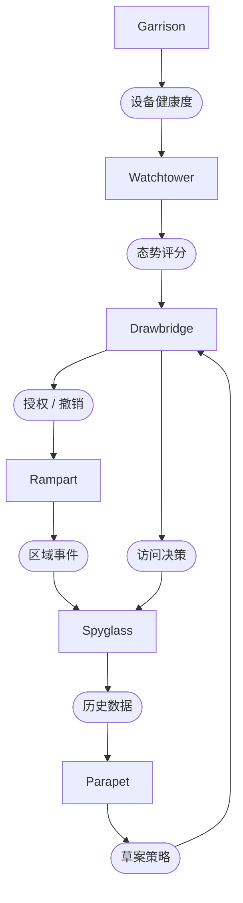

# 平台概述

Sentinel 是为分布式团队打造的信任引擎。它持续评估某个人、设备与上下文是否仍应拥有访问权——并在答案改变的那一刻立即撤销。访问不是一扇打开后就敞开的门，而是一场永不停止的对话。

> "边界早在多年前就已消解。我们只是终于停止假装它还在。"

## 架构

Sentinel 平台由六个组件组成，它们构成一个持续运转的信任闭环。Watchtower 负责观察，Drawbridge 负责执行，Garrison 管理端点，Rampart 隔离工作负载，Spyglass 负责审计，Parapet 负责仿真。

## 组件

| 组件             | 用途                             |
|----------------|--------------------------------|
| **Watchtower** | 持续态势评估——每 90 秒评估一次设备健康度、位置与行为。 |
| **Drawbridge** | 自适应访问网关——基于上下文，实时授予、收窄或撤销访问权。  |
| **Garrison**   | 端点合规引擎——在授予访问前对每一台已连接设备执行策略检查。 |
| **Rampart**    | 微隔离层——隔离工作负载，使各区域之间的横向移动不可能发生。 |
| **Spyglass**   | 审计与取证——完整的会话还原，日志不可篡改并保留 7 年。  |
| **Parapet**    | 策略仿真沙盒——在真实流量上测试访问规则后再投入执行。    |

## 工作原理

Sentinel 中的每一次访问决策都遵循同一个循环：

1. **Garrison** 上报设备态势——操作系统版本、磁盘加密、防火墙状态、补丁等级。
2. **Watchtower** 综合设备态势、用户身份、网络上下文与行为信号，计算出信任评分。
3. **Drawbridge** 将信任评分与适用策略进行比对，授予、收窄或撤销访问权。
4. **Rampart** 在区域边界处执行强制，确保被授予的访问被限定在正确的工作负载段内。
5. **Spyglass** 完整、不可篡改地记录整条决策链，并保留 7 年。
6. 对于每一个活跃会话，这一循环每 90 秒重复一次。

:::info 持续，而非周期性
Sentinel 不会只在登录时校验一次信任。它对每一个活跃会话每 90 秒重新评估一次。如果某台设备在会话中途脱离合规状态，访问会在下一次请求完成前被撤销。
:::

## 信任评分

信任评分由四个加权信号类别共同计算得出：

| 类别        | 权重  | 信号                   |
|-----------|-----|----------------------|
| **设备态势**  | 40% | 操作系统版本、磁盘加密、防火墙、补丁等级 |
| **用户身份**  | 30% | 认证强度、MFA 注册情况、账户风险   |
| **网络上下文** | 20% | 源 IP 信誉、地理位置、连接类型    |
| **行为信号**  | 10% | 访问模式异常、数据量、时段        |

策略定义最低分数阈值。如果综合评分低于该阈值，Drawbridge 会立即撤销访问，并要求重新认证。

## 下一步

- [安装](/docs/getting-started/installation/) — 通过 Spark、Vial 或 Arcline 部署 Sentinel 代理。
- [你的第一条策略](/docs/getting-started/your-first-policy/) — 编写一条信任策略并观察 Watchtower 对其进行评估。
- [信任策略](/docs/trust/trust-policies/) — 深入了解策略语法、条件与可组合性。
- [API 参考](/docs/reference/api-reference/) — 完整的 Spoke API 文档，覆盖策略管理与审计导出。
