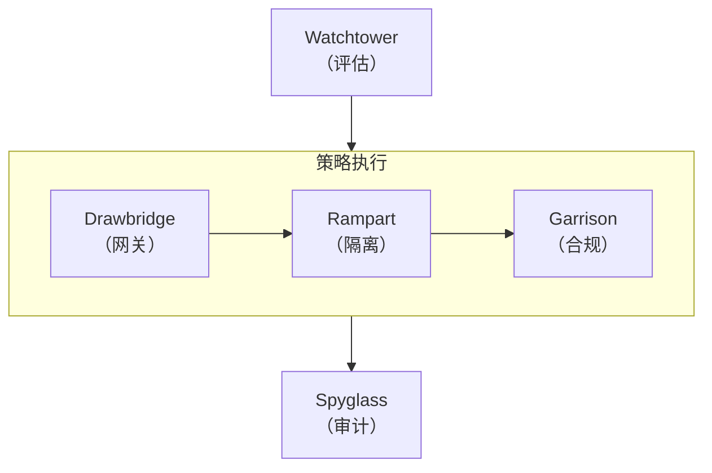
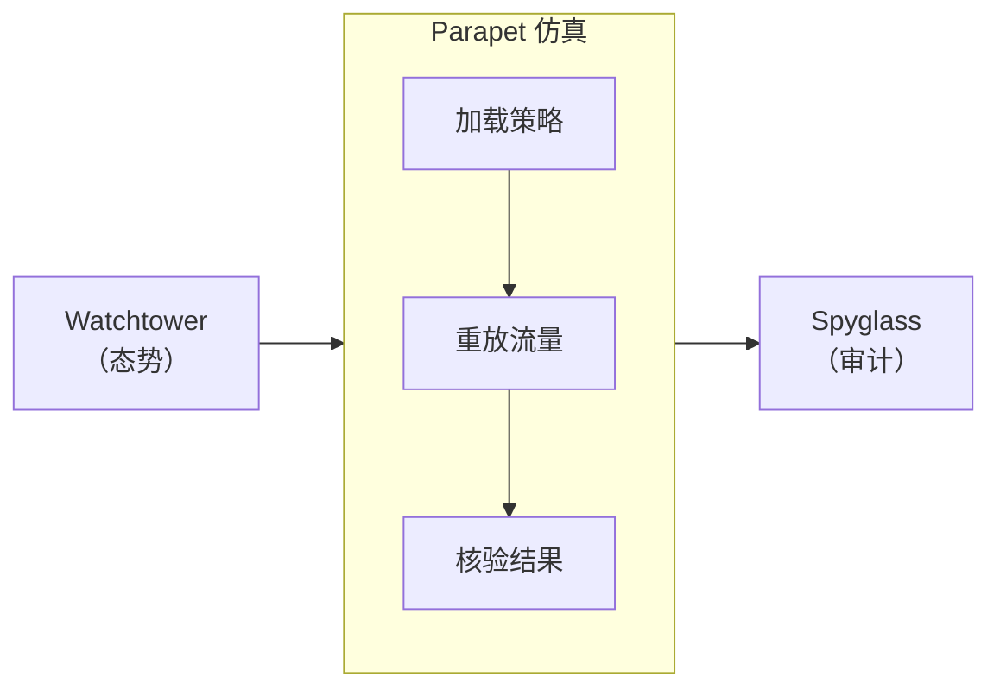

import Details from '@theme/Details';
import Tabs from '@theme/Tabs';
import TabItem from '@theme/TabItem';

# 主题展示

本页展示 Docusaurus 预设中提供的每一个主题组件。在编写文档页时，可将其作为活的样式指南来参照。

## 标题

下方的标题层级展示了每一级别的渲染效果。请使用 `h2` 到 `h4` 来构建页面结构；将 `h5` 与 `h6` 保留给极少数确有更深嵌套需求的特殊场景。

### 三级标题

#### 四级标题

##### 五级标题

###### 六级标题

---

## 行内文本格式

正文段落以基础正文字体渲染。请保持段落简短——技术文档中两到四句话最为理想。

**加粗文本**用于在术语首次出现时引起注意。*斜体文本*适合引入术语或引用标题。~~删除线文本~~标记不再准确或已被替代的内容。需要强烈强调时，也可以组合使用 **_加粗加斜体_**。

行内 `代码` 用于引用函数名（如 `evaluatePolicy`）、文件路径（如 `trust-policy.grain`）或 CLI 参数（如 `--dry-run`）。

---

## 链接

内部链接指向本文档站点内的其他页面：

- [概述](/docs/overview/) — 新用户应该阅读的第一页。
- [安装指南](/docs/getting-started/installation/) — 前置条件与配置步骤。

外部链接指向站外资源：

- [Filament 协议参考](https://nova.cbnventures.io) — 官方 Filament 文档。
- [Arcline 云市场](https://nova.cbnventures.io) — 从市场部署 Sentinel。

---

## 列表

### 无序列表

- Watchtower 每 90 秒评估一次设备态势，从无例外。
- Drawbridge 基于持续的信任评分实时执行访问决策。
- Rampart 区域阻止隔离工作负载段之间的横向移动。
- Spyglass 维护不可篡改的审计日志，保留期 7 年。

### 有序列表

1. 通过 Spark 安装 Sentinel 代理。
2. 使用注册令牌向你的控制面注册。
3. 编写一份 `.grain` 信任策略，定义访问条件。
4. 运行 `sentinel policy validate` 检查策略语法。
5. 运行 `sentinel policy apply` 开始执行。

### 嵌套列表

- **CLI 命令**
  - 策略
    - `sentinel policy validate` — 在应用前检查策略语法。
    - `sentinel policy apply` — 将经过校验的策略应用到生产。
    - `sentinel policy list` — 列出所有处于活跃状态的策略及其状态。
  - 监控
    - `sentinel watchtower watch` — 观察实时的态势评估。
    - `sentinel drawbridge watch` — 实时观察访问决策。
- **组件类别**
  - Trust — 策略、设备注册、访问控制。
  - 运维 — 微隔离、审计、仿真。
  - 参考 — API 端点、CLI 命令。

---

## 引用

> 信任本身就是一种漏洞。唯一安全的假设是：每一个假设都不安全。

嵌套引用适用于署名或后续注释：

> 边界早在多年前就已消解。我们只是终于停止假装它还在。
>
> > 这就是 Sentinel 持续评估的原因——在信任成为负担之前，先消除信任假设。

---

## 代码块

### 语法高亮

带标题栏的 Grain 策略：

```text title="policies/api-access.grain"
policy "api-cluster-access" {
  resource = "api-cluster-east"
  effect   = "allow"
  priority = 100

  conditions {
    device.posture   >= 85
    user.mfa         = true
    user.role        = ["engineer", "sre"]
    network.location = ["office", "vpn"]
  }

  on_failure {
    action = "revoke"
    notify = "security-ops"
    log    = "spyglass"
  }
}
```

带行号的 CSS：

```css showLineNumbers title="src/styles/base.css"
:root {
  --color-primary: oklch(0.55 0.18 260);
  --color-surface: oklch(0.98 0 0);
  --color-text: oklch(0.15 0 0);
  --spacing-base: 0.5rem;
  --radius-md: 0.375rem;
}

.container {
  max-width: 72rem;
  margin-inline: auto;
  padding-inline: var(--spacing-base);
}
```

JSON API 响应：

```json title="Spoke API — 策略评估"
{
  "policy_id": "pol_8a3f7b2c9d1e",
  "resource": "api-cluster-east",
  "result": "pass",
  "score": 92,
  "conditions_met": 4,
  "conditions_total": 4,
  "next_evaluation": "90s"
}
```

Spark 命令：

```bash
# 安装 Sentinel 代理并注册
spark install sentinel-agent
sentinel-agent register --control-plane sentinel.internal

# 校验并应用一条信任策略
sentinel policy validate policies/api-access.grain
sentinel policy apply policies/api-access.grain
```

### 行高亮

使用 `highlight-next-line`、`highlight-start` 与 `highlight-end` 注释来突出特定行：

```text title="policies/production-access.grain"
policy "production-access" {
  extends  = "base-access"
  resource = "production-*"

  // highlight-start
  conditions {
    device.posture   >= 90
    network.location = ["office"]
    session.age      <= 3600
  }
  // highlight-end

  on_failure {
    action = "revoke"
    // highlight-next-line
    step_up = "mfa"
  }
}
```

### 差异高亮

在同一代码块中展示新增与删除：

```text title="policies/api-access.grain"
policy "api-cluster-access" {
// remove-start
  conditions {
    device.posture >= 70
  }
// remove-end
// add-start
  conditions {
    device.posture   >= 85
    user.mfa         = true
    session.age      <= 3600
  }
// add-end
}
```

---

## 提示框

:::note
说明型提示提供有用但非必需的补充上下文。即使读者跳过它，也不会错过关键信息。
:::

:::tip
小贴士分享省时的最佳实践或快捷方式。例如，运行 `sentinel parapet dry-run` 可在应用策略变更前对所有活跃会话进行一次试运行。
:::

:::info
信息块强调有助于理解的背景细节。Sentinel 信任模型每 90 秒评估一次四个信号类别——设备态势、用户身份、网络上下文与行为信号。
:::

:::warning
警告标记潜在陷阱。追溯性地变更合规配置文件会对所有归属该配置的设备重新评估。请先运行一次 Parapet 仿真以观察影响。
:::

:::danger
危险块标记可能导致访问中断的操作。一旦应用的策略中态势阈值高于车队平均水平，未达标设备的访问将被立即撤销，没有缓冲期。
:::

:::tip[自定义标题]
提示框可以在关键字后用方括号传入自定义标题。利用它让标题更贴合内容。
:::

---

## 详情 / 可折叠区块

<Details>
<summary>支持哪些 Filament 协议版本？</summary>

Sentinel 3.x 要求 Filament 协议版本 2.0 或更高。更早的 Filament 版本不支持 Garrison 上报设备健康所用的加密态势遥测通道。可用 `filament --version` 验证你的版本。

</Details>

<Details>
<summary>信任策略如何组合？</summary>

策略可使用 `extends` 关键字从父策略继承。子策略继承父策略的所有条件，并可新增或覆盖特定条件：

```text title="policies/production-access.grain"
policy "production-access" {
  extends  = "base-access"
  resource = "production-*"

  conditions {
    device.posture >= 90
    session.age    <= 3600
  }
}
```

子策略从父策略继承了 `user.mfa = true`，并新增了自己的态势与会话时长要求。

</Details>

---

## 标签页

<Tabs>
<TabItem value="spark" label="Spark" default>

```bash
spark install sentinel-agent
```

</TabItem>
<TabItem value="vial" label="Vial 容器">

```bash
vial pull sentinel/agent:latest
```

</TabItem>
<TabItem value="arcline" label="Arcline 市场">

```bash
arcline deploy sentinel-agent --region us-east-1
```

</TabItem>
</Tabs>

<Tabs>
<TabItem value="policy" label="信任策略" default>

```text title="policies/access.grain"
policy "service-access" {
  resource = "api-services"
  effect   = "allow"

  conditions {
    device.posture >= 80
    user.mfa       = true
  }
}
```

</TabItem>
<TabItem value="zone" label="Rampart 区域">

```text title="zones/internal.grain"
zone "api-services" {
  type     = "internal"
  workloads = ["api-east-*", "api-west-*"]

  ingress {
    allow_from = ["public-edge"]
  }
}
```

</TabItem>
</Tabs>

---

## 表格

| 组件         | 评估间隔 | 数据来源        | 说明                |
|------------|------|-------------|-------------------|
| Watchtower | 90 秒 | Garrison、网络 | 持续的态势与上下文评估。      |
| Drawbridge | 实时   | Watchtower  | 授予、收窄或撤销访问的决策。    |
| Garrison   | 持续   | 代理遥测        | 设备健康与合规监控。        |
| Rampart    | 每次跨越 | Drawbridge  | 区域边界执行与隔离。        |
| Spyglass   | 仅追加  | 所有组件        | 不可篡改的审计日志，保留 7 年。 |
| Parapet    | 按需   | Spyglass、流量 | 策略仿真与影响分析。        |

一张最小的双列表格：

| 快捷键                                               | 操作   |
|---------------------------------------------------|------|
| <kbd>Ctrl</kbd> + <kbd>C</kbd>                    | 复制   |
| <kbd>Ctrl</kbd> + <kbd>V</kbd>                    | 粘贴   |
| <kbd>Ctrl</kbd> + <kbd>Shift</kbd> + <kbd>P</kbd> | 命令面板 |

---

## 图片

图片使用标准 Markdown 语法。将文件放入 `static/img/` 目录，并以绝对路径引用：

```markdown

```

---

## Mermaid 图

Mermaid 图直接由围栏代码块渲染。预设会自动应用主题感知的配色、圆角集群边框与平滑边曲线。

### 带横向集群的纵向图



### 带纵向集群的横向图



### 提示探针


---

## 水平分割线

水平分割线用于分隔主要章节，渲染为一条横跨内容宽度的细线。本页每段上下出现的三个连字符（`---`）就是水平分割线。

---

## 键盘快捷键

使用 `<kbd>` 标签来行内渲染按键：

- <kbd>Ctrl</kbd> + <kbd>S</kbd> — 保存当前文件。
- <kbd>Ctrl</kbd> + <kbd>Shift</kbd> + <kbd>F</kbd> — 在整个工作区中搜索。
- <kbd>Ctrl</kbd> + <kbd>`</kbd> — 切换集成终端。
- <kbd>Alt</kbd> + <kbd>Up</kbd> / <kbd>Down</kbd> — 上下移动一行。
- <kbd>Ctrl</kbd> + <kbd>D</kbd> — 选中当前单词的下一个出现位置。

在 macOS 上，大多数快捷键中可以用 <kbd>Cmd</kbd> 代替 <kbd>Ctrl</kbd>。
