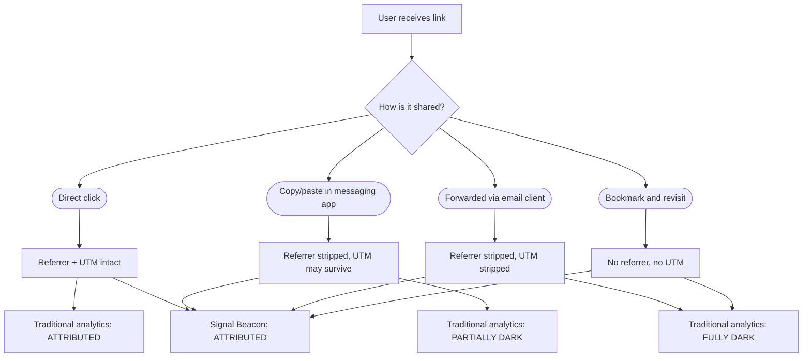

Someone copies your link and pastes it into a messaging app. The referrer disappears. The UTM parameters get stripped. The click becomes invisible. We call this dark traffic, and for most analytics tools, it does not exist. Here is how Beacon metadata survives where everything else fails.

{/* truncate */}

## What Makes Traffic Dark

Dark traffic is any visit that arrives without attribution data. It happens constantly:

- A colleague pastes a URL into a private Alloy chat channel. The messaging app strips the referrer header.
- Someone copies a link with UTM parameters and pastes it into an email draft. The email client drops everything after the `?`.
- A user bookmarks a tracked URL and returns three weeks later. The original campaign context is gone.
- A mobile app opens a link in its in-app browser. The referrer shows the app, not the source.

In all four cases, the click arrives. The conversion might happen. But from the analytics tool's perspective, the visitor materialized from nothing.

## How Much Traffic Is Dark

We analyzed attribution data across 50 million Beacon redirects over six months. The numbers were sobering:

| Source          | Attributed | Dark |
|-----------------|------------|------|
| Email campaigns | 82%        | 18%  |
| Social posts    | 61%        | 39%  |
| Messaging apps  | 12%        | 88%  |
| Direct shares   | 8%         | 92%  |
| Cross-device    | 34%        | 66%  |

Messaging apps and direct shares are almost entirely dark. Social is one-third dark. Even email — the most controlled channel — loses nearly one in five clicks to dark traffic.

## Beacon's Embedded Metadata

A standard URL relies on query parameters for attribution:

```
https://example.com/pricing?utm_source=email&utm_medium=newsletter&utm_campaign=launch
```

When someone copies and pastes this link, the query parameters may or may not survive. The referrer header almost certainly will not.

A Beacon link embeds attribution metadata in the redirect itself:

```json title="Beacon link structure"
{
  "shortUrl": "https://go.signal.example/a7x9m2",
  "destination": "https://example.com/pricing",
  "attribution": {
    "campaign": "launch",
    "channel": "email",
    "variant": "newsletter-hero",
    "trace": "trc_8f3a1b2c4d5e6f70"
  }
}
```

The attribution data is not in the URL the user sees. It is stored server-side and resolved during the redirect. No matter how the link is shared — copied, pasted, bookmarked, screenshotted and retyped — the attribution survives because it lives in the redirect, not in the URL.

## Attributed vs Dark Traffic Flow



With traditional analytics, three of the four paths produce dark or partially dark traffic. With Beacon, all four paths are fully attributed.

### Detection heuristics for dark traffic

Even without Beacon, you can estimate your dark traffic volume using these heuristics:

1. **Direct traffic anomalies** — If your "direct" traffic segment shows behavior patterns identical to your email audience (same pages visited, same conversion paths), a portion of that direct traffic is likely dark email traffic.

2. **Referrer gaps** — Compare Beacon redirect logs (which always have attribution) against page-side analytics (which depend on referrer headers). The gap is your dark traffic rate per channel.

3. **UTM survival rate** — Create test Beacon links with UTM parameters and share them through every channel. Measure what percentage of clicks arrive at the destination with UTMs intact. The complement is your UTM strip rate.

4. **Cross-device shadows** — Users who convert on one device after clicking on another appear as new direct visitors. Beacon's trace ID links them across devices without cookies.

## The Cost of Ignoring Dark Traffic

If 30% of your traffic is dark, 30% of your attribution data is a lie. Last-click models credit "direct" traffic — which is not a channel, it is an absence of information. Media spend decisions based on incomplete attribution consistently undervalue the channels that generate the most dark traffic: messaging, social sharing, and word of mouth.

Beacon does not eliminate dark traffic. It makes it visible.

## Next Steps

- [Click Attribution](/docs/features/click-attribution/) — See how Prism handles multi-touch paths that include recovered dark traffic.
- [Quick Start](/docs/getting-started/quick-start/) — Mint your first Beacon link and see the attribution metadata in action.
