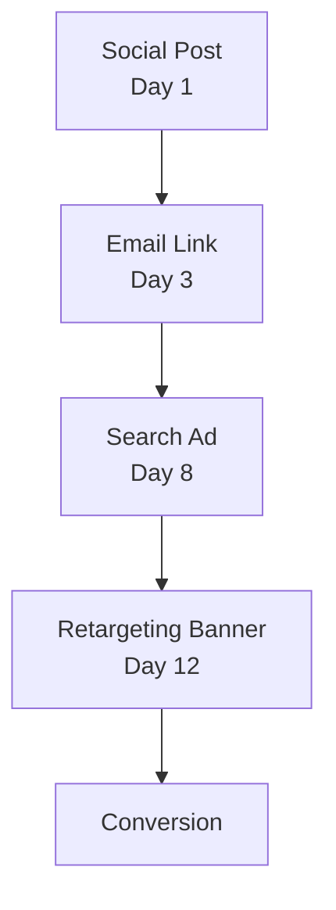

import Details from '@theme/Details';

# Click Attribution

Prism is Signal's multi-touch attribution engine. It traces the full conversion path across channels, assigns weighted credit to every touchpoint, and reconstructs the journey from first encounter to final action.

## The Problem with Single-Touch

Most attribution models credit one touchpoint — either the first click or the last click. Both are wrong. A user who sees a social post, clicks an email link, revisits through a search ad, and finally converts from a retargeting banner is not a single-click story. It is a four-chapter narrative, and every chapter contributed.

Prism captures all of it.

## Multi-Touch Attribution Path

When a user interacts with multiple Beacon links across channels, Prism builds an attribution path:



Each node is a Beacon link with embedded trace metadata. Prism connects them into a single attribution chain by matching the user's fingerprint across touchpoints.

## Attribution Models

Prism supports multiple attribution models. Choose the one that matches your business logic:

| Model        | Description                                                       | Best For                       |
|--------------|-------------------------------------------------------------------|--------------------------------|
| **Linear**   | Equal credit to every touchpoint.                                 | Simple campaigns, baselines.   |
| **Decay**    | More credit to recent touchpoints. Configurable half-life.        | Long sales cycles.             |
| **Position** | 40% to first touch, 40% to last touch, 20% split across the rest. | Brand + conversion campaigns.  |
| **Custom**   | Write your own weighting function in Alloy.                       | Complex multi-channel funnels. |

## Querying Attribution Paths

Query a specific trace to see the full path:

```bash title="Query an attribution path"
signal prism path --trace "trc_8f3a1b2c4d5e6f70"
```

```json title="Multi-touch attribution output"
{
  "trace": "trc_8f3a1b2c4d5e6f70",
  "model": "decay",
  "halfLife": "7d",
  "touchpoints": [
    {
      "order": 1,
      "channel": "social",
      "campaign": "product-launch",
      "variant": "og-card",
      "timestamp": "2025-02-08T14:22:00Z",
      "weight": 0.12
    },
    {
      "order": 2,
      "channel": "email",
      "campaign": "product-launch",
      "variant": "hero-cta",
      "timestamp": "2025-02-10T09:15:00Z",
      "weight": 0.18
    },
    {
      "order": 3,
      "channel": "search",
      "campaign": "brand-terms",
      "variant": "headline-a",
      "timestamp": "2025-02-15T11:40:00Z",
      "weight": 0.28
    },
    {
      "order": 4,
      "channel": "retargeting",
      "campaign": "product-launch",
      "variant": "banner-300x250",
      "timestamp": "2025-02-19T16:05:00Z",
      "weight": 0.42
    }
  ],
  "conversion": {
    "event": "signup",
    "timestamp": "2025-02-19T16:08:32Z",
    "value": 49.00
  }
}
```

## Decay Curves

The decay model assigns more credit to touchpoints closer to the conversion. The half-life parameter controls how quickly earlier touchpoints lose credit:

| Half-Life | Effect                                                            |
|-----------|-------------------------------------------------------------------|
| `1d`      | Aggressive decay. Only the last day or two matter.                |
| `7d`      | Moderate decay. A full week of touchpoints get meaningful credit. |
| `30d`     | Gentle decay. Long nurture sequences retain credit.               |

```bash title="Set a decay model with 7-day half-life"
signal prism model set --model decay --half-life 7d --campaign "product-launch"
```

<Details>
<summary>How the decay algorithm works</summary>

Prism's decay model uses an exponential decay function. For each touchpoint at time `t` before the conversion, the raw weight is:

```
weight(t) = e^(-lambda * t)
```

Where `lambda = ln(2) / halfLife`. After computing raw weights for all touchpoints, Prism normalizes them so the total sums to 1.0.

For a 7-day half-life, a touchpoint from 7 days before conversion receives half the weight of a touchpoint at conversion time. A touchpoint from 14 days before receives one quarter.

The custom model lets you replace this function entirely with an Alloy script that receives the touchpoint array and returns a weight array.

</Details>

## Channel Weighting

Override the base attribution model with channel-specific multipliers:

```bash title="Apply channel weights"
signal prism weights set \
  --campaign "product-launch" \
  --channel email=1.2 \
  --channel social=0.8 \
  --channel search=1.0 \
  --channel retargeting=0.9
```

Channel weights are applied after the base model calculates raw weights. A 1.2 multiplier on email means email touchpoints receive 20% more credit than the base model would assign.

## Next Steps

- [Campaign Management](/docs/features/campaign-management/) — Snapshot campaign performance with Aperture.
- [Audience Analysis](/docs/features/audience-analysis/) — Detect where audiences overlap with Resonance.
