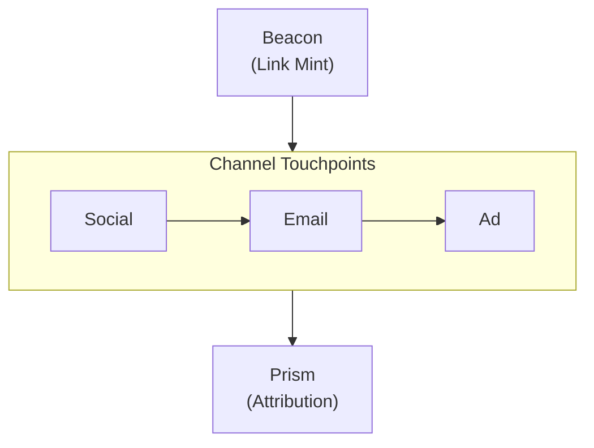
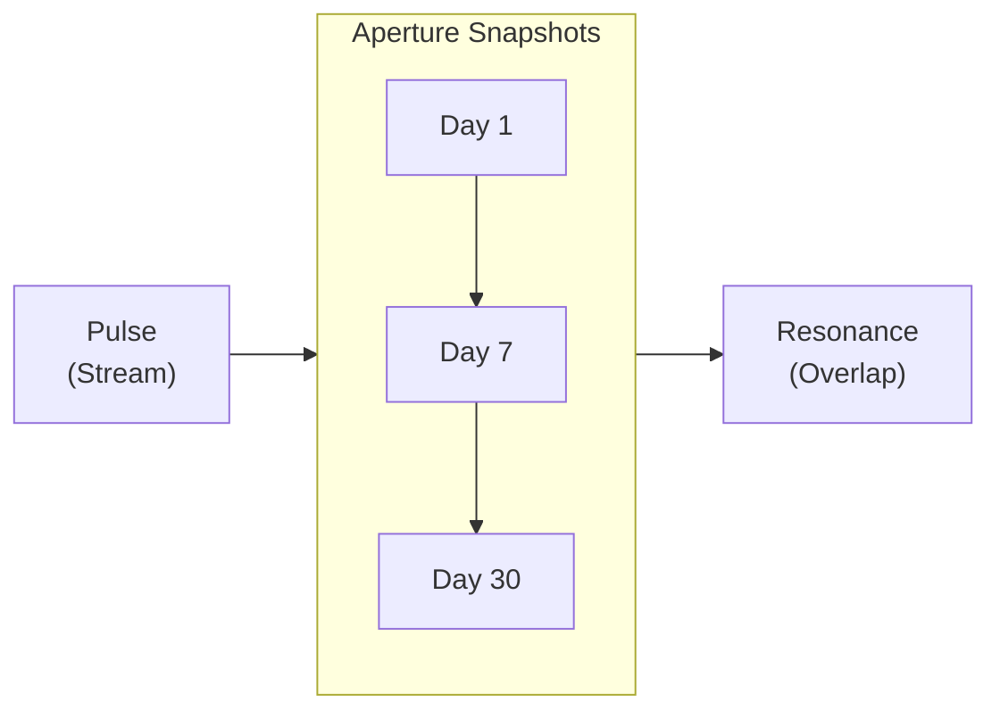

import Details from '@theme/Details';
import Tabs from '@theme/Tabs';
import TabItem from '@theme/TabItem';

# Theme Showcase

This page demonstrates every theme component available in the Docusaurus preset. Use it as a living style guide when building documentation pages.

## Headings

The heading hierarchy below shows how each level renders. Use `h2` through `h4` for page structure. Reserve `h5` and `h6` for rare edge cases where deeper nesting is genuinely needed.

### Third-Level Heading

#### Fourth-Level Heading

##### Fifth-Level Heading

###### Sixth-Level Heading

---

## Inline Text Formatting

Regular paragraph text renders in the base body font. Keep paragraphs short — two to four sentences is ideal for technical documentation.

**Bold text** draws attention to key terms on first use. *Italic text* is useful for introducing terminology or referencing titles. ~~Strikethrough text~~ marks content that is no longer accurate or has been superseded. You can also combine **_bold and italic_** when emphasis is critical.

Inline `code` is for referencing function names like `prism.path`, file paths like `credentials.grain`, or CLI flags like `--half-life`.

---

## Links

Internal links point to other pages within this documentation site:

- [Overview](/docs/overview/) — the first page new users should read.
- [Installation Guide](/docs/getting-started/installation/) — prerequisites and setup steps.

External links point to resources outside the site:

- [Alloy Language Reference](https://nova.cbnventures.io) — official Alloy documentation.
- [Loom Registry](https://nova.cbnventures.io) — the package registry for Alloy and Ferric packages.

---

## Lists

### Unordered List

- Beacon links embed attribution metadata that survives URL copying and messaging apps.
- Prism traces multi-touch conversion paths across channels.
- Pulse streams click events in real time with geo and device data.
- Flare bridges physical and digital attribution with QR codes and deep links.

### Ordered List

1. Install the CLI with Spark.
2. Authenticate with your Signal API key.
3. Mint a Beacon link with campaign metadata.
4. Open Pulse to watch clicks arrive in real time.
5. Query Prism for the full attribution path after conversion.

### Nested Lists

- **CLI Commands**
  - Beacon
    - `signal beacon create` — mint a new Beacon link with attribution metadata.
    - `signal beacon batch import` — import links in bulk from CSV.
    - `signal beacon domain add` — register a branded domain.
  - Analysis
    - `signal prism path` — query an attribution path by trace ID.
    - `signal resonance overlap` — measure audience overlap between segments.
- **Attribution Models**
  - Linear — equal credit to every touchpoint.
  - Decay — more credit to recent touchpoints.
  - Position — weighted split favoring first and last touch.

---

## Blockquotes

> Every click tells a story. Most tools miss the plot.

Nested blockquotes work for attributions or follow-up commentary:

> The best attribution data is the data that already exists when you need it.
>
> > That is why Beacon embeds metadata in the link itself — it removes the dependency on referrer headers and UTM parameters before they can fail.

---

## Code Blocks

### Syntax Highlighting

Alloy with a title bar:

```alloy title="src/lib/attribution.al"
interface TouchPoint {
  channel: Text
  campaign: Text
  variant: Text
  timestamp: DateTime
  weight: Float
}

function calculateDecay(touchpoints: List<TouchPoint>, halfLife: Duration): List<TouchPoint> {
  const lambda: Float = ln(2.0) / halfLife.toDays()

  return touchpoints.map(tp => {
    const daysBeforeConversion: Float = now().daysSince(tp.timestamp)
    const rawWeight: Float = exp(-lambda * daysBeforeConversion)
    return { ...tp, weight: rawWeight }
  }).normalize()
}
```

CSS with line numbers:

```css showLineNumbers title="src/styles/base.css"
:root {
  --color-primary: oklch(0.55 0.18 260);
  --color-surface: oklch(0.98 0 0);
  --color-text: oklch(0.15 0 0);
  --spacing-base: 0.5rem;
  --radius-md: 0.375rem;
}

.container {
  max-width: 72rem;
  margin-inline: auto;
  padding-inline: var(--spacing-base);
}
```

JSON configuration:

```json title="beacon-response.json"
{
  "id": "bcn_01J9K4M7N2P8Q3R5S6T1U0V2",
  "shortUrl": "https://go.signal.example/a7x9m2",
  "attribution": {
    "campaign": "product-launch",
    "channel": "email",
    "variant": "hero-cta",
    "trace": "trc_8f3a1b2c4d5e6f70"
  }
}
```

Spark commands:

```bash
# Install Signal and mint a Beacon link
spark install signal-cli
signal auth login --key sk_live_...

# Create a Beacon link and open the live stream
signal beacon create --url https://example.com --campaign launch
signal pulse watch --campaign launch
```

### Line Highlighting

Use `highlight-next-line`, `highlight-start`, and `highlight-end` comments to draw attention to specific lines:

```json title="prism-attribution.json"
{
  "trace": "trc_8f3a1b2c4d5e6f70",
  "model": "decay",
  // highlight-start
  "touchpoints": [
    { "channel": "social", "weight": 0.12 },
    { "channel": "email", "weight": 0.18 },
    { "channel": "search", "weight": 0.28 },
    { "channel": "retargeting", "weight": 0.42 }
  ],
  // highlight-end
  "conversion": {
    "event": "signup",
    // highlight-next-line
    "value": 49.00
  }
}
```

### Diff Highlighting

Show additions and removals inside a code block:

```bash title="signal beacon create"
signal beacon create \
  --url "https://threadbare.example/pricing" \
  --campaign "product-launch" \
// remove-start
  --channel "social"
// remove-end
// add-start
  --channel "email" \
  --variant "hero-cta"
// add-end
```

---

## Admonitions

:::note
Notes provide supplementary context that is helpful but not essential. The reader can skip this without missing critical information.
:::

:::tip
Tips share best practices or shortcuts that save time. For example, run `signal pulse watch --campaign launch` to see clicks arrive in real time before querying Prism for the full attribution path.
:::

:::info
Info blocks highlight background details that aid understanding. Beacon links embed attribution metadata in the redirect itself — not in query parameters — so data survives URL copying and messaging apps.
:::

:::warning
Warnings flag potential pitfalls. Changing a Beacon link's destination after it has been shared will not update attribution metadata for clicks that already occurred. Historical Prism paths are immutable.
:::

:::danger
Danger blocks mark actions that can cause data loss or breaking changes. Running `signal beacon batch delete --campaign launch --confirm` permanently removes all Beacon links and their click data with no recovery path.
:::

:::tip[Custom Title]
Admonitions accept a custom title in brackets after the keyword. Use this to make the heading more specific to the content.
:::

---

## Details / Collapsible Sections

<Details>
<summary>What attribution models does Prism support?</summary>

Prism supports four attribution models: linear (equal credit), decay (recent touchpoints weighted higher), position (40/20/40 split for first/middle/last), and custom (write your own weighting function in Alloy). The model is configured per campaign and can be changed retroactively — Prism re-calculates historical paths with the new model.

</Details>

<Details>
<summary>How does Beacon metadata survive messaging apps?</summary>

Messaging apps strip referrer headers and sometimes remove query parameters. Beacon links store attribution data server-side, not in the URL. When the link is clicked, the redirect resolves the metadata from Signal's edge before forwarding to the destination:

```json title="Beacon redirect resolution"
{
  "shortUrl": "https://go.signal.example/a7x9m2",
  "resolvedAttribution": {
    "campaign": "product-launch",
    "channel": "email",
    "trace": "trc_8f3a1b2c4d5e6f70"
  },
  "redirectTo": "https://threadbare.example/pricing"
}
```

The user never sees the attribution data. It exists entirely in the redirect layer.

</Details>

---

## Tabs

<Tabs>
<TabItem value="spark" label="Spark" default>

```bash
spark install signal-cli
```

</TabItem>
<TabItem value="loom" label="Loom Registry">

```bash
loom add --global signal-cli
```

</TabItem>
<TabItem value="vial" label="Vial Container">

```bash
vial pull signal/cli:latest
```

</TabItem>
</Tabs>

<Tabs>
<TabItem value="alloy" label="Alloy" default>

```alloy title="src/attribution.al"
function weightTouchpoints(points: List<TouchPoint>): List<TouchPoint> {
  return points.mapWithIndex((point, index) => {
    return { ...point, weight: 1.0 / points.length() }
  })
}
```

</TabItem>
<TabItem value="ferric" label="Ferric">

```ferric title="src/attribution.fe"
fn weight_touchpoints(points: &[TouchPoint]) -> Vec<TouchPoint> {
    let weight = 1.0 / points.len() as f64;
    points.iter().map(|p| TouchPoint { weight, ..p.clone() }).collect()
}
```

</TabItem>
</Tabs>

---

## Tables

| Attribution Model | Credit Distribution    | Best For                       |
|-------------------|------------------------|--------------------------------|
| Linear            | Equal across all       | Simple campaigns, baselines.   |
| Decay             | Weighted toward recent | Long sales cycles.             |
| Position          | 40% first, 40% last    | Brand + conversion campaigns.  |
| Custom            | User-defined in Alloy  | Complex multi-channel funnels. |

A minimal two-column table:

| Shortcut                                          | Action                       |
|---------------------------------------------------|------------------------------|
| <kbd>Ctrl</kbd> + <kbd>C</kbd>                    | Cancel current operation.    |
| <kbd>Ctrl</kbd> + <kbd>L</kbd>                    | Clear the Pulse live stream. |
| <kbd>Ctrl</kbd> + <kbd>Shift</kbd> + <kbd>E</kbd> | Export current view to CSV.  |

---

## Images

Images use standard Markdown syntax. Place files in the `static/img/` directory and reference them with an absolute path:

```markdown

```

---

## Mermaid Diagrams

Mermaid diagrams render directly from fenced code blocks. The preset applies theme-aware colors, rounded cluster borders, and smooth edge curves automatically.

### Vertical Graph with Horizontal Cluster



### Horizontal Graph with Vertical Cluster



---

## Horizontal Rules

Horizontal rules separate major sections. They render as a thin line spanning the content width. The three dashes (`---`) above and below each section on this page are horizontal rules.

---

## Keyboard Shortcuts

Use `<kbd>` tags to render keyboard keys inline:

- <kbd>Ctrl</kbd> + <kbd>S</kbd> — save the current file.
- <kbd>Ctrl</kbd> + <kbd>Shift</kbd> + <kbd>F</kbd> — search across the entire workspace.
- <kbd>Ctrl</kbd> + <kbd>`</kbd> — toggle the integrated terminal.
- <kbd>Alt</kbd> + <kbd>Up</kbd> / <kbd>Down</kbd> — move a line up or down.
- <kbd>Ctrl</kbd> + <kbd>D</kbd> — select the next occurrence of the current word.

On macOS, substitute <kbd>Ctrl</kbd> with <kbd>Cmd</kbd> for most shortcuts.
