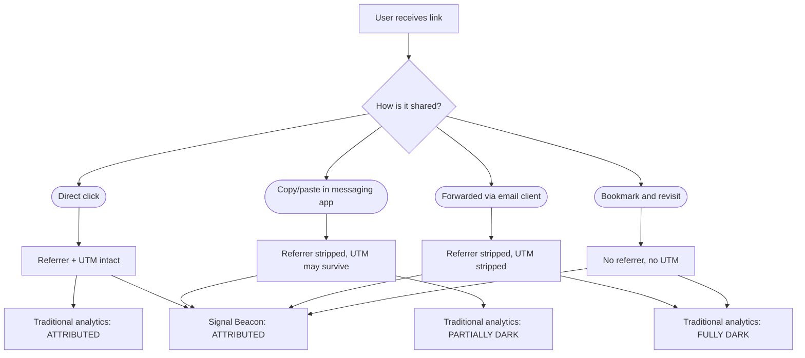

ينسخ أحدهم رابطك ويلصقه في تطبيق مراسلة. يختفي المُحيل. تُجرَّد معاملات UTM. تصبح النقرة غير مرئية. نسمي هذا الحركة المظلمة، وبالنسبة لمعظم أدوات التحليلات، فإنها غير موجودة. إليك كيف تنجو بيانات Beacon حيث يفشل كل شيء آخر.

{/* truncate */}

## ما الذي يجعل الحركة مظلمة

الحركة المظلمة هي أي زيارة تصل بدون بيانات إسناد. تحدث باستمرار:

- زميل يلصق عنوان URL في قناة Alloy خاصة. يُجرّد تطبيق المراسلة ترويسة المُحيل.
- شخص ينسخ رابطاً بمعاملات UTM ويلصقه في مسودة بريد. يُسقط عميل البريد كل شيء بعد `?`.
- مستخدم يضع علامة مرجعية على عنوان مُتتبَّع ويعود بعد ثلاثة أسابيع. سياق الحملة الأصلي قد ذهب.
- تطبيق هاتف يفتح رابطاً في متصفحه الداخلي. يُظهر المُحيل التطبيق، لا المصدر.

في الحالات الأربع، تصل النقرة. وقد يحدث التحويل. لكن من منظور أداة التحليلات، تجسّد الزائر من العدم.

## كم من الحركة مظلمة

حلّلنا بيانات إسناد عبر 50 مليون إعادة توجيه Beacon على مدى ستة أشهر. الأرقام كانت رصينة:

| المصدر             | مُسنَد | مظلم |
|--------------------|--------|------|
| حملات البريد       | 82%    | 18%  |
| منشورات اجتماعية   | 61%    | 39%  |
| تطبيقات المراسلة   | 12%    | 88%  |
| المشاركات المباشرة | 8%     | 92%  |
| عبر الأجهزة        | 34%    | 66%  |

تطبيقات المراسلة والمشاركات المباشرة مظلمة بالكامل تقريباً. التواصل الاجتماعي ثلث مظلم. حتى البريد، أكثر القنوات انضباطاً، يفقد قرابة نقرة من كل خمس للحركة المظلمة.

## بيانات Beacon المضمَّنة

يعتمد عنوان URL القياسي على معاملات الاستعلام للإسناد:

```
https://example.com/pricing?utm_source=email&utm_medium=newsletter&utm_campaign=launch
```

حين ينسخ أحدهم هذا الرابط ويلصقه، قد تنجو معاملات الاستعلام أو لا تنجو. وترويسة المُحيل لن تنجو على الأرجح.

يُضمّن رابط Beacon بيانات الإسناد داخل إعادة التوجيه نفسها:

```json title="بنية رابط Beacon"
{
  "shortUrl": "https://go.signal.example/a7x9m2",
  "destination": "https://example.com/pricing",
  "attribution": {
    "campaign": "launch",
    "channel": "email",
    "variant": "newsletter-hero",
    "trace": "trc_8f3a1b2c4d5e6f70"
  }
}
```

بيانات الإسناد ليست في عنوان URL الذي يراه المستخدم. مخزَّنة على جانب الخادم وتُحلّ خلال إعادة التوجيه. مهما تشاركَ الرابط، نُسخ، لُصق، أُشير له، أُخذ منه لقطة شاشة وأُعيد إدخاله، ينجو الإسناد لأنه يقطن في إعادة التوجيه، لا في عنوان URL.

## تدفق الحركة المُسنَدة مقابل المظلمة



مع التحليلات التقليدية، ثلاثة من المسارات الأربعة تنتج حركة مظلمة كلياً أو جزئياً. مع Beacon، المسارات الأربعة كلها مُسنَدة بالكامل.

### قرائن لاكتشاف الحركة المظلمة

حتى دون Beacon، تستطيع تقدير حجم الحركة المظلمة باستخدام هذه القرائن:

1. **شذوذ الحركة المباشرة** — إن أظهرت شريحة الحركة «المباشرة» أنماط سلوك مطابقة لجمهور البريد لديك (الصفحات نفسها، ومسارات التحويل نفسها)، فجزء من تلك الحركة المباشرة هو غالباً حركة بريد مظلمة.

2. **فجوات المُحيل** — قارن سجلات إعادة توجيه Beacon (التي لها دائماً إسناد) بتحليلات جانب الصفحة (التي تعتمد على ترويسات المُحيل). الفجوة هي معدل الحركة المظلمة لديك لكل قناة.

3. **معدل بقاء UTM** — أنشئ روابط Beacon تجريبية بمعاملات UTM وشاركها عبر كل قناة. قِس النسبة المئوية من النقرات التي تصل إلى الوجهة بمعاملات UTM سليمة. المُكمِّل هو معدل تجريد UTM لديك.

4. **ظلال عبر الأجهزة** — المستخدمون الذين يُحوِّلون على جهاز بعد النقر على آخر يظهرون كزوار مباشرين جدد. يربطهم معرّف أثر Beacon عبر الأجهزة دون ملفات تعريف ارتباط.

## كلفة تجاهل الحركة المظلمة

إن كانت 30% من حركتك مظلمة، فإن 30% من بيانات إسنادك كذب. تُسند نماذج النقرة الأخيرة الفضل إلى الحركة «المباشرة»، وهي ليست قناة، بل غياب معلومات. قرارات إنفاق الإعلام المستندة إلى إسناد ناقص تُبخّس باستمرار القنوات التي تُنتج أكبر قدر من الحركة المظلمة: المراسلة، والمشاركة الاجتماعية، والكلمة المنطوقة.

لا يُلغي Beacon الحركة المظلمة. يجعلها مرئية.

## الخطوات التالية

- [إسناد النقرات](/docs/attribution/click-attribution/) — انظر كيف يتعامل Prism مع مسارات متعددة اللمس تشمل حركة مظلمة مستردة.
- [البداية السريعة](/docs/getting-started/quick-start/) — أنشئ أول رابط Beacon وشاهد بيانات الإسناد في عملها.
