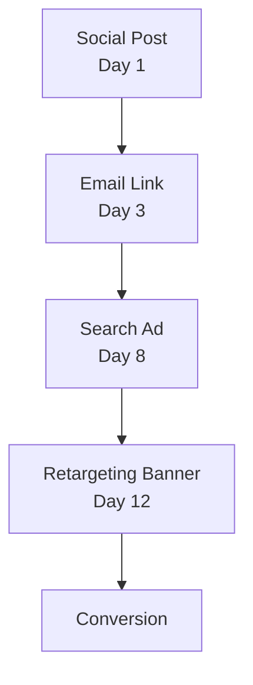

import Details from '@theme/Details';

# إسناد النقرات

Prism هو محرك الإسناد متعدد اللمس لدى Signal. يتتبع مسار التحويل الكامل عبر القنوات، ويُسند فضلاً مرجَّحاً لكل نقطة تماس، ويعيد بناء الرحلة من الظهور الأول إلى الإجراء النهائي.

## مشكلة اللمس الواحد

تُسند معظم نماذج الإسناد الفضل إلى نقطة تماس واحدة، إما النقرة الأولى أو الأخيرة. وكلاهما خطأ. المستخدم الذي يرى منشوراً اجتماعياً، ثم ينقر رابط بريد إلكتروني، ثم يعود عبر إعلان بحث، ثم يُحوِّل أخيراً من لافتة استهداف، ليس قصة نقرة واحدة. إنها رواية من أربعة فصول، وكل فصل أسهم.

يلتقط Prism هذا كله.

## مسار الإسناد متعدد اللمس

حين يتفاعل المستخدم مع روابط Beacon متعددة عبر القنوات، يبني Prism مسار إسناد:



كل عقدة هي رابط Beacon ببيانات تتبع مضمنة. يربطها Prism في سلسلة إسناد واحدة عن طريق مطابقة بصمة المستخدم عبر نقاط التماس.

## نماذج الإسناد

يدعم Prism عدة نماذج إسناد. اختر النموذج الذي يطابق منطق عملك:

| النموذج    | الوصف                                                 | الأنسب لـ                     |
|------------|-------------------------------------------------------|-------------------------------|
| **خطّي**   | فضل متساوٍ لكل نقطة تماس.                             | الحملات البسيطة، خطوط الأساس. |
| **متناقص** | فضل أكبر لنقاط التماس الأحدث. عمر النصف قابل للضبط.   | دورات المبيعات الطويلة.       |
| **موضعي**  | 40% للمسة الأولى و40% للأخيرة و20% توزَّع على الباقي. | حملات العلامة والتحويل.       |
| **مخصص**   | اكتب دالة التوزين الخاصة بك في Alloy.                 | قِمَع متعدد القنوات معقّد.    |

## استعلام مسارات الإسناد

استعلم عن أثر محدد لرؤية المسار الكامل:

```bash title="استعلام مسار إسناد"
signal prism path --trace "trc_8f3a1b2c4d5e6f70"
```

```json title="مخرَج إسناد متعدد اللمس"
{
  "trace": "trc_8f3a1b2c4d5e6f70",
  "model": "decay",
  "halfLife": "7d",
  "touchpoints": [
    {
      "order": 1,
      "channel": "social",
      "campaign": "product-launch",
      "variant": "og-card",
      "timestamp": "2025-02-08T14:22:00Z",
      "weight": 0.12
    },
    {
      "order": 2,
      "channel": "email",
      "campaign": "product-launch",
      "variant": "hero-cta",
      "timestamp": "2025-02-10T09:15:00Z",
      "weight": 0.18
    },
    {
      "order": 3,
      "channel": "search",
      "campaign": "brand-terms",
      "variant": "headline-a",
      "timestamp": "2025-02-15T11:40:00Z",
      "weight": 0.28
    },
    {
      "order": 4,
      "channel": "retargeting",
      "campaign": "product-launch",
      "variant": "banner-300x250",
      "timestamp": "2025-02-19T16:05:00Z",
      "weight": 0.42
    }
  ],
  "conversion": {
    "event": "signup",
    "timestamp": "2025-02-19T16:08:32Z",
    "value": 49.00
  }
}
```

## منحنيات التناقص

يُسند النموذج المتناقص فضلاً أكبر لنقاط التماس الأقرب إلى التحويل. يتحكم معامل عمر النصف في سرعة فقدان نقاط التماس الأبكر فضلها:

| عمر النصف | الأثر                                                        |
|-----------|--------------------------------------------------------------|
| `1d`      | تناقص حاد. آخر يوم أو اثنان فقط لهما اعتبار.                 |
| `7d`      | تناقص معتدل. أسبوع كامل من نقاط التماس يحصل على فضل ذي معنى. |
| `30d`     | تناقص لطيف. تسلسلات الرعاية الطويلة تحتفظ بفضلها.            |

```bash title="ضبط نموذج متناقص بعمر نصف 7 أيام"
signal prism model set --model decay --half-life 7d --campaign "product-launch"
```

<Details>
<summary>كيف تعمل خوارزمية التناقص</summary>

يستخدم النموذج المتناقص لدى Prism دالة تناقص أُسي. لكل نقطة تماس عند الزمن `t` قبل التحويل، الوزن الأولي هو:

```
weight(t) = e^(-lambda * t)
```

حيث `lambda = ln(2) / halfLife`. بعد حساب الأوزان الأولية لجميع نقاط التماس، يُطبّعها Prism بحيث يكون مجموعها 1.0.

لعمر نصف 7 أيام، تتلقى نقطة تماس من قبل التحويل بسبعة أيام نصف وزن نقطة عند زمن التحويل. وتتلقى نقطة من قبل 14 يوماً ربعه.

يتيح لك النموذج المخصص استبدال هذه الدالة بالكامل بسكربت Alloy يستقبل مصفوفة نقاط التماس ويُعيد مصفوفة أوزان.

</Details>

## ترجيح القنوات

تجاوز نموذج الإسناد الأساسي بمضاعِفات خاصة بكل قناة:

```bash title="تطبيق أوزان القنوات"
signal prism weights set \
  --campaign "product-launch" \
  --channel email=1.2 \
  --channel social=0.8 \
  --channel search=1.0 \
  --channel retargeting=0.9
```

تُطبَّق أوزان القنوات بعد أن يحسب النموذج الأساسي الأوزان الأولية. مضاعِف 1.2 على البريد الإلكتروني يعني أن نقاط تماس البريد تحصل على فضل أكبر بنسبة 20% مما يُسنده النموذج الأساسي.

## الخطوات التالية

- [إدارة الحملات](/docs/campaigns/campaign-management/) — التقط أداء الحملة بلقطات Aperture.
- [تحليل الجمهور](/docs/attribution/audience-analysis/) — اكتشف أين تتداخل الجماهير عبر Resonance.
