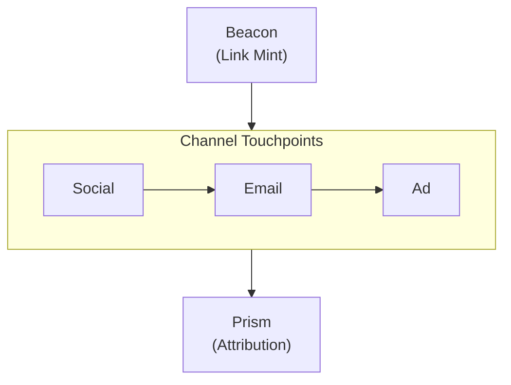
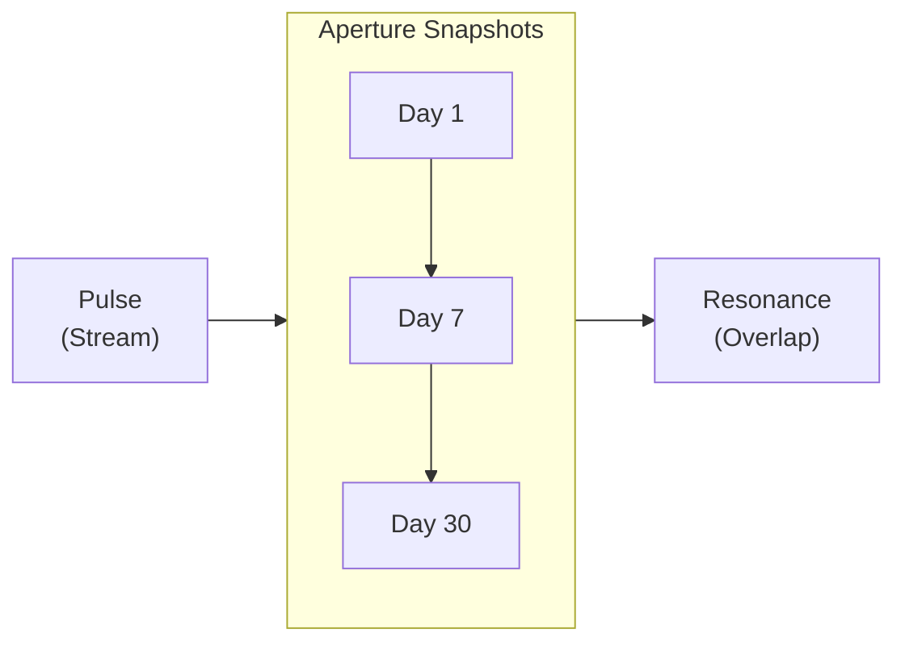
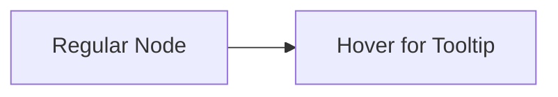

import Details from '@theme/Details';
import Tabs from '@theme/Tabs';
import TabItem from '@theme/TabItem';

# عرض القالب

تعرض هذه الصفحة كل مكوّن قالب متاح في الإعداد المسبق لـ Docusaurus. استخدمها دليلاً حياً للأسلوب عند بناء صفحات التوثيق.

## العناوين

يبيّن التسلسل أدناه كيف يظهر كل مستوى. استخدم `h2` إلى `h4` لبنية الصفحة. واحتفظ بـ `h5` و`h6` للحالات النادرة التي يكون فيها التداخل العميق ضرورياً فعلاً.

### عنوان من المستوى الثالث

#### عنوان من المستوى الرابع

##### عنوان من المستوى الخامس

###### عنوان من المستوى السادس

---

## تنسيق النص المضمَّن

يظهر نص الفقرة العادي بخط النص الأساسي. اجعل الفقرات قصيرة، جملتان إلى أربع جمل هي المثالي للتوثيق التقني.

**النص العريض** يلفت الانتباه إلى المصطلحات الرئيسية عند ظهورها الأول. *النص المائل* مفيد لتقديم مصطلح أو الإشارة إلى عنوان. ~~النص المشطوب~~ يُعلِّم المحتوى الذي لم يعد دقيقاً أو الذي حلّ محله غيره. يمكنك أيضاً الجمع بين **_العريض والمائل_** عندما يكون التأكيد حاسماً.

`الشيفرة` المضمنة لذكر أسماء دوال مثل `prism.path`، أو مسارات ملفات مثل `credentials.grain`، أو رايات واجهة الأوامر مثل `--half-life`.

---

## الروابط

تشير الروابط الداخلية إلى صفحات أخرى ضمن موقع التوثيق هذا:

- [نظرة عامة](/docs/overview/) — أول صفحة يجب أن يقرأها المستخدمون الجدد.
- [دليل التثبيت](/docs/getting-started/installation/) — المتطلبات الأساسية وخطوات الإعداد.

تشير الروابط الخارجية إلى موارد خارج الموقع:

- [مرجع لغة Alloy](https://nova.cbnventures.io) — وثائق Alloy الرسمية.
- [Loom Registry](https://nova.cbnventures.io) — سجل الحزم لحزم Alloy وFerric.

---

## القوائم

### قائمة غير مرتّبة

- روابط Beacon تُضمّن بيانات إسناد تبقى صامدة عبر نسخ الرابط وتطبيقات المراسلة.
- يتتبع Prism مسارات التحويل متعددة اللمس عبر القنوات.
- يبثّ Pulse أحداث النقر لحظياً مع بيانات الموقع الجغرافي والجهاز.
- يجسر Flare بين الإسناد المادي والرقمي عبر رموز QR والروابط العميقة.

### قائمة مرتّبة

1. ثبّت واجهة الأوامر بـ Spark.
2. صادق باستخدام مفتاح Signal API.
3. أنشئ رابط Beacon ببيانات وصفية للحملة.
4. افتح Pulse لمشاهدة النقرات تصل لحظياً.
5. استعلم Prism عن مسار الإسناد الكامل بعد التحويل.

### قوائم متداخلة

- **أوامر واجهة الأوامر**
  - Beacon
    - `signal beacon create` — إنشاء رابط Beacon جديد ببيانات الإسناد.
    - `signal beacon batch import` — استيراد الروابط بالجملة من CSV.
    - `signal beacon domain add` — تسجيل نطاق موسوم.
  - التحليل
    - `signal prism path` — استعلام مسار إسناد بمعرّف الأثر.
    - `signal resonance overlap` — قياس تداخل الجمهور بين الشرائح.
- **نماذج الإسناد**
  - خطّي — فضل متساوٍ لكل نقطة تماس.
  - متناقص — فضل أكبر لنقاط التماس الأحدث.
  - موضعي — توزيع مرجَّح يفضّل اللمسة الأولى والأخيرة.

---

## الاقتباسات

> كل نقرة تروي قصة. معظم الأدوات تفوّت الحبكة.

تعمل الاقتباسات المتداخلة لإسناد ما تنقل عنه أو لتعليق لاحق:

> أفضل بيانات الإسناد هي البيانات الموجودة بالفعل حين تحتاج إليها.
>
> > لذلك يُضمّن Beacon البيانات داخل الرابط نفسه، يُزيل اعتماده على ترويسات المُحيل ومعاملات UTM قبل أن تخذله.

---

## كتل الشيفرة

### تلوين الصياغة

Alloy مع شريط عنوان:

```alloy title="src/lib/attribution.al"
interface TouchPoint {
  channel: Text
  campaign: Text
  variant: Text
  timestamp: DateTime
  weight: Float
}

function calculateDecay(touchpoints: List<TouchPoint>, halfLife: Duration): List<TouchPoint> {
  const lambda: Float = ln(2.0) / halfLife.toDays()

  return touchpoints.map(tp => {
    const daysBeforeConversion: Float = now().daysSince(tp.timestamp)
    const rawWeight: Float = exp(-lambda * daysBeforeConversion)
    return { ...tp, weight: rawWeight }
  }).normalize()
}
```

CSS مع أرقام السطور:

```css showLineNumbers title="src/styles/base.css"
:root {
  --color-primary: oklch(0.55 0.18 260);
  --color-surface: oklch(0.98 0 0);
  --color-text: oklch(0.15 0 0);
  --spacing-base: 0.5rem;
  --radius-md: 0.375rem;
}

.container {
  max-width: 72rem;
  margin-inline: auto;
  padding-inline: var(--spacing-base);
}
```

ضبط JSON:

```json title="beacon-response.json"
{
  "id": "bcn_01J9K4M7N2P8Q3R5S6T1U0V2",
  "shortUrl": "https://go.signal.example/a7x9m2",
  "attribution": {
    "campaign": "product-launch",
    "channel": "email",
    "variant": "hero-cta",
    "trace": "trc_8f3a1b2c4d5e6f70"
  }
}
```

أوامر Spark:

```bash
# تثبيت Signal وإنشاء رابط Beacon
spark install signal-cli
signal auth login --key sk_live_...

# إنشاء رابط Beacon وفتح البث المباشر
signal beacon create --url https://example.com --campaign launch
signal pulse watch --campaign launch
```

### إبراز السطور

استخدم تعليقات `highlight-next-line` و`highlight-start` و`highlight-end` للفت الانتباه إلى سطور معينة:

```json title="prism-attribution.json"
{
  "trace": "trc_8f3a1b2c4d5e6f70",
  "model": "decay",
  // highlight-start
  "touchpoints": [
    { "channel": "social", "weight": 0.12 },
    { "channel": "email", "weight": 0.18 },
    { "channel": "search", "weight": 0.28 },
    { "channel": "retargeting", "weight": 0.42 }
  ],
  // highlight-end
  "conversion": {
    "event": "signup",
    // highlight-next-line
    "value": 49.00
  }
}
```

### إبراز الفروق

أظهر الإضافات والإزالات داخل كتلة شيفرة:

```bash title="signal beacon create"
signal beacon create \
  --url "https://threadbare.example/pricing" \
  --campaign "product-launch" \
// remove-start
  --channel "social"
// remove-end
// add-start
  --channel "email" \
  --variant "hero-cta"
// add-end
```

---

## التنبيهات

:::note
توفّر الملاحظات سياقاً تكميلياً مفيداً لكنه ليس جوهرياً. يمكن للقارئ تخطّيها دون أن تفوته معلومة حاسمة.
:::

:::tip
تشارك التلميحات أفضل الممارسات أو الاختصارات الموفّرة للوقت. على سبيل المثال، شغّل `signal pulse watch --campaign launch` لرؤية النقرات تصل لحظياً قبل استعلام Prism عن مسار الإسناد الكامل.
:::

:::info
تبرز كتل المعلومات تفاصيل خلفية تعين على الفهم. روابط Beacon تُضمّن بيانات الإسناد داخل إعادة التوجيه نفسها، لا في معاملات الاستعلام، فتبقى البيانات صامدة عبر نسخ الرابط وتطبيقات المراسلة.
:::

:::warning
تنبه التحذيرات إلى مزالق محتملة. تغيير وجهة رابط Beacon بعد مشاركته لن يحدّث بيانات الإسناد للنقرات التي وقعت بالفعل. مسارات Prism التاريخية غير قابلة للتعديل.
:::

:::danger
تُعلّم كتل الخطر الإجراءات التي قد تتسبب بفقدان بيانات أو تغييرات كاسرة. تشغيل `signal beacon batch delete --campaign launch --confirm` يحذف بشكل دائم جميع روابط Beacon وبيانات نقراتها دون مسار للاسترداد.
:::

:::tip[عنوان مخصص]
تقبل التنبيهات عنواناً مخصصاً بين قوسين مربعين بعد الكلمة المفتاحية. استخدم هذا لجعل العنوان أكثر تحديداً للمحتوى.
:::

---

## التفاصيل / الأقسام القابلة للطي

<Details>
<summary>ما نماذج الإسناد التي يدعمها Prism؟</summary>

يدعم Prism أربعة نماذج إسناد: خطّي (فضل متساوٍ)، ومتناقص (نقاط التماس الأحدث تُرجَّح أعلى)، وموضعي (توزيع 40/20/40 للأولى والوسطى والأخيرة)، ومخصص (اكتب دالة التوزين الخاصة بك في Alloy). يُضبط النموذج لكل حملة ويمكن تغييره بأثر رجعي، يعيد Prism حساب المسارات التاريخية بالنموذج الجديد.

</Details>

<Details>
<summary>كيف تبقى بيانات Beacon صامدة عبر تطبيقات المراسلة؟</summary>

تُجرِّد تطبيقات المراسلة ترويسات المُحيل وأحياناً تُزيل معاملات الاستعلام. تخزّن روابط Beacon بيانات الإسناد على جانب الخادم، لا في عنوان URL. حين يُنقر الرابط، تُحلّ إعادة التوجيه البيانات من حافة Signal قبل التحويل إلى الوجهة:

```json title="حلّ إعادة توجيه Beacon"
{
  "shortUrl": "https://go.signal.example/a7x9m2",
  "resolvedAttribution": {
    "campaign": "product-launch",
    "channel": "email",
    "trace": "trc_8f3a1b2c4d5e6f70"
  },
  "redirectTo": "https://threadbare.example/pricing"
}
```

المستخدم لا يرى بيانات الإسناد أبداً. هي موجودة بالكامل في طبقة إعادة التوجيه.

</Details>

---

## التبويبات

<Tabs>
<TabItem value="spark" label="Spark" default>

```bash
spark install signal-cli
```

</TabItem>
<TabItem value="loom" label="Loom Registry">

```bash
loom add --global signal-cli
```

</TabItem>
<TabItem value="vial" label="Vial Container">

```bash
vial pull signal/cli:latest
```

</TabItem>
</Tabs>

<Tabs>
<TabItem value="alloy" label="Alloy" default>

```alloy title="src/attribution.al"
function weightTouchpoints(points: List<TouchPoint>): List<TouchPoint> {
  return points.mapWithIndex((point, index) => {
    return { ...point, weight: 1.0 / points.length() }
  })
}
```

</TabItem>
<TabItem value="ferric" label="Ferric">

```ferric title="src/attribution.fe"
fn weight_touchpoints(points: &[TouchPoint]) -> Vec<TouchPoint> {
    let weight = 1.0 / points.len() as f64;
    points.iter().map(|p| TouchPoint { weight, ..p.clone() }).collect()
}
```

</TabItem>
</Tabs>

---

## الجداول

| نموذج الإسناد | توزيع الفضل                  | الأنسب لـ                     |
|---------------|------------------------------|-------------------------------|
| خطّي          | متساوٍ عبر الكل              | الحملات البسيطة، خطوط الأساس. |
| متناقص        | مرجَّح نحو الأحدث            | دورات المبيعات الطويلة.       |
| موضعي         | 40% الأولى، 40% الأخيرة      | حملات العلامة والتحويل.       |
| مخصص          | مُعرَّف من المستخدم في Alloy | قِمَع متعدد القنوات معقّد.    |

جدول بسيط من عمودين:

| الاختصار                                          | الإجراء                     |
|---------------------------------------------------|-----------------------------|
| <kbd>Ctrl</kbd> + <kbd>C</kbd>                    | إلغاء العملية الحالية.      |
| <kbd>Ctrl</kbd> + <kbd>L</kbd>                    | مسح بث Pulse المباشر.       |
| <kbd>Ctrl</kbd> + <kbd>Shift</kbd> + <kbd>E</kbd> | تصدير العرض الحالي إلى CSV. |

---

## الصور

تستخدم الصور صياغة Markdown القياسية. ضع الملفات في مجلد `static/img/` وأشِر إليها بمسار مطلق:

```markdown

```

---

## مخططات Mermaid

تُعرَض مخططات Mermaid مباشرةً من كتل الشيفرة المسوّرة. يُطبّق الإعداد المسبق ألواناً متجاوبة مع القالب وحدوداً مستديرة للعناقيد ومنحنيات حواف ناعمة تلقائياً.

### مخطط عمودي مع عنقود أفقي



### مخطط أفقي مع عنقود عمودي



### اختبار التلميح



---

## الفواصل الأفقية

تفصل الفواصل الأفقية بين الأقسام الرئيسية. تظهر كخط رفيع يمتد بعرض المحتوى. الشرطات الثلاث (`---`) فوق وتحت كل قسم في هذه الصفحة هي فواصل أفقية.

---

## اختصارات لوحة المفاتيح

استخدم وسوم `<kbd>` لعرض مفاتيح لوحة المفاتيح ضمن النص:

- <kbd>Ctrl</kbd> + <kbd>S</kbd> — حفظ الملف الحالي.
- <kbd>Ctrl</kbd> + <kbd>Shift</kbd> + <kbd>F</kbd> — البحث عبر مساحة العمل بأكملها.
- <kbd>Ctrl</kbd> + <kbd>`</kbd> — تبديل الطرفية المدمجة.
- <kbd>Alt</kbd> + <kbd>Up</kbd> / <kbd>Down</kbd> — تحريك سطر لأعلى أو لأسفل.
- <kbd>Ctrl</kbd> + <kbd>D</kbd> — تحديد التواجد التالي للكلمة الحالية.

على macOS، استبدل <kbd>Ctrl</kbd> بـ <kbd>Cmd</kbd> لمعظم الاختصارات.
