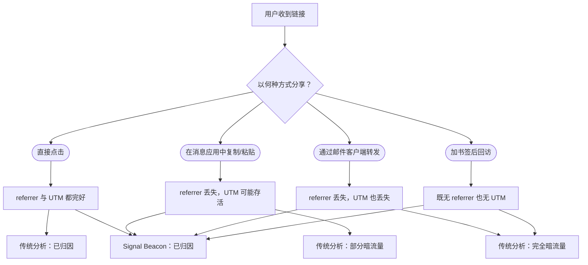

有人把你的链接复制到一个消息应用里粘贴出去。referrer 不见了。UTM 参数被剥掉了。这次点击就此变成不可见。我们称这种为暗流量——对大多数分析工具来说，它根本不存在。下面讲讲 Beacon 元数据是如何在其他东西都失效的地方依然存活下来的。

{/* truncate */}

## 什么让流量变"暗"

暗流量是指任何到达时没有归因数据的访问。它发生得很频繁：

- 一位同事把 URL 粘到一个私有 Alloy 频道里。消息应用剥掉 referrer 头。
- 有人复制了一个带 UTM 参数的链接、贴进邮件草稿里。邮件客户端把 `?` 之后的东西全部丢掉。
- 用户给一个被跟踪的 URL 加了书签，三周后回访。原来的营销活动上下文消失了。
- 一个移动 App 在内置浏览器里打开链接。referrer 显示的是 App，而不是来源。

在这四种情况中，点击都到达了。转化或许也发生了。但从分析工具的视角来看，这位访客是从一片虚空中冒出来的。

## 暗流量到底有多少

我们分析了六个月内 5,000 万次 Beacon 重定向中的归因数据，结果令人警醒：

| 来源     | 已归因 | 暗流量 |
|--------|-----|-----|
| 邮件营销活动 | 82% | 18% |
| 社交贴文   | 61% | 39% |
| 消息应用   | 12% | 88% |
| 直接转发   | 8%  | 92% |
| 跨设备    | 34% | 66% |

消息应用与直接转发几乎全是暗流量。社交三分之一是暗的。即便是邮件这个最可控的渠道，也仍有近五分之一的点击落入暗流量。

## Beacon 的嵌入式元数据

一条标准 URL 依赖查询参数来承载归因：

```
https://example.com/pricing?utm_source=email&utm_medium=newsletter&utm_campaign=launch
```

当有人复制并粘贴这条链接时，查询参数能否保留是不确定的；而 referrer 头几乎肯定不会保留。

一条 Beacon 链接则把归因元数据嵌进重定向自身：

```json title="Beacon 链接结构"
{
  "shortUrl": "https://go.signal.example/a7x9m2",
  "destination": "https://example.com/pricing",
  "attribution": {
    "campaign": "launch",
    "channel": "email",
    "variant": "newsletter-hero",
    "trace": "trc_8f3a1b2c4d5e6f70"
  }
}
```

归因数据不在用户看到的 URL 里，它存在服务端，并在重定向时被解析出来。无论链接是怎么被分享的——复制、粘贴、加书签、截图后再打字——归因都能存活下来，因为它住在重定向里，不在 URL 里。

## 已归因 vs 暗流量的流向



在传统分析中，四条路径里有三条会变成暗流量或部分暗流量。在 Beacon 下，这四条路径全部完整归因。

### 暗流量的检测启发式

即便没有 Beacon，你也可以用下列启发式估算自己的暗流量量级：

1. **直接流量异常** — 如果你的"直接"流量细分在行为上与邮件受众一致（访问同样页面、走同样转化路径），那么其中很大一部分大概率是暗化的邮件流量。

2. **referrer 缺口** — 拿 Beacon 重定向日志（始终带归因）与页面侧分析（依赖 referrer 头）做对比，二者之间的差距就是你每个渠道的暗流量比例。

3. **UTM 存活率** — 创建带 UTM 的测试 Beacon 链接，通过每一种渠道分享出去，测量到达目的地时仍带完整 UTM 的点击占比。其补数即 UTM 剥离率。

4. **跨设备阴影** — 在一台设备上点击、却在另一台设备上转化的用户，会被算作"新的直接访客"。Beacon 的 trace ID 能在没有 cookie 的情况下把他们跨设备关联起来。

## 忽视暗流量的代价

如果你 30% 的流量是暗的，那么你 30% 的归因数据就是谎言。最后点击模型把功劳记给"直接"流量——而"直接"不是一个渠道，它只是信息缺失的代号。基于不完整归因做出的媒体投放决策，会持续低估那些最容易产生暗流量的渠道：消息、社交转发与口碑。

Beacon 并不会消灭暗流量，它让暗流量变得可见。

## 下一步

- [点击归因](/docs/attribution/click-attribution/) — 看 Prism 如何处理包含被找回的暗流量的多触点路径。
- [快速开始](/docs/getting-started/quick-start/) — 铸造你的第一条 Beacon 链接，亲眼看到归因元数据在工作。
