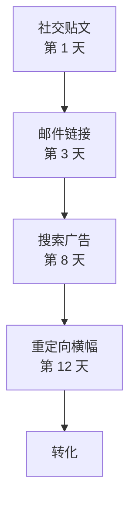

import Details from '@theme/Details';

# 点击归因

Prism 是 Signal 的多触点归因引擎。它追踪跨渠道的完整转化路径，为每一个触点分配加权功劳，并重建从初次接触到最终行动的整段旅程。

## 单一触点的问题

大多数归因模型只把功劳记给一个触点——要么是首次点击，要么是最后一次点击。两者都不对。一个用户看到社交贴，点击邮件链接，通过搜索广告再次访问，最终从重定向横幅完成转化——这不是"一次点击"的故事，而是一部四章的叙事，每一章都贡献了内容。

Prism 把它们全部记下来。

## 多触点归因路径

当用户跨渠道与多条 Beacon 链接发生交互时，Prism 会构建一条归因路径：



每一个节点都是一条带有 trace 元数据的 Beacon 链接。Prism 通过跨触点匹配用户指纹，把它们串联成一条统一的归因链。

## 归因模型

Prism 支持多种归因模型。请选择与你业务逻辑相符的那一种：

| 模型      | 描述                                  | 最适用于          |
|---------|-------------------------------------|---------------|
| **线性**  | 每个触点平均分配功劳。                         | 简单营销活动、基线参考。  |
| **衰减**  | 更靠近转化的触点权重更高。半衰期可配置。                | 长销售周期。        |
| **位置**  | 首次接触 40%、最后接触 40%、其余 20% 在中间触点之间分摊。 | 品牌 + 转化型营销活动。 |
| **自定义** | 在 Alloy 中自行编写加权函数。                  | 复杂的多渠道漏斗。     |

## 查询归因路径

按特定 trace 查询完整路径：

```bash title="查询归因路径"
signal prism path --trace "trc_8f3a1b2c4d5e6f70"
```

```json title="多触点归因输出"
{
  "trace": "trc_8f3a1b2c4d5e6f70",
  "model": "decay",
  "halfLife": "7d",
  "touchpoints": [
    {
      "order": 1,
      "channel": "social",
      "campaign": "product-launch",
      "variant": "og-card",
      "timestamp": "2025-02-08T14:22:00Z",
      "weight": 0.12
    },
    {
      "order": 2,
      "channel": "email",
      "campaign": "product-launch",
      "variant": "hero-cta",
      "timestamp": "2025-02-10T09:15:00Z",
      "weight": 0.18
    },
    {
      "order": 3,
      "channel": "search",
      "campaign": "brand-terms",
      "variant": "headline-a",
      "timestamp": "2025-02-15T11:40:00Z",
      "weight": 0.28
    },
    {
      "order": 4,
      "channel": "retargeting",
      "campaign": "product-launch",
      "variant": "banner-300x250",
      "timestamp": "2025-02-19T16:05:00Z",
      "weight": 0.42
    }
  ],
  "conversion": {
    "event": "signup",
    "timestamp": "2025-02-19T16:08:32Z",
    "value": 49.00
  }
}
```

## 衰减曲线

衰减模型让越靠近转化的触点拿到越多功劳。半衰期参数控制更早的触点失去权重的速度：

| 半衰期   | 效果                      |
|-------|-------------------------|
| `1d`  | 激进衰减。只有最近一两天的触点才重要。     |
| `7d`  | 温和衰减。整整一周的触点都能分到有意义的权重。 |
| `30d` | 缓慢衰减。长周期培育序列也能保留较多权重。   |

```bash title="设置 7 天半衰期的衰减模型"
signal prism model set --model decay --half-life 7d --campaign "product-launch"
```

<Details>
<summary>衰减算法的工作方式</summary>

Prism 的衰减模型使用指数衰减函数。对于转化前时间 `t` 的每一个触点，原始权重为：

```
weight(t) = e^(-lambda * t)
```

其中 `lambda = ln(2) / halfLife`。Prism 计算完所有触点的原始权重后会做归一化，使总和等于 1.0。

举例：在 7 天半衰期下，转化前 7 天的触点拿到的权重恰好是转化时刻触点的一半；转化前 14 天的触点则只剩四分之一。

自定义模型让你可以用一段 Alloy 脚本替换掉这个函数——脚本接收触点数组，返回权重数组。

</Details>

## 渠道加权

可以用按渠道的乘子覆盖基础归因模型：

```bash title="应用渠道权重"
signal prism weights set \
  --campaign "product-launch" \
  --channel email=1.2 \
  --channel social=0.8 \
  --channel search=1.0 \
  --channel retargeting=0.9
```

渠道权重会在基础模型算出原始权重之后再被乘上去。把 email 的乘子设为 1.2 意味着邮件触点会比基础模型分到多 20% 的功劳。

## 下一步

- [营销活动管理](/docs/campaigns/campaign-management/) — 用 Aperture 拍下营销活动的表现快照。
- [受众分析](/docs/attribution/audience-analysis/) — 用 Resonance 找出受众在何处发生重叠。
