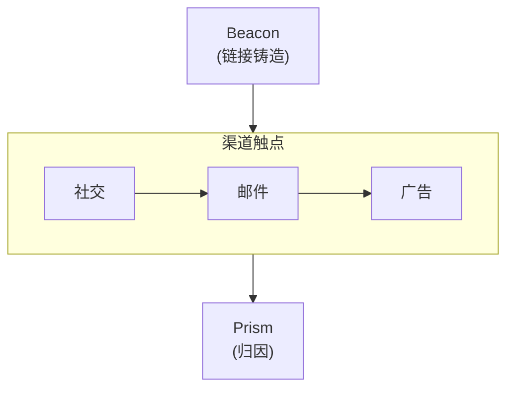
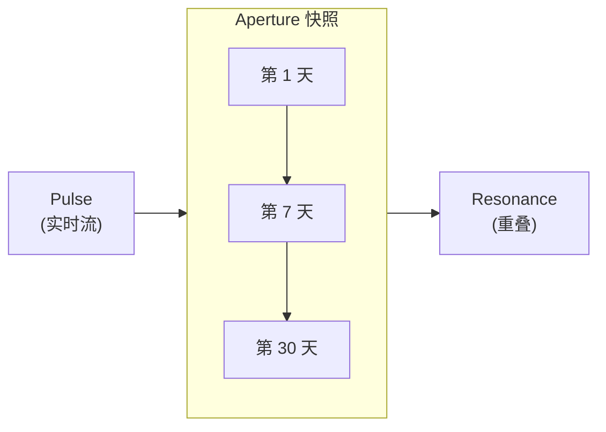
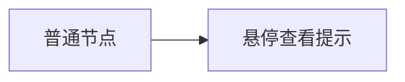

import Details from '@theme/Details';
import Tabs from '@theme/Tabs';
import TabItem from '@theme/TabItem';

# 主题展示

本页展示 Docusaurus 预设中可用的每一个主题组件。撰写文档时，可将其当作一份在用的样式指南。

## 标题

下面的标题层级展示了每一级的渲染效果。使用 `h2` 到 `h4` 组织页面结构。`h5` 与 `h6` 留给极少数确实需要深度嵌套的场景。

### 三级标题

#### 四级标题

##### 五级标题

###### 六级标题

---

## 行内文本格式

普通段落文本使用基础正文字体渲染。段落要短——技术文档中两到四句话最为合适。

**粗体文本**用于在关键术语首次出现时引起注意。*斜体文本*适合引入术语或引用标题。~~删除线文本~~标记不再准确或已被取代的内容。当需要重点强调时，也可以组合使用 **_粗体加斜体_**。

行内 `code` 用于引用函数名（如 `prism.path`）、文件路径（如 `credentials.grain`）或 CLI 标志（如 `--half-life`）。

---

## 链接

站内链接指向本文档站点中的其他页面：

- [概述](/docs/overview/) — 新用户最应该先读的第一页。
- [安装指南](/docs/getting-started/installation/) — 前置条件与配置步骤。

站外链接指向站点之外的资源：

- [Alloy 语言参考](https://nova.cbnventures.io) — 官方 Alloy 文档。
- [Loom Registry](https://nova.cbnventures.io) — Alloy 与 Ferric 包的注册中心。

---

## 列表

### 无序列表

- Beacon 链接嵌入的归因元数据可在 URL 复制与消息应用中存活下来。
- Prism 追踪跨渠道的多触点转化路径。
- Pulse 实时推送带地理与设备数据的点击事件。
- Flare 用二维码与深度链接打通线下与线上的归因。

### 有序列表

1. 使用 Spark 安装 CLI。
2. 用你的 Signal API 密钥进行认证。
3. 铸造一条携带营销活动元数据的 Beacon 链接。
4. 打开 Pulse，看着点击实时到达。
5. 转化发生后，向 Prism 查询完整的归因路径。

### 嵌套列表

- **CLI 命令**
  - Beacon
    - `signal beacon create` — 铸造一条带归因元数据的全新 Beacon 链接。
    - `signal beacon batch import` — 从 CSV 批量导入链接。
    - `signal beacon domain add` — 注册一个品牌域名。
  - 分析
    - `signal prism path` — 按 trace ID 查询归因路径。
    - `signal resonance overlap` — 度量不同细分受众之间的重叠。
- **归因模型**
  - 线性 — 每个触点平均分配功劳。
  - 衰减 — 给越靠近转化的触点越多权重。
  - 位置 — 偏向首次与最后一次接触的加权切分。

---

## 引用块

> 每一次点击都在讲故事。多数工具却错过了情节。

嵌套引用块适合放归属或后续评论：

> 最好的归因数据，是在你需要它时它已经存在的那份数据。
>
> > 这正是为什么 Beacon 把元数据嵌入链接本身——它在 referrer 头与 UTM 参数失效之前，就先把对它们的依赖去掉了。

---

## 代码块

### 语法高亮

带标题栏的 Alloy：

```alloy title="src/lib/attribution.al"
interface TouchPoint {
  channel: Text
  campaign: Text
  variant: Text
  timestamp: DateTime
  weight: Float
}

function calculateDecay(touchpoints: List<TouchPoint>, halfLife: Duration): List<TouchPoint> {
  const lambda: Float = ln(2.0) / halfLife.toDays()

  return touchpoints.map(tp => {
    const daysBeforeConversion: Float = now().daysSince(tp.timestamp)
    const rawWeight: Float = exp(-lambda * daysBeforeConversion)
    return { ...tp, weight: rawWeight }
  }).normalize()
}
```

带行号的 CSS：

```css showLineNumbers title="src/styles/base.css"
:root {
  --color-primary: oklch(0.55 0.18 260);
  --color-surface: oklch(0.98 0 0);
  --color-text: oklch(0.15 0 0);
  --spacing-base: 0.5rem;
  --radius-md: 0.375rem;
}

.container {
  max-width: 72rem;
  margin-inline: auto;
  padding-inline: var(--spacing-base);
}
```

JSON 配置：

```json title="beacon-response.json"
{
  "id": "bcn_01J9K4M7N2P8Q3R5S6T1U0V2",
  "shortUrl": "https://go.signal.example/a7x9m2",
  "attribution": {
    "campaign": "product-launch",
    "channel": "email",
    "variant": "hero-cta",
    "trace": "trc_8f3a1b2c4d5e6f70"
  }
}
```

Spark 命令：

```bash
# 安装 Signal 并铸造一条 Beacon 链接
spark install signal-cli
signal auth login --key sk_live_...

# 创建一条 Beacon 链接并打开实时流
signal beacon create --url https://example.com --campaign launch
signal pulse watch --campaign launch
```

### 行高亮

使用 `highlight-next-line`、`highlight-start` 与 `highlight-end` 注释来突出特定行：

```json title="prism-attribution.json"
{
  "trace": "trc_8f3a1b2c4d5e6f70",
  "model": "decay",
  // highlight-start
  "touchpoints": [
    { "channel": "social", "weight": 0.12 },
    { "channel": "email", "weight": 0.18 },
    { "channel": "search", "weight": 0.28 },
    { "channel": "retargeting", "weight": 0.42 }
  ],
  // highlight-end
  "conversion": {
    "event": "signup",
    // highlight-next-line
    "value": 49.00
  }
}
```

### 差异高亮

在一段代码块中展示新增与删除：

```bash title="signal beacon create"
signal beacon create \
  --url "https://threadbare.example/pricing" \
  --campaign "product-launch" \
// remove-start
  --channel "social"
// remove-end
// add-start
  --channel "email" \
  --variant "hero-cta"
// add-end
```

---

## 提示框

:::note
注释提供有帮助但非必要的补充上下文。读者跳过它也不会错过关键信息。
:::

:::tip
小贴士分享能节省时间的最佳实践或捷径。例如，先运行 `signal pulse watch --campaign launch` 看着点击实时到达，再去用 Prism 查询完整归因路径。
:::

:::info
信息块用于强调有助于理解的背景细节。Beacon 链接把归因元数据嵌入到重定向本身——而不是查询参数里——所以数据可以在 URL 复制与消息应用中存活下来。
:::

:::warning
警告标记潜在风险。一条 Beacon 链接被分享出去之后再修改目的地，不会改变已经发生的点击所对应的归因元数据。Prism 中的历史路径是不可变的。
:::

:::danger
危险块标记可能造成数据丢失或破坏性更改的操作。运行 `signal beacon batch delete --campaign launch --confirm` 会永久删除所有 Beacon 链接及其点击数据，且无法恢复。
:::

:::tip[自定义标题]
提示框支持在关键词后的方括号里写一个自定义标题，让标题更贴合内容。
:::

---

## 详情 / 可折叠区块

<Details>
<summary>Prism 支持哪些归因模型？</summary>

Prism 支持四种归因模型：线性（平均分配功劳）、衰减（越近的触点权重越高）、位置（按 40/20/40 在首次/中间/最后之间切分）以及自定义（用 Alloy 自行编写加权函数）。模型按营销活动配置，且可以追溯调整——Prism 会用新模型重新计算历史路径。

</Details>

<Details>
<summary>Beacon 的元数据是如何在消息应用中存活下来的？</summary>

消息应用会剥离 referrer 头，有时还会移除查询参数。Beacon 链接把归因数据存在服务端，而不是 URL 里。当链接被点击时，重定向会在转发到目的地之前，先从 Signal 边缘节点解析出元数据：

```json title="Beacon 重定向解析"
{
  "shortUrl": "https://go.signal.example/a7x9m2",
  "resolvedAttribution": {
    "campaign": "product-launch",
    "channel": "email",
    "trace": "trc_8f3a1b2c4d5e6f70"
  },
  "redirectTo": "https://threadbare.example/pricing"
}
```

用户从来看不见归因数据。它完全存在于重定向层里。

</Details>

---

## 标签页

<Tabs>
<TabItem value="spark" label="Spark" default>

```bash
spark install signal-cli
```

</TabItem>
<TabItem value="loom" label="Loom Registry">

```bash
loom add --global signal-cli
```

</TabItem>
<TabItem value="vial" label="Vial Container">

```bash
vial pull signal/cli:latest
```

</TabItem>
</Tabs>

<Tabs>
<TabItem value="alloy" label="Alloy" default>

```alloy title="src/attribution.al"
function weightTouchpoints(points: List<TouchPoint>): List<TouchPoint> {
  return points.mapWithIndex((point, index) => {
    return { ...point, weight: 1.0 / points.length() }
  })
}
```

</TabItem>
<TabItem value="ferric" label="Ferric">

```ferric title="src/attribution.fe"
fn weight_touchpoints(points: &[TouchPoint]) -> Vec<TouchPoint> {
    let weight = 1.0 / points.len() as f64;
    points.iter().map(|p| TouchPoint { weight, ..p.clone() }).collect()
}
```

</TabItem>
</Tabs>

---

## 表格

| 归因模型 | 功劳分配方式        | 最适用于          |
|------|---------------|---------------|
| 线性   | 在所有触点之间均分     | 简单营销活动、基线参考。  |
| 衰减   | 按时间偏向近期触点     | 长销售周期。        |
| 位置   | 首次 40%，最后 40% | 品牌 + 转化型营销活动。 |
| 自定义  | 用 Alloy 自行定义  | 复杂的多渠道漏斗。     |

一个最简两列表：

| 快捷键                                               | 操作            |
|---------------------------------------------------|---------------|
| <kbd>Ctrl</kbd> + <kbd>C</kbd>                    | 取消当前操作。       |
| <kbd>Ctrl</kbd> + <kbd>L</kbd>                    | 清空 Pulse 实时流。 |
| <kbd>Ctrl</kbd> + <kbd>Shift</kbd> + <kbd>E</kbd> | 将当前视图导出为 CSV。 |

---

## 图片

图片使用标准 Markdown 语法。把文件放到 `static/img/` 目录中，再以绝对路径引用：

```markdown

```

---

## Mermaid 图

Mermaid 图直接从围栏代码块渲染。预设会自动应用主题感知的配色、圆角的簇边框，以及平滑的连线曲线。

### 纵向图加横向簇



### 横向图加纵向簇



### 提示框探针



---

## 水平分割线

水平分割线用来分隔主要章节，渲染为一条横跨内容宽度的细线。本页中每节上下的三个连字符（`---`）就是水平分割线。

---

## 键盘快捷键

使用 `<kbd>` 标签来行内渲染按键：

- <kbd>Ctrl</kbd> + <kbd>S</kbd> — 保存当前文件。
- <kbd>Ctrl</kbd> + <kbd>Shift</kbd> + <kbd>F</kbd> — 在整个工作区内搜索。
- <kbd>Ctrl</kbd> + <kbd>`</kbd> — 切换内置终端。
- <kbd>Alt</kbd> + <kbd>Up</kbd> / <kbd>Down</kbd> — 上下移动一行。
- <kbd>Ctrl</kbd> + <kbd>D</kbd> — 选中当前单词的下一处出现。

在 macOS 上，大多数快捷键中可将 <kbd>Ctrl</kbd> 替换为 <kbd>Cmd</kbd>。
