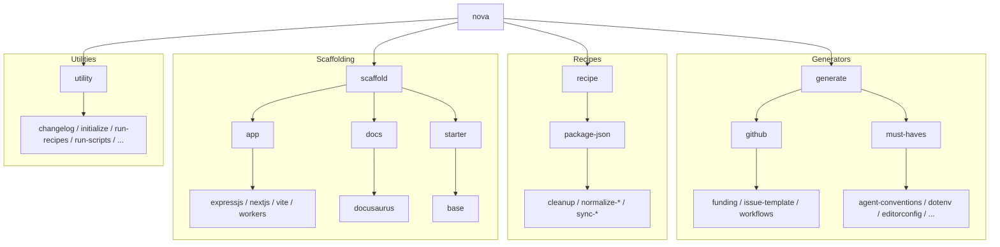

import { Terminology } from '@cbnventures/docusaurus-preset-nova/components';
import Tabs from '@theme/Tabs';
import TabItem from '@theme/TabItem';

The **Nova <Terminology title="command line interface" to="/docs/quickstart/terminology#fundamentals" color={true}>CLI</Terminology>** lets you generate files, apply <Terminology title="transform script" to="/docs/quickstart/terminology#nova-concepts" color={true}>recipes</Terminology>, <Terminology title="project starter" to="/docs/quickstart/terminology#nova-concepts" color={true}>scaffold</Terminology> projects, and run utilities.

:::tip Step by step
Not sure what to type? Build the command **one section at a time**.

Start with `nova`, then the **command** and **subcommand** (if available), and finally the **options** like `--all` or `-a`. Each step shows **inline guidance** so you don't wonder what to do next.
:::

## Get Started

<Tabs groupId="install-state">
  <TabItem value="nova" label="nova (installed)" default>

    ```bash
    nova <command> <subcommand> [option]
    ```

  </TabItem>
  <TabItem value="npx" label="npx (no install)">

    ```bash
    npx --yes @cbnventures/nova@latest <command> <subcommand> [option]
    ```

  </TabItem>
</Tabs>

- **Options are recommended** — Type the option (**flags / switches**) you want, like `--all` or `-a`. This helps you learn the command faster.
- **Build it step by step** — Start with `nova`, add the **command** and **subcommand**, then finish with **options** like `--all` or `-a`. Repeat until it feels natural.

## Commands



All commands below **show a help screen when run with the `--help` or `-h` option**, so you can explore safely and avoid accidental runs.

:::tip Mix and match
You can freely combine full names and shorthands in the same command. For example, `nova generate must lic` and `nova gen must-haves license` both work the same way.
:::

### Generators

Create **semi-tailored** versions of supported vendor and project essentials, populated with values from <Terminology title="Nova config" to="/docs/quickstart/terminology#nova-concepts" color={true}>`nova.config.json`</Terminology> at the <Terminology title="project root" to="/docs/quickstart/terminology#git-and-workflow" color={true}>monorepo root</Terminology>.

:::info
All commands in "Generators" are shaped as `nova generate <category> <subcommand>` or `nova gen <alias> <shorthand>`.
:::

#### GitHub
_Category: `github` · Alias: `gh`_

| Subcommand                                                     | Shorthand | What It Does                                                                                                                                                                                                                    |
|----------------------------------------------------------------|-----------|---------------------------------------------------------------------------------------------------------------------------------------------------------------------------------------------------------------------------------|
| [`funding`](/docs/cli/generators/github/funding)               | —         | Create a `.github/FUNDING.yml` file for [GitHub](https://github.com/) sponsor links.                                                                                                                                            |
| [`issue-template`](/docs/cli/generators/github/issue-template) | `issue`   | Create `.github/ISSUE_TEMPLATE` files for [GitHub](https://github.com/) issue forms.                                                                                                                                            |
| [`workflows`](/docs/cli/generators/github/workflows)           | —         | Create `.github/workflows` files for [GitHub](https://github.com/) <Terminology title="continuous integration and deployment" to="/docs/quickstart/terminology#builds-and-tooling" color={true}>CI/CD</Terminology> automation. |

#### Must-Haves
_Category: `must-haves` · Alias: `must`_

| Subcommand                                                               | Shorthand | What It Does                                                     |
|--------------------------------------------------------------------------|-----------|------------------------------------------------------------------|
| [`agent-conventions`](/docs/cli/generators/must-haves/agent-conventions) | `agent`   | Create agent convention files for coding assistants.             |
| [`dotenv`](/docs/cli/generators/must-haves/dotenv)                       | `env`     | Create `.env` and `.env.sample` files for environment secrets.   |
| [`editorconfig`](/docs/cli/generators/must-haves/editorconfig)           | —         | Create a `.editorconfig` file for consistent coding styles.      |
| [`gitignore`](/docs/cli/generators/must-haves/gitignore)                 | —         | Create a `.gitignore` file for excluding files from Git commits. |
| [`license`](/docs/cli/generators/must-haves/license)                     | `lic`     | Create a `LICENSE` file for project license agreements.          |
| [`read-me`](/docs/cli/generators/must-haves/read-me)                     | `read`    | Create a baseline `README.md` file for your project.             |

### Recipes

Apply **scripted edits** that automate routine maintenance, using values from <Terminology title="Nova config" to="/docs/quickstart/terminology#nova-concepts" color={true}>`nova.config.json`</Terminology> at the <Terminology title="project root" to="/docs/quickstart/terminology#git-and-workflow" color={true}>monorepo root</Terminology>.

:::info
All commands in "Recipes" are shaped as `nova recipe <category> <subcommand>` or `nova rcp <alias> <shorthand>`.
:::

#### package.json
_Category: `package-json` · Alias: `pkg`_

| Subcommand                                                                        | Shorthand   | What It Does                                                                                          |
|-----------------------------------------------------------------------------------|-------------|-------------------------------------------------------------------------------------------------------|
| [`cleanup`](/docs/cli/recipes/package-json/cleanup)                               | `clean`     | Remove unsupported keys and reorder remaining keys in workspace `package.json` files.                 |
| [`normalize-artifacts`](/docs/cli/recipes/package-json/normalize-artifacts)       | `norm-art`  | Normalize files, bin, man, directories, private, and publishConfig in workspace `package.json` files. |
| [`normalize-bundler`](/docs/cli/recipes/package-json/normalize-bundler)           | `norm-bun`  | Normalize types, module, sideEffects, and esnext bundler fields in workspace `package.json` files.    |
| [`normalize-dependencies`](/docs/cli/recipes/package-json/normalize-dependencies) | `norm-dep`  | Normalize dependency fields and optionally pin versions in workspace `package.json` files.            |
| [`normalize-modules`](/docs/cli/recipes/package-json/normalize-modules)           | `norm-mod`  | Normalize exports, main, type, browser, and imports fields in workspace `package.json` files.         |
| [`normalize-tooling`](/docs/cli/recipes/package-json/normalize-tooling)           | `norm-tool` | Normalize scripts, gypfile, config, and workspaces in workspace `package.json` files.                 |
| [`sync-environment`](/docs/cli/recipes/package-json/sync-environment)             | `sync-env`  | Sync engines, os, cpu, libc, devEngines, and packageManager in workspace `package.json` files.        |
| [`sync-identity`](/docs/cli/recipes/package-json/sync-identity)                   | `sync-id`   | Sync name, version, description, keywords, and license to workspace `package.json` files.             |
| [`sync-ownership`](/docs/cli/recipes/package-json/sync-ownership)                 | `sync-own`  | Sync homepage, bugs, author, contributors, funding, and repository to workspace `package.json` files. |

### Scaffolding

Bootstrap **full project starters** as <Terminology title="multi-package repo" to="/docs/quickstart/terminology#git-and-workflow" color={true}>monorepo</Terminology> workspaces. Each <Terminology title="project starter" to="/docs/quickstart/terminology#nova-concepts" color={true}>scaffold</Terminology> creates a ready-to-use workspace with all necessary config files, dependencies, and build setup.

:::info
All commands in "Scaffolding" are shaped as `nova scaffold <category> <subcommand>` or `nova scaf <alias> <shorthand>`.
:::

#### App
_Category: `app` · Alias: none_

| Subcommand                                         | Shorthand | What It Does                             |
|----------------------------------------------------|-----------|------------------------------------------|
| [`expressjs`](/docs/cli/scaffolding/app/expressjs) | `express` | Scaffold an Express.js workspace.        |
| [`nextjs`](/docs/cli/scaffolding/app/nextjs)       | `next`    | Scaffold a Next.js workspace.            |
| [`vite`](/docs/cli/scaffolding/app/vite)           | —         | Scaffold a Vite workspace.               |
| [`workers`](/docs/cli/scaffolding/app/workers)     | —         | Scaffold a Cloudflare Workers workspace. |

#### Docs
_Category: `docs` · Alias: none_

| Subcommand                                            | Shorthand | What It Does                                   |
|-------------------------------------------------------|-----------|------------------------------------------------|
| [`docusaurus`](/docs/cli/scaffolding/docs/docusaurus) | —         | Scaffold a Docusaurus documentation workspace. |

#### Starter
_Category: `starter` · Alias: `start`_

| Subcommand                                   | Shorthand | What It Does                                                    |
|----------------------------------------------|-----------|-----------------------------------------------------------------|
| [`base`](/docs/cli/scaffolding/starter/base) | —         | Scaffold a base monorepo project without a framework workspace. |

### Utilities

Tools for **diagnostics**, **quick checks**, and **development helpers**.

:::info
All commands in "Utilities" are shaped as `nova utility <subcommand>` or `nova util <shorthand>`.
:::

| Subcommand                                       | Shorthand  | What It Does                                                                                            |
|--------------------------------------------------|------------|---------------------------------------------------------------------------------------------------------|
| [`changelog`](/docs/cli/utilities/changelog)     | `log`      | Record changes and release versioned changelogs.                                                        |
| [`initialize`](/docs/cli/utilities/initialize)   | `init`     | Generate a new `nova.config.json` configuration file for this project.                                  |
| [`run-recipes`](/docs/cli/utilities/run-recipes) | `run-rcp`  | Run all enabled recipes and finalize workspace `package.json` files.                                    |
| [`run-scripts`](/docs/cli/utilities/run-scripts) | `run-scr`  | Run package.json scripts by pattern in sequential or parallel mode.                                     |
| [`transpile`](/docs/cli/utilities/transpile)     | `xpile`    | Transpile TypeScript with filtered diagnostics, emitting compiled output for project-owned files.       |
| [`type-check`](/docs/cli/utilities/type-check)   | `type-chk` | Run full TypeScript type checking scoped to project-owned files, filtering out third-party diagnostics. |
| [`version`](/docs/cli/utilities/version)         | `ver`      | Generate a Markdown-ready snapshot of your development stack versions (e.g., `node --version`).         |

## Troubleshooting

### Exit Codes

| Code | Meaning | Result                            |
|------|---------|-----------------------------------|
| `0`  | Success | Response of the executed command. |
| `1`  | Error   | Help text displayed.              |

### Quick Fixes
- Prefer **explicit command, subcommands, and options** for clarity, fewer mistakes, and predictable behavior. For example, `nova utility version --all` instead of the alternate variants.
