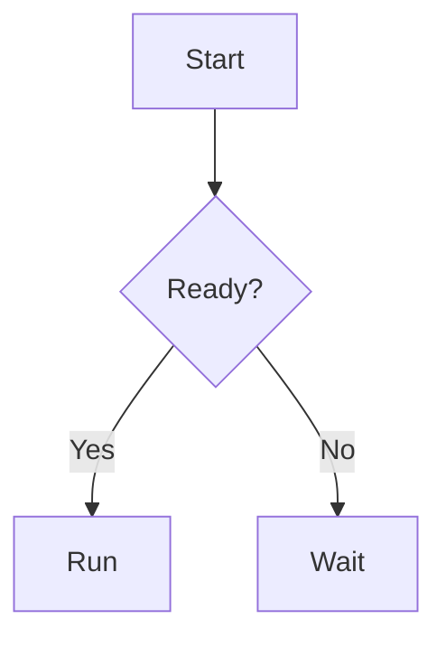
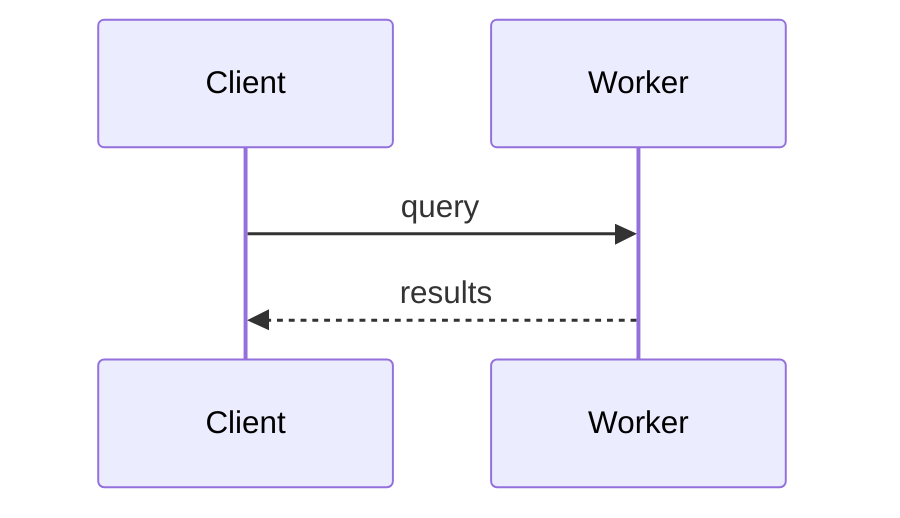
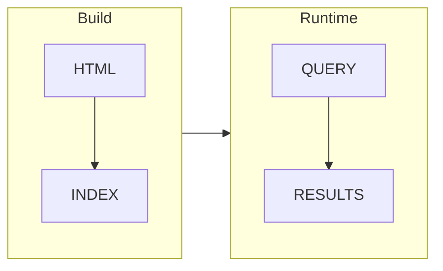
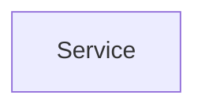

Render Mermaid diagrams by writing a fenced code block whose language is `mermaid`, once Mermaid is enabled in your Docusaurus config.

## Summary

The preset registers a Mermaid renderer as the MDX component for `mermaid` fences, so a code block tagged `mermaid` renders as a diagram instead of highlighted source.

- **`markdown.mermaid: true`** in `docusaurus.config` is required, otherwise `mermaid` fences stay plain code.
- A fenced block with the `mermaid` language is the only authoring step.
- Diagrams adopt **per-preset identity** through `--nova-mermaid-*` tokens for node radius, cluster fill, and cluster stroke.
- Clickable nodes show a **styled hover tooltip** instead of the browser's native one.
- The renderer follows the active color mode, re-rendering when `data-theme` flips between light and dark.

## Why Use This?

- Authors diagrams in plain Markdown so a flowchart lives next to the prose it documents.
- Themes each diagram with the active preset's tokens so it matches the rest of the page in both light and dark mode.
- Renders inside an error boundary so a malformed diagram does not crash the page.
- Replaces the unstyled native tooltip on clickable nodes with one that follows the design system.

## Enabling Mermaid

Mermaid is off by default. Set `markdown.mermaid` to `true` in your Docusaurus config so the toolchain treats `mermaid` fences as diagrams.

```ts title="docusaurus.config.ts"
const config = {
  markdown: {
    mermaid: true,
  },
};
```

Without this flag, a `mermaid` code fence renders as a static code block rather than a diagram.

## Usage

Write a fenced code block whose language identifier is `mermaid`. The block body is standard Mermaid syntax.

### Flowchart

````markdown

````

### Sequence Diagram

Any diagram type Mermaid supports works the same way; only the fence language matters.

````markdown

````

### Subgraphs

Subgraphs become clusters, which pick up the preset's cluster fill, stroke, and corner radius.

````markdown

````

## Per-Preset Identity

Diagrams are not generically styled. The renderer reads preset CSS variables at render time and feeds them into Mermaid's theme, so node, edge, and cluster appearance track the active preset.

- **Node corner radius** comes from `--nova-mermaid-node-radius`, declared by each preset.
- **Cluster fill and stroke** come from `--nova-mermaid-cluster-fill` and `--nova-mermaid-cluster-stroke`.
- **Cluster corner radius** comes from `--nova-mermaid-cluster-radius`.
- **Node, line, and text colors** are derived from the preset's primary, accent, surface, border, and text color tokens.

Each preset (`envoy`, `foundry`, `lantern`, `marshal`, `sentinel`, `signal`) maps these shared tokens to its own preset-scoped values, so the same diagram looks at home under any preset.

## Hover Tooltip

Mermaid lets you attach a tooltip to a node with a `click` directive. On SVG nodes the browser ignores the underlying `title` attribute, so the preset ships a runtime handler that renders a styled `<div class="nova-mermaid-tooltip">` on hover instead.

````markdown

````

The native `title` is removed while the node is hovered so it does not compete, and restored on leave for accessibility.

## Color Mode

The renderer reads the document's `data-theme` attribute and re-renders when it changes, so diagrams switch between the preset's light and dark token values when the reader toggles the theme.

## Troubleshooting

- **Diagram renders as a code block** — `markdown.mermaid` is not set to `true` in `docusaurus.config`. The fence is treated as plain code until the flag is enabled.
- **Nothing renders for the fence** — The fence language is not exactly `mermaid`. Only the `mermaid` language is mapped to the diagram renderer.
- **Diagram colors look generic** — Confirm a Nova preset is active so the `--nova-mermaid-*` and color tokens resolve. The renderer pulls its theme from those variables at render time.
- **Tooltip is missing or unstyled** — The tooltip only appears on nodes that declare a `click` directive with a tooltip string. Nodes without one show nothing on hover.
- **Diagram does not follow dark mode** — The renderer keys off `data-theme` on the document element. If the theme attribute is overridden, the color mode it reads may not match.
