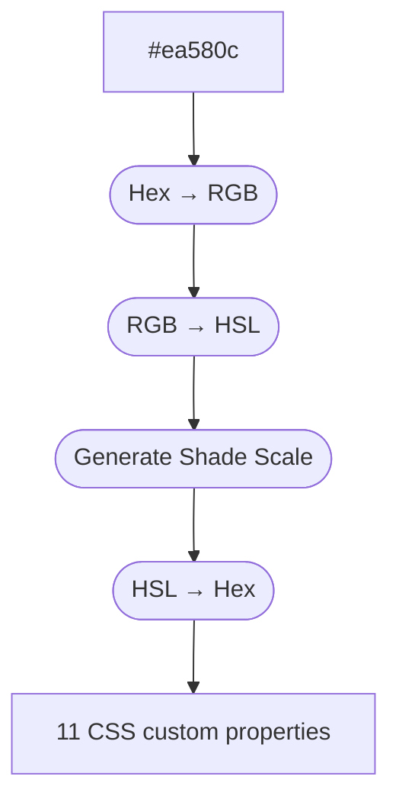

# Color Pipeline

Each preset declares six color categories, each as a `{ light, dark }` hex pair. The two brand colors — `primary` and `secondary` — pass through a generation pipeline to produce 11-level shade scales. The remaining four (`text`, `border`, `warning`, `danger`) are used as single values plus a handful of derived `color-mix` tokens.

## Summary

For brand colors, the pipeline converts a hex color to HSL, then interpolates lightness and adjusts saturation to produce 11 shades (50 through 950). Each shade is converted back to hex and written as a CSS custom property.

The base color sits at the 600 level. The pipeline runs twice per brand color — once for `light` and once for `dark` — producing a full light-mode scale on `:root` and a full dark-mode override under `:root[data-theme="dark"]`.

## How It Works



### Step 1: Hex to HSL

The input hex color (e.g., `#ea580c`) is parsed into RGB channels, then converted to HSL (hue, saturation, lightness) using standard color math.

```
#ea580c → RGB(234, 88, 12) → HSL(20.5°, 90.2%, 48.2%)
```

### Step 2: Generate Shade Scale

Each shade level has a predefined lightness position and saturation factor:

| Level | Position | Saturation Factor | Purpose      |
|-------|----------|-------------------|--------------|
| 50    | +0.93    | 0.40              | Near white   |
| 100   | +0.86    | 0.55              | Very light   |
| 200   | +0.73    | 0.70              | Light        |
| 300   | +0.58    | 0.82              | Light-medium |
| 400   | +0.39    | 0.92              | Medium-light |
| 500   | +0.20    | 0.98              | Medium       |
| 600   | 0        | 1.00              | Base color   |
| 700   | −0.28    | 0.95              | Medium-dark  |
| 800   | −0.50    | 0.90              | Dark         |
| 900   | −0.66    | 0.85              | Very dark    |
| 950   | −0.80    | 0.80              | Near black   |

**Lightness calculation:**
- Positive position: `targetLightness = baseLightness + (position × (100 − baseLightness))`
- Negative position: `targetLightness = baseLightness × (1 + position)`

**Saturation calculation:**
- `adjustedSaturation = baseSaturation × saturationFactor`

### Step 3: HSL to Hex

Each computed HSL value is converted back to RGB, then to a hex string. The result is a set of 11 hex colors that form a perceptually smooth gradient from near-white to near-black.

## Output

For the Foundry primary color `#ea580c`:

| Property                   | Value     |
|----------------------------|-----------|
| `--nova-color-primary-50`  | Lightest  |
| `--nova-color-primary-100` | ↓         |
| `--nova-color-primary-200` | ↓         |
| `--nova-color-primary-300` | ↓         |
| `--nova-color-primary-400` | ↓         |
| `--nova-color-primary-500` | ↓         |
| `--nova-color-primary-600` | `#ea580c` |
| `--nova-color-primary-700` | ↓         |
| `--nova-color-primary-800` | ↓         |
| `--nova-color-primary-900` | ↓         |
| `--nova-color-primary-950` | Darkest   |

The same shade-scale pipeline runs for `secondary`, which is emitted under the `--nova-color-accent-*` namespace for backward compatibility with existing preset CSS.

### Non-Brand Color Tokens

The remaining four color categories (`text`, `border`, `warning`, `danger`) write a single base token per category plus a small set of derived tokens computed at the CSS layer via `color-mix`:

| Property                      | Source                                                      |
|-------------------------------|-------------------------------------------------------------|
| `--nova-color-text`           | `text.light` (and `text.dark` under `[data-theme="dark"]`)  |
| `--nova-color-text-muted`     | `color-mix` of `--nova-color-text` and the background       |
| `--nova-color-text-soft`      | `color-mix` of `--nova-color-text` and the background       |
| `--nova-color-text-inverse`   | `text.dark` (always the dark-mode hex, used for inverse UI) |
| `--nova-color-border`         | `border.light` (and `border.dark` in dark mode)             |
| `--nova-color-border-subtle`  | `color-mix` of `--nova-color-border` and the background     |
| `--nova-color-surface-raised` | `color-mix` of background and `--nova-color-text`           |
| `--nova-color-warning-500`    | `warning.light` (and `warning.dark` in dark mode)           |
| `--nova-color-warning-400`    | `color-mix` of `--nova-color-warning-500` and background    |
| `--nova-color-warning-bg`     | `color-mix` of `--nova-color-warning-500` and transparent   |
| `--nova-color-danger-500`     | `danger.light` (and `danger.dark` in dark mode)             |
| `--nova-color-danger-400`     | `color-mix` of `--nova-color-danger-500` and background     |
| `--nova-color-danger-bg`      | `color-mix` of `--nova-color-danger-500` and transparent    |

In total, a single resolved preset emits 22 brand shade tokens (11 primary + 11 secondary/accent) plus 13 non-brand color tokens under `:root`, for 35 color custom properties.

## Using Color Tokens

Reference the generated tokens in your CSS:

```css
.my-element {
  color: var(--nova-color-text);
  background-color: var(--nova-color-primary-50);
  border-color: var(--nova-color-accent-200);
}
```

Lighter primary/secondary shades (50–400) work well for backgrounds and borders. The base shade (600) is the brand color.

Darker primary/secondary shades (700–950) work well for emphasis and on-color foregrounds. Use `--nova-color-text` (rather than a dark primary shade) for body copy so the color tracks the active color mode automatically.
