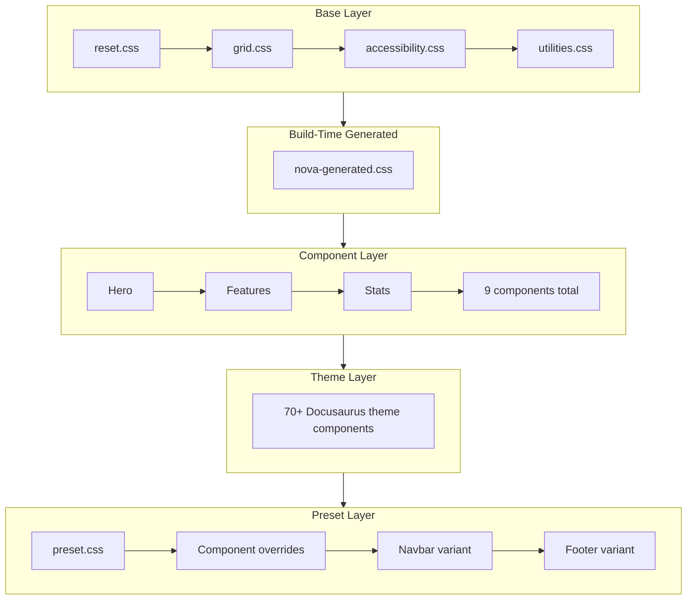

# CSS Architecture

The theme uses a three-layer CSS architecture. Each layer has a clear responsibility and loads in a deterministic order.

## Summary

Styles are organized into three layers: **base** (universal resets and utilities), **component** (structural layout for Nova components), and **preset** (visual identity — colors, shapes, depth, and motion). The theme also generates CSS custom properties from the preset configuration at build time.

## Three-Layer Model

### Base Layer

Universal styles shared across all presets and components.

| File                | Purpose                                                |
|---------------------|--------------------------------------------------------|
| `reset.css`         | CSS reset for consistent cross-browser baseline.       |
| `grid.css`          | Responsive grid system using CSS custom properties.    |
| `accessibility.css` | Focus styles, screen reader utilities, reduced motion. |
| `utilities.css`     | Shared structural patterns for reusable UI elements.   |

### Component Layer

Structural styles for the 9 Nova components. No colors, no shadows, no preset-specific values. Only layout, spacing, and responsive behavior.

| Directory                                | Purpose                      |
|------------------------------------------|------------------------------|
| `styles/components/hero/`                | Hero section layout.         |
| `styles/components/features/`            | Feature grid layout.         |
| `styles/components/stats/`               | Stats grid layout.           |
| `styles/components/spotlight/`           | Spotlight section layout.    |
| `styles/components/install-strip/`       | Install strip layout.        |
| `styles/components/blog-preview/`        | Blog preview grid layout.    |
| `styles/components/app-market-download/` | Download button layout.      |
| `styles/components/typewriter/`          | Typewriter animation layout. |
| `styles/components/terminology/`         | Terminology tooltip layout.  |

### Preset Layer

Visual identity for each preset. Each preset directory contains its own `preset.css`, component overrides, and navbar/footer variant styles.

```
styles/presets/{foundry|sentinel|signal|envoy}/
├── preset.css                     (root variables and base overrides)
├── components/                    (per-component visual overrides)
│   ├── hero/style.css
│   ├── features/style.css
│   └── ...
└── theme/                         (Docusaurus theme component overrides)
    ├── Navbar/{Bridge|Canopy|Compass|Monolith}/style.css
    ├── Footer/{Commons|Embassy|Ledger|Launchpad}/style.css
    ├── CodeBlock/style.css
    ├── DocSidebar/style.css
    └── ...
```

## CSS Load Order



The theme loads stylesheets in this exact sequence at page mount:

1. **Global resets** — `reset.css`, `grid.css`, `accessibility.css`, `utilities.css`
2. **Generated CSS** — `nova-generated.css` (CSS custom properties from preset config)
3. **Shared component styles** — structural layout for all 9 Nova components
4. **Shared theme styles** — base styles for 70+ Docusaurus theme components
5. **Preset identity CSS** — `preset.css` for the active preset
6. **Preset component overrides** — visual overrides per component per preset
7. **Preset navbar variant** — styles for the active navbar variant
8. **Preset footer variant** — styles for the active footer variant

:::info Load Order Matters
Later stylesheets override earlier ones at the same specificity. The preset layer loads last so it can override component and theme styles without `!important`.
:::

## CSS Custom Properties

The theme generates CSS custom properties from the preset configuration at build time. These properties are written to `nova-generated.css` and available globally.

### Colors

Each color (primary, accent, neutral) generates 11 shades:

| Property                   | Example Value | Description    |
|----------------------------|---------------|----------------|
| `--nova-color-primary-50`  | `#fff7ed`     | Lightest shade |
| `--nova-color-primary-100` | `#ffedd5`     |                |
| `--nova-color-primary-200` | `#fed7aa`     |                |
| `--nova-color-primary-300` | `#fdba74`     |                |
| `--nova-color-primary-400` | `#fb923c`     |                |
| `--nova-color-primary-500` | `#f97316`     |                |
| `--nova-color-primary-600` | `#ea580c`     | Base color     |
| `--nova-color-primary-700` | `#c2410c`     |                |
| `--nova-color-primary-800` | `#9a3412`     |                |
| `--nova-color-primary-900` | `#7c2d12`     |                |
| `--nova-color-primary-950` | `#431407`     | Darkest shade  |

The same pattern applies to `--nova-color-accent-*` and `--nova-color-neutral-*`.

### Fonts

| Property              | Example Value                     |
|-----------------------|-----------------------------------|
| `--nova-font-display` | `'Plus Jakarta Sans', sans-serif` |
| `--nova-font-body`    | `'Inter', sans-serif`             |
| `--nova-font-code`    | `'Fira Code', monospace`          |

### Shape

**Radius** is set by the `radius` config (`sharp`, `rounded`, `pill`):

| Property              | `sharp` | `rounded` | `pill`   |
|-----------------------|---------|-----------|----------|
| `--nova-shape-radius` | `0`     | `0.5rem`  | `9999px` |

**Density** is set by the `density` config (`compact`, `comfortable`, `spacious`):

| Property               | `compact` | `comfortable` | `spacious` |
|------------------------|-----------|---------------|------------|
| `--nova-shape-padding` | `0.5rem`  | `1rem`        | `1.5rem`   |
| `--nova-shape-gap`     | `0.25rem` | `0.5rem`      | `1rem`     |

### Depth

| Property                     | `flat`                                    | `elevated`                 | `glass`                            |
|------------------------------|-------------------------------------------|----------------------------|------------------------------------|
| `--nova-depth-card-shadow`   | `none`                                    | `0 4px 6px …, 0 2px 4px …` | `0 4px 30px …`                     |
| `--nova-depth-card-border`   | `1px solid var(--nova-color-neutral-200)` | `none`                     | `1px solid rgba(255,255,255,0.18)` |
| `--nova-depth-card-backdrop` | `none`                                    | `none`                     | `blur(5px)`                        |

Code block depth follows the same pattern with `--nova-depth-code-shadow` and `--nova-depth-code-border` (`flat`, `bordered`, `elevated`).

### Motion

**Speed** is set by the `speed` config (`none`, `subtle`, `normal`, `expressive`):

| Property                 | `none` | `subtle` | `normal` | `expressive` |
|--------------------------|--------|----------|----------|--------------|
| `--nova-motion-duration` | `0ms`  | `150ms`  | `200ms`  | `300ms`      |

**Toggles** are CSS numeric booleans (`0` or `1`):

| Property                          | Description                  |
|-----------------------------------|------------------------------|
| `--nova-motion-staggered-reveals` | Enable staggered animations. |
| `--nova-motion-hover-effects`     | Enable hover transitions.    |

### Grid

Responsive grid tokens with three breakpoints:

| Property              | Base   | 480px+ | 768px+ |
|-----------------------|--------|--------|--------|
| `--nova-grid-gutter`  | `16px` | `20px` | `24px` |
| `--nova-grid-padding` | `16px` | `20px` | `24px` |

Values shown for `comfortable` density. `compact` uses smaller values; `spacious` uses larger values.
