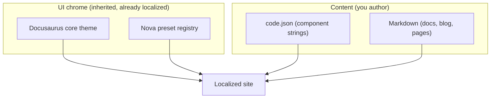
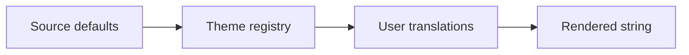

import Tabs from '@theme/Tabs';
import TabItem from '@theme/TabItem';

The `theme-nova` binary reconciles a site's translation tree. It regenerates the extractable keys, drops copies that merely duplicate a default, and preserves every real translation, replacing `docusaurus write-translations` for Nova sites.

## Summary

Docusaurus `write-translations` only ever adds keys. Over time the translation tree fills with `theme.*` copies that duplicate the built-in defaults and with keys whose source strings have been removed. `theme-nova i18n` reconciles the tree in both directions: it seeds new keys, prunes redundant copies, and surfaces orphaned keys for review before anything is deleted.

Two subcommands share one engine:

- `theme-nova i18n sync` — regenerate and reconcile the tree, writing the result.
- `theme-nova i18n check` — compute the same plan without writing and exit non-zero when the tree is out of sync, for continuous integration.

## What Gets Localized

Translations on a Nova site fall into two streams:

- **UI chrome** — buttons, navigation, the code-block Copy control, the footer credit. This is inherited and already localized: Docusaurus core translates its own components, and the Nova preset registry (`theme-nova.json`) ships translations for every Nova component in each supported locale. You touch it only to override a default, which lands in `code.json` under a `theme.*` key.
- **Content** — the words you write. Component strings extracted from `<Translate>` and `translate()` calls live in `code.json`; docs, blog posts, and Markdown pages are translated as whole files under `i18n/<locale>/`.



The preset offers translations for the full set of Docusaurus locales, independent of any consuming site; each site enables the subset it needs through `i18n.locales`. Reconciliation keeps `code.json` down to the chrome you actually overrode and the content you actually wrote — the rest resolves through the layers below.

## The Layered Pipeline

Every translation key resolves through three layers. Each layer overrides the one before it, so the final message is always the most specific value available.



| Layer             | Origin                                                                           | Role                                                   |
|-------------------|----------------------------------------------------------------------------------|--------------------------------------------------------|
| Source defaults   | `translate()` / `<Translate>` calls in the site, blocks, and theme-common source | The fallback English message extracted from the code.  |
| Theme registry    | `@docusaurus/theme-translations` for the active locale                           | The upstream localized default for each `theme.*` key. |
| User translations | The on-disk `code.json` and `docusaurus-theme-nova/<area>.json` bundles          | Your edits — these always win.                         |

**User translations always win.** Reconciliation never overwrites a message that differs from its resolved default. A value that matches the default exactly is a redundant copy and can be pruned; any other value is treated as a deliberate translation or override and is kept verbatim.

## How Reconciliation Classifies Each Key

For every key already on disk, the engine compares the stored message against the resolved default for that locale and sorts it into one bucket:

| Classification | Condition                                                                 | Action                                                                             |
|----------------|---------------------------------------------------------------------------|------------------------------------------------------------------------------------|
| Keep           | The stored message differs from the default (a real translation)          | Written back verbatim.                                                             |
| Redundant      | The stored message equals the default and the key is still live           | Dropped in non-default locales; kept in the default locale as the source of truth. |
| Seed           | A live source key is missing from the default locale                      | Added with its source message.                                                     |
| Orphan         | The key is no longer emitted by any source and is not a redundant default | Gated — never deleted without confirmation.                                        |

The default locale keeps redundant `theme.*` copies out of `code.json` because their message equals the extracted source, so English sites shrink to only the keys that carry real content. Non-default locales drop the same redundant copies because a message identical to the localized default carries no translation.

:::info Precedence is exact
The comparison is an exact match on the message string. Any difference — whitespace, plural form, placeholder order — counts as an override and is kept. Reconciliation only ever drops a copy that is byte-for-byte identical to its default, so a real translation is never mistaken for a redundant one.
:::

## Orphan Handling

An orphan is a key on disk that no live source emits and whose message is not a plain default copy — for example, a translation for a component that was removed. Because an orphan may hold real translated content, it is never deleted silently.

- **Interactive terminal** — `sync` prompts once per file, listing the orphaned keys and asking whether to delete them. Declining keeps them; cancelling aborts the run without writing anything.
- **Non-interactive (CI, no TTY)** — `sync` blocks, writes nothing, and exits `1`, printing every orphan so the drift is visible in the log.
- **`--delete-defunct`** — opt in to deleting orphans during a non-interactive run.

This gate is the tool's core safety guarantee: a genuine translation is never dropped without either an interactive confirmation or an explicit `--delete-defunct` flag.

## `theme-nova i18n sync`

Regenerate and reconcile the translation tree, writing the reconciled `code.json` and area bundles back to disk.

<Tabs groupId="i18n-invocation">
  <TabItem value="script" label="package.json script" default>

    ```json title="package.json"
    {
      "scripts": {
        "i18n:sync": "theme-nova i18n sync"
      }
    }
    ```

  </TabItem>
  <TabItem value="npx" label="npx">

    ```bash
    npx theme-nova i18n sync [options]
    ```

  </TabItem>
</Tabs>

### Options

| Flag                    | Description                                        |
|-------------------------|----------------------------------------------------|
| `-d, --dry-run`         | Compute the full plan without writing any files.   |
| `--delete-defunct`      | Delete orphaned keys during a non-interactive run. |
| `-l, --locale <locale>` | Restrict reconciliation to a single locale.        |

### Exit Codes

| Code | Meaning                                                                     |
|------|-----------------------------------------------------------------------------|
| `0`  | The tree was reconciled and written.                                        |
| `1`  | Orphans blocked a non-interactive run, or an interactive run was cancelled. |
| `2`  | The site could not be loaded (run from a Docusaurus site root).             |

## `theme-nova i18n check`

Compute the reconciliation plan without writing, and exit non-zero when the tree would change. Wire it into continuous integration to keep the committed translation tree reconciled.

<Tabs groupId="i18n-invocation">
  <TabItem value="script" label="package.json script" default>

    ```json title="package.json"
    {
      "scripts": {
        "i18n:check": "theme-nova i18n check"
      }
    }
    ```

  </TabItem>
  <TabItem value="npx" label="npx">

    ```bash
    npx theme-nova i18n check [options]
    ```

  </TabItem>
</Tabs>

### Options

| Flag                    | Description                            |
|-------------------------|----------------------------------------|
| `-l, --locale <locale>` | Restrict the check to a single locale. |

### Exit Codes

| Code | Meaning                                                          |
|------|------------------------------------------------------------------|
| `0`  | The translation tree is in sync.                                 |
| `1`  | The tree would change — run `theme-nova i18n sync` to reconcile. |
| `2`  | The site could not be loaded (run from a Docusaurus site root).  |

## `theme-nova i18n coverage`

Report how much of each configured locale is actually translated. Where `check` verifies the tree is *reconciled*, `coverage` measures *completeness* — the two are independent, and a reconciled tree can still be far from fully translated.

Coverage scores two streams per locale and blends them into one percentage over both:

- **Strings** — the site's own component translations (the `code.json` keys extracted from `<Translate>` and `translate()`). Inherited theme chrome is excluded, since the preset already provides it.
- **Content** — Markdown files under `docs`, `blog`, and `pages`, counted as covered for a locale when a translated copy exists in its `i18n/<locale>/` tree.

A string counts as translatable only when at least one locale overrides it, so brand and technical tokens that stay English in every locale never count against coverage. Gaps split accordingly:

- **To translate** — strings translated in another locale but English here, plus content files with no translated copy. This is the actionable work.
- **English-only** — strings English in every locale (usually brand or technical tokens). Review these; do not blindly fill them.

The default (source) locale is the reference and always reads as fully covered. `--locale` narrows the report to one locale but still scores it against the full cross-locale union, so the split stays meaningful.

<Tabs groupId="i18n-invocation">
  <TabItem value="script" label="package.json script" default>

    ```json title="package.json"
    {
      "scripts": {
        "i18n:coverage": "theme-nova i18n coverage"
      }
    }
    ```

  </TabItem>
  <TabItem value="npx" label="npx">

    ```bash
    npx theme-nova i18n coverage [options]
    ```

  </TabItem>
</Tabs>

### Options

| Flag                       | Description                                                          |
|----------------------------|----------------------------------------------------------------------|
| `-l, --locale <locale>`    | Report a single locale, still scored against all configured locales. |
| `--min-coverage <percent>` | Exit `1` when any reported locale falls below this percentage.       |
| `--gaps`                   | List the untranslated strings and content files for each locale.     |

### Exit Codes

| Code | Meaning                                                                 |
|------|-------------------------------------------------------------------------|
| `0`  | The report was printed, and every reported locale met `--min-coverage`. |
| `1`  | A locale fell below the `--min-coverage` threshold.                     |
| `2`  | The threshold was invalid, or the site could not be loaded.             |

## Replacing `write-translations`

`theme-nova i18n sync` is a complete replacement for `docusaurus write-translations` on Nova sites. It performs the same extraction and seeding, then adds the pruning and orphan-gating that `write-translations` lacks. There is no separate post-prune step to run afterward — the single `sync` command both writes new keys and removes the redundant ones in one pass. Point your `i18n` scripts at `theme-nova i18n sync` and drop `docusaurus write-translations`.
