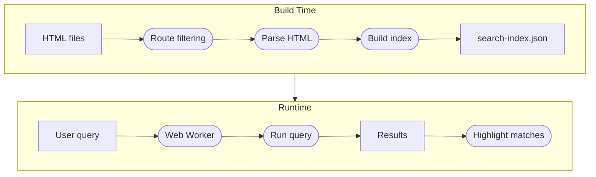

import Tabs from '@theme/Tabs';
import TabItem from '@theme/TabItem';

# Search

Built-in full-text search. The search index is built at Docusaurus build time, serialized to JSON, and queried at runtime in a background worker so the UI stays responsive.

## Summary

When search is enabled, the theme reads the generated HTML after the Docusaurus build, extracts titles, headings, body text, and descriptions, and produces a search index.

At runtime, a Web Worker loads the index and processes queries without blocking the main thread. Matching terms are highlighted on the page.

## How It Works



### Build-Time Indexing

1. **Route filtering** — each route is classified as docs, blog, or page. Routes matching `ignorePatterns` are skipped. Routes whose type is disabled (e.g., `indexBlog: false`) are skipped.
2. **HTML parsing** — the built HTML for each route is parsed to extract searchable content. The title, description meta tag, h2/h3 headings with anchors, and article body text are extracted.
3. **Index build** — documents are indexed with field boosts: title (10×), headings (5×), body (1×). Language-specific stemmers are loaded for non-English languages.
4. **Serialization** — the index and document manifest are written to JSON. If `hashed` is enabled, the filename includes a content hash so browsers pick up updates immediately.

### Runtime Search

1. **Web Worker** — a dedicated worker loads the serialized index on first query.
2. **Query execution** — the search engine processes the query with fuzzy matching (configurable distance 0–2).
3. **Result rendering** — results are returned to the main thread. Matching terms are highlighted on the target page when `highlightSearchTermsOnTargetPage` is enabled.

## Configuration

<Tabs groupId="search-config">
  <TabItem value="default" label="Default" default>

```ts title="docusaurus.config.ts"
{
  preset: 'envoy',
  search: {
    language: ['en'],
    indexDocs: true,
    indexBlog: true,
    indexPages: false,
    hashed: true,
    searchResultLimits: 8,
    highlightSearchTermsOnTargetPage: true,
    searchBarShortcutKeymap: 'mod+k',
    fuzzyMatchingDistance: 1,
  },
}
```

  </TabItem>
  <TabItem value="multi" label="Multi-language">

```ts title="docusaurus.config.ts"
{
  preset: 'envoy',
  search: {
    language: ['en', 'de', 'ja'],
    indexDocs: true,
    indexBlog: true,
    indexPages: true,
  },
}
```

Multi-language search loads language-specific stemmers for each non-English language. Chinese (`zh`) also requires a native word-segmentation package — see the Chinese Segmentation note below.

  </TabItem>
  <TabItem value="disabled" label="Disabled">

```ts title="docusaurus.config.ts"
{
  preset: 'envoy',
  search: false,
}
```

Set `search` to `false` to disable search entirely. No index is built and the search bar is hidden.

  </TabItem>
</Tabs>

:::info Chinese Segmentation
Chinese text has no spaces between words, so the default stemmer cannot tokenize it. When `zh` is included in `language`, the preset expects [`@node-rs/jieba`](https://www.npmjs.com/package/@node-rs/jieba) to be installed as a peer dependency.

Install it in any site that enables Chinese search:

```bash
npm install @node-rs/jieba
```

If `zh` is configured but `@node-rs/jieba` is missing, the build throws an error with the install command.
:::

## Options

| Option                             | Type       | Default   | Description                                                                          |
|------------------------------------|------------|-----------|--------------------------------------------------------------------------------------|
| `language`                         | `string[]` | `['en']`  | Languages for stemming. Accepts ISO 639-1 language codes such as `en`, `de`, `ja`.   |
| `indexDocs`                        | `boolean`  | `true`    | Index documentation pages.                                                           |
| `indexBlog`                        | `boolean`  | `true`    | Index blog posts.                                                                    |
| `indexPages`                       | `boolean`  | `false`   | Index custom pages.                                                                  |
| `hashed`                           | `boolean`  | `true`    | Append a content hash to the index filename so browsers pick up updates immediately. |
| `searchResultLimits`               | `number`   | `8`       | Maximum number of search results to display.                                         |
| `highlightSearchTermsOnTargetPage` | `boolean`  | `true`    | Highlight matching terms on the target page after navigation.                        |
| `searchBarShortcutKeymap`          | `string`   | `'mod+k'` | Keyboard shortcut to focus the search bar.                                           |
| `fuzzyMatchingDistance`            | `number`   | `1`       | Levenshtein distance for fuzzy matching (0 = exact, 1 = 1 typo, 2 = 2 typos).        |
| `ignorePatterns`                   | `string[]` | `[]`      | Route patterns to exclude from indexing (e.g., `'/docs/tags/**'`).                   |
| `docsRouteBasePath`                | `string`   | `'docs'`  | Base path for documentation routes.                                                  |

## Output Files

After build, search produces these files in the output directory:

| File                       | Purpose                                         |
|----------------------------|-------------------------------------------------|
| `search-index-{hash}.json` | Serialized search index plus document manifest. |
| `search-manifest.json`     | Points to the current index file.               |
