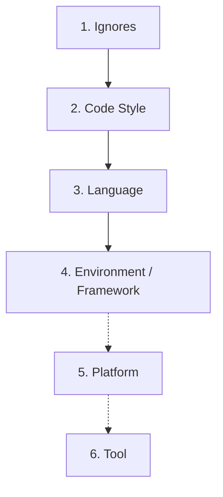
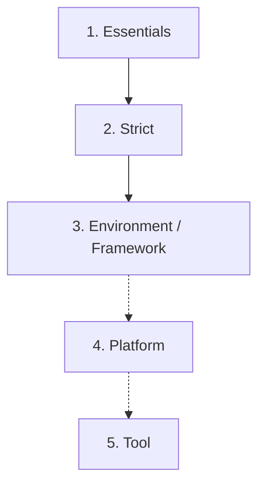

import { Terminology } from '@cbnventures/docusaurus-preset-nova/components';

# Overview

Use **Nova Presets** to lock in strict TypeScript, consistent style, and predictable builds. Pick the layers that match your stack. Each <Terminology title="config layer" to="/docs/quickstart/terminology#nova-concepts" color={true}>preset</Terminology> is an <Terminology title="ECMAScript Modules" to="/docs/quickstart/terminology#javascript-and-typescript" color={true}>ESM</Terminology> module designed for modern <Terminology title="package" to="/docs/quickstart/terminology#nova-concepts" color={true}>workspaces</Terminology>.

## Install

If the package is not in your repo yet, go to **[Setup and Configure](/docs/quickstart/setup#choose-your-path)** and choose **Install into project**.

:::warning
**Nova** must be installed **in your project** before importing <Terminology title="config layer" to="/docs/quickstart/terminology#nova-concepts" color={true}>presets</Terminology>. This is because Node.js resolves imports from your project's `node_modules` folder.
:::

:::info
If you wish, you can install Nova **globally** (into the system) and **locally** (into the project) at the same time. They will not conflict with each other.
:::

## ESLint Presets

Configure ESLint by **composing small layers** into a single <Terminology title="single-file config" to="/docs/quickstart/terminology#builds-and-tooling" color={true}>flat config</Terminology> export. The goal is clear rules, low noise, and fast composition.

### Mental Model
Nova's ESLint <Terminology title="config layer" to="/docs/quickstart/terminology#nova-concepts" color={true}>presets</Terminology> are <Terminology title="single-file config" to="/docs/quickstart/terminology#builds-and-tooling" color={true}>flat config</Terminology> layers that you **spread** into one export. Think of them as small building blocks. Each layer states intent and adds a focused set of opinions without hiding magic.

Composition follows a simple order:



1. Start with an **ignores** file to keep noise out.
2. Apply strict **code styling** so formatting is consistent project-wide.
3. Add a single **language** layer for the code you write (e.g., TypeScript).
4. Then the **environment** (runtime) or **framework** that matches where it runs.
5. Optionally, pick a **platform**.
6. Finish with any **tool** specifics.

### 60-Second Setup

This example shows a minimal Node.js project using TypeScript, composed with Nova's ESLint <Terminology title="config layer" to="/docs/quickstart/terminology#nova-concepts" color={true}>presets</Terminology>. Configured through the `eslint.config.ts` file.

```ts
import {
  dxCodeStyle,
  dxIgnore,
  langTypescript,
  runtimeNode,
} from '@cbnventures/nova/presets/eslint';

export default [
  ...dxIgnore,
  ...dxCodeStyle,
  ...langTypescript,
  ...runtimeNode,
];
```

> Read next: **[ESLint Best Practices](/docs/presets/eslint/best-practices)**.

## TSConfig Presets

Configure TypeScript by **chaining a few <Terminology title="config layer" to="/docs/quickstart/terminology#nova-concepts" color={true}>preset</Terminology> configs** with `"extends"`. Aim for consistent compiler behavior, strict typing, and predictable output with minimal overrides.

### Mental Model
Nova's TSConfig <Terminology title="config layer" to="/docs/quickstart/terminology#nova-concepts" color={true}>presets</Terminology> are **small layers** you **chain** with `"extends"`.

Composition follows a simple order:



1. Start with **essentials** as the baseline.
2. Apply **strict** for stronger compiler checks.
3. Then add the **environment** (runtime) or **framework** that matches where it runs.
4. Optionally, pick a **platform**.
5. Finish with any **tool** specifics.

The <Terminology title="config layer" to="/docs/quickstart/terminology#nova-concepts" color={true}>presets</Terminology> set the heavy knobs for you (e.g., `module` with `moduleResolution`, matching `lib` sets, etc.), so your config stays simple.

Keep **local overrides** focused on project wiring: `paths` and `baseUrl` for imports, `outDir` and `rootDir` for layout, `types` for type packages, and use `include` for the files you compile and `exclude` for build artifacts and `node_modules`.

### 60-Second Setup

This example shows a minimal Node.js project using TypeScript, composed with Nova's TSConfig <Terminology title="config layer" to="/docs/quickstart/terminology#nova-concepts" color={true}>presets</Terminology>. Configured through the `tsconfig.json` file.

```json
{
  "extends": [
    "@cbnventures/nova/presets/tsconfig/dx-essentials.json",
    "@cbnventures/nova/presets/tsconfig/dx-strict.json",
    "@cbnventures/nova/presets/tsconfig/runtime-node.json"
  ],
  "compilerOptions": {
    "baseUrl": "./",
    "outDir": "./build",
    "paths": {
      "@/*": [
        "./src/*"
      ]
    },
    "rootDir": "./",
    "types": [
      "@types/node"
    ]
  },
  "include": [
    "./*",
    "./src/**/*"
  ],
  "exclude": [
    "./build/**",
    "./node_modules/**"
  ]
}
```

> Read next: **[TSConfig Best Practices](/docs/presets/tsconfig/best-practices)**.

> Looking for custom ESLint rules? See **[Nova Rules](/docs/rules/)**.
