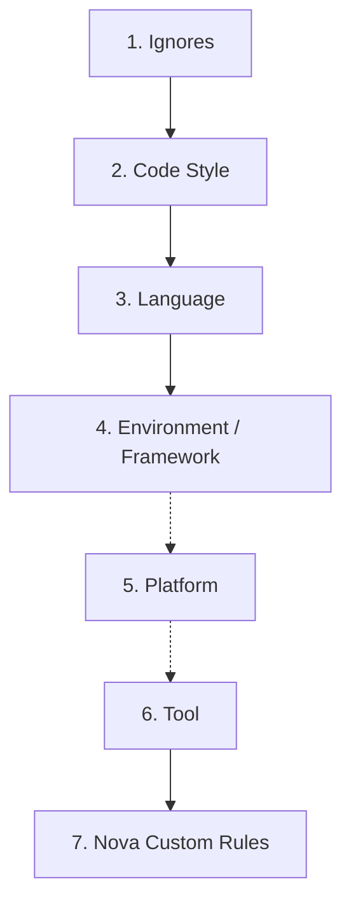
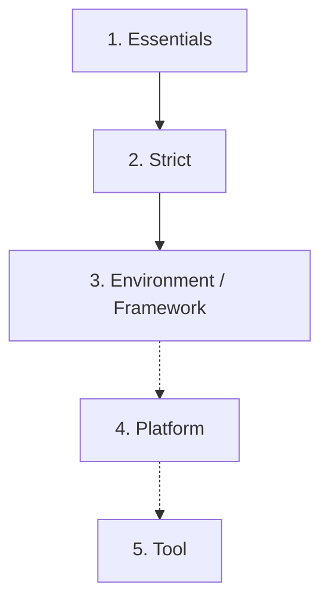

import { Terminology } from '@cbnventures/docusaurus-preset-nova/blocks';

Use **Nova Presets** to lock in strict TypeScript, consistent style, and predictable builds. Pick the layers that match your stack.

Each <Terminology title="config layer" to="/docs/quickstart/terminology#nova-concepts" color={true}>preset</Terminology> is an <Terminology title="ECMAScript Modules" to="/docs/quickstart/terminology#javascript-and-typescript" color={true}>ESM</Terminology> module designed for modern <Terminology title="package" to="/docs/quickstart/terminology#nova-concepts" color={true}>workspaces</Terminology>.

## Install

If the package is not in your repo yet, go to **[Setup and Configure](/docs/quickstart/setup#choose-your-path)** and choose **Install into project**.

:::warning
**Nova** must be installed **in your project** before importing <Terminology title="config layer" to="/docs/quickstart/terminology#nova-concepts" color={true}>presets</Terminology>. This is because Node.js resolves imports from your project's `node_modules` folder.
:::

:::info
If you wish, you can install Nova **globally** (into the system) and **locally** (into the project) at the same time. They will not conflict with each other.
:::

## ESLint Presets

Configure ESLint by **composing small layers** into a single <Terminology title="single-file config" to="/docs/quickstart/terminology#builds-and-tooling" color={true}>flat config</Terminology> export. The goal is clear rules, low noise, and fast composition.

ESLint presets and Nova custom rules are separate on purpose. Presets compose curated ESLint core and third-party behavior. `novaRules`, imported from `@cbnventures/nova/rules/eslint`, registers Nova-owned rules and enables all of their scaffold defaults. Consumers can append a later config object to change or disable any rule.

### Mental Model
Nova's ESLint <Terminology title="config layer" to="/docs/quickstart/terminology#nova-concepts" color={true}>presets</Terminology> are <Terminology title="single-file config" to="/docs/quickstart/terminology#builds-and-tooling" color={true}>flat config</Terminology> layers that you **spread** into one export. Think of them as small building blocks.

Each layer states intent and adds a focused set of opinions without hiding magic.

Composition follows a simple order:


```mermaid
flowchart TD
    I[1. Ignores] --> CS[2. Code Style]
    CS --> L[3. Language]
    L --> E[4. Environment / Framework]
    E -.-> P[5. Platform]
    P -.-> T[6. Tool]
    T --> NR[7. Nova Custom Rules]
```

1. Start with an **ignores** file to keep noise out.
2. Apply strict **code styling** so formatting is consistent project-wide.
3. Add a single **language** layer for the code you write (e.g., TypeScript).
4. Then the **environment** (runtime) or **framework** that matches where it runs.
5. Optionally, pick a **platform**.
6. Finish with any **tool** specifics.
7. Add `novaRules`, then append consumer-owned overrides last.

### Available ESLint Presets

| Layer             | Presets                                                                                                                                                                                                                                                                                                                                                                               | Use                                                                            |
|-------------------|---------------------------------------------------------------------------------------------------------------------------------------------------------------------------------------------------------------------------------------------------------------------------------------------------------------------------------------------------------------------------------------|--------------------------------------------------------------------------------|
| Required baseline | [`dxIgnore`](/docs/presets/eslint/dx-ignore), [`dxCodeStyle`](/docs/presets/eslint/dx-code-style)                                                                                                                                                                                                                                                                                     | Always begin with these two layers, in this order.                             |
| Language          | [`langJavascript`](/docs/presets/eslint/lang-javascript), [`langTypescript`](/docs/presets/eslint/lang-typescript), [`langMdx`](/docs/presets/eslint/lang-mdx)                                                                                                                                                                                                                        | Select every language present in the linted workspace.                         |
| Framework         | [`fwAstro`](/docs/presets/eslint/fw-astro), [`fwDocusaurus`](/docs/presets/eslint/fw-docusaurus), [`fwExpressjs`](/docs/presets/eslint/fw-expressjs), [`fwNextjs`](/docs/presets/eslint/fw-nextjs), [`fwReact`](/docs/presets/eslint/fw-react), [`fwSvelte`](/docs/presets/eslint/fw-svelte), [`fwVue`](/docs/presets/eslint/fw-vue)                                                  | Add the framework adapter after its language layers.                           |
| Runtime           | [`runtimeBrowser`](/docs/presets/eslint/runtime-browser), [`runtimeCloudflareWorkers`](/docs/presets/eslint/runtime-cloudflare-workers), [`runtimeEdge`](/docs/presets/eslint/runtime-edge), [`runtimeNode`](/docs/presets/eslint/runtime-node), [`runtimeServiceWorker`](/docs/presets/eslint/runtime-service-worker), [`runtimeWebWorker`](/docs/presets/eslint/runtime-web-worker) | Declare only the globals and runtime checks available where the code executes. |
| Tool              | [`toolVite`](/docs/presets/eslint/tool-vite)                                                                                                                                                                                                                                                                                                                                          | Scope Node.js globals to Vite and Vitest configuration files.                  |

### 60-Second Setup

This example shows a minimal Node.js project using TypeScript, composed with Nova's ESLint <Terminology title="config layer" to="/docs/quickstart/terminology#nova-concepts" color={true}>presets</Terminology>. Configured through the `eslint.config.mts` file.

```ts
import {
  dxCodeStyle,
  dxIgnore,
  langTypescript,
  runtimeNode,
} from '@cbnventures/nova/presets/eslint';
import { novaRules } from '@cbnventures/nova/rules/eslint';

export default [
  ...dxIgnore,
  ...dxCodeStyle,
  ...langTypescript,
  ...runtimeNode,
  ...novaRules,
];
```

> Read next: **[ESLint Best Practices](/docs/presets/eslint/best-practices)**.

## TSConfig Presets

Configure TypeScript by **chaining a few <Terminology title="config layer" to="/docs/quickstart/terminology#nova-concepts" color={true}>preset</Terminology> configs** with `"extends"`. Aim for consistent compiler behavior, strict typing, and predictable output with minimal overrides.

### Mental Model
Nova's TSConfig <Terminology title="config layer" to="/docs/quickstart/terminology#nova-concepts" color={true}>presets</Terminology> are **small layers** you **chain** with `"extends"`.

Composition follows a simple order:


```mermaid
flowchart TD
    ES[1. Essentials] --> ST[2. Strict]
    ST --> E[3. Environment / Framework]
    E -.-> P[4. Platform]
    P -.-> T[5. Tool]
```

1. Start with **essentials** as the baseline.
2. Apply **strict** for stronger compiler checks.
3. Then add the **environment** (runtime) or **framework** that matches where it runs.
4. Optionally, pick a **platform**.
5. Finish with any **tool** specifics.

The <Terminology title="config layer" to="/docs/quickstart/terminology#nova-concepts" color={true}>presets</Terminology> set the heavy knobs for you (e.g., `module` with `moduleResolution`, matching `lib` sets, etc.), so your config stays simple.

Keep **local overrides** focused on project wiring: `paths` for imports, `outDir` and `rootDir` for layout, `types` for type packages, and use `include` for the files you compile and `exclude` for build artifacts and `node_modules`.

### Available TSConfig Presets

| Layer             | Presets                                                                                                                                                                                                                                                                                                                                                                                                            | Use                                                                         |
|-------------------|--------------------------------------------------------------------------------------------------------------------------------------------------------------------------------------------------------------------------------------------------------------------------------------------------------------------------------------------------------------------------------------------------------------------|-----------------------------------------------------------------------------|
| Required baseline | [`dx-essentials`](/docs/presets/tsconfig/dx-essentials), [`dx-strict`](/docs/presets/tsconfig/dx-strict)                                                                                                                                                                                                                                                                                                           | Every Nova TSConfig begins with these two presets, in this order.           |
| Framework         | [`fw-astro`](/docs/presets/tsconfig/fw-astro), [`fw-docusaurus`](/docs/presets/tsconfig/fw-docusaurus), [`fw-expressjs`](/docs/presets/tsconfig/fw-expressjs), [`fw-homebridge`](/docs/presets/tsconfig/fw-homebridge), [`fw-nextjs`](/docs/presets/tsconfig/fw-nextjs), [`fw-react`](/docs/presets/tsconfig/fw-react), [`fw-svelte`](/docs/presets/tsconfig/fw-svelte), [`fw-vue`](/docs/presets/tsconfig/fw-vue) | Add framework compiler behavior after the matching runtime.                 |
| Runtime           | [`runtime-browser`](/docs/presets/tsconfig/runtime-browser), [`runtime-cloudflare-workers`](/docs/presets/tsconfig/runtime-cloudflare-workers), [`runtime-edge`](/docs/presets/tsconfig/runtime-edge), [`runtime-node`](/docs/presets/tsconfig/runtime-node), [`runtime-service-worker`](/docs/presets/tsconfig/runtime-service-worker), [`runtime-web-worker`](/docs/presets/tsconfig/runtime-web-worker)         | Select module resolution and libraries for the execution environment.       |
| Tool              | [`tool-vite`](/docs/presets/tsconfig/tool-vite)                                                                                                                                                                                                                                                                                                                                                                    | Configure bundler resolution and isolated transforms for Vite-built source. |

### 60-Second Setup

This example shows a minimal Node.js project using TypeScript, composed with Nova's TSConfig <Terminology title="config layer" to="/docs/quickstart/terminology#nova-concepts" color={true}>presets</Terminology>. Configured through the `tsconfig.json` file.

```json
{
  "extends": [
    "@cbnventures/nova/presets/tsconfig/dx-essentials.json",
    "@cbnventures/nova/presets/tsconfig/dx-strict.json",
    "@cbnventures/nova/presets/tsconfig/runtime-node.json"
  ],
  "compilerOptions": {
    "outDir": "./build",
    "paths": {
      "@/*": [
        "./src/*"
      ]
    },
    "rootDir": "./",
    "types": [
      "@types/node"
    ]
  },
  "include": [
    "./*",
    "./src/**/*"
  ],
  "exclude": [
    "./build/**",
    "./node_modules/**"
  ]
}
```

> Read next: **[TypeScript Compatibility](/docs/presets/tsconfig/compatibility)** and **[TSConfig Best Practices](/docs/presets/tsconfig/best-practices)**.

## Scaffold Coverage

Every generated monorepo root has ESLint, TSConfig, and Vitest, even when it starts with no workspace. Every JavaScript or TypeScript workspace starts with `dxIgnore`, `dxCodeStyle`, `dx-essentials`, and `dx-strict`, enables `novaRules`, and includes a Vitest suite. Native-only workspace code keeps its native toolchain; Nova applies the JavaScript stack only to Node.js helpers that Nova generates.

| Scaffold                 | Additional ESLint layers                                  | Source TSConfig layers            | Test owner                                                                |
|--------------------------|-----------------------------------------------------------|-----------------------------------|---------------------------------------------------------------------------|
| Starter - Base           | JavaScript, TypeScript, Node                              | Node                              | Vitest at the root                                                        |
| App - Android            | JavaScript, TypeScript, Node for helper scripts           | Node for helper scripts           | Vitest for helpers; Gradle for native code                                |
| App - Apple              | None inside the native workspace                          | None inside the native workspace  | XCTest; the monorepo root still uses Vitest                               |
| App - Astro              | JavaScript, TypeScript, Astro, Browser                    | Browser, Astro                    | Vitest                                                                    |
| App - Cloudflare Workers | JavaScript, TypeScript, Cloudflare Workers                | Cloudflare Workers                | Vitest                                                                    |
| App - Discord Bot        | JavaScript, TypeScript, Node                              | Node                              | Vitest                                                                    |
| App - Docker Image       | JavaScript, TypeScript, Node                              | Node for tooling                  | Vitest                                                                    |
| App - Express.js         | JavaScript, TypeScript, Express.js, Node                  | Node, Express.js                  | Vitest                                                                    |
| App - Next.js            | JavaScript, TypeScript, Next.js                           | Browser, Next.js                  | Vitest                                                                    |
| App - Vite               | JavaScript, TypeScript, Browser, Vite, selected framework | Browser, Vite, selected framework | Vitest                                                                    |
| Docs - Docusaurus        | JavaScript, MDX, TypeScript, Docusaurus, Browser          | Browser, Docusaurus               | Vitest and Nova documentation suites                                      |
| Package - GitHub Action  | JavaScript, TypeScript, Node                              | Node                              | Vitest                                                                    |
| Package - Homebridge     | JavaScript, TypeScript, Node                              | Node, Homebridge                  | Vitest                                                                    |
| Package - Node CLI       | JavaScript, TypeScript, Node                              | Node                              | Vitest                                                                    |
| Package - pfSense        | JavaScript, TypeScript, Node for packaging helpers        | Node for packaging helpers        | Vitest for helpers; package-specific structural checks for native sources |

> Looking for individual custom ESLint rules and their options? See **[Nova Rules](/docs/rules/)**.
